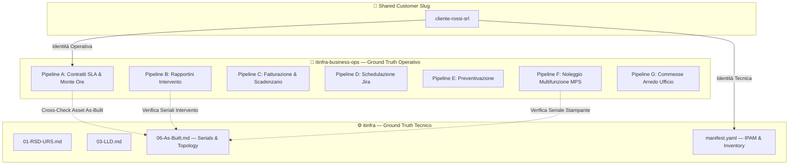

# 🏢 itinfra-business-ops

> **Hub Operativo, Finanziario, Contrattualistica PSA e Commesse**  
> Progettato secondo il paradigma **Hub-and-Spoke** basato su **Shared Customer Slug (`<slug>`)**, in perfetta sinergia con il repository tecnico [`itinfra`](https://github.com/matrixNeo76/itinfra).

---

## 🎯 Visione Architetturale: Hub-and-Spoke & SoC

L'architettura separa rigorosamente il **Ground Truth Tecnico** dal **Ground Truth Operativo & Finanziario** (Separation of Concerns):



---

## 🚀 Le 11 Pipeline Operative

| Pipeline | Ambito | Descrizione & Output |
| :---: | :--- | :--- |
| **A** | **Contratti Assistenza IT (SLA & Monte Ore)** | Gestione canoni fissi MSP, monte ore a scalare, scadenze, alert rinnovo e audit normativo 2026 (`ctr-*.yaml`). |
| **B** | **Rapportini di Assistenza** | Compilazione intervento tecnico, tracciamento ore, arrotondamenti, firma e scarico saldo (`rap-*.yaml`). |
| **C** | **Fatturazione & Scadenzario Attivo** | Calcolo batch fine mese, conguagli, generazione tracciato SDI v1.2 e scadenzario partite aperte (`billing_batch.json`). |
| **D** | **Task Giornalieri Jira & Agenda** | Allineamento ticket Jira, sincronizzazione slot appuntamenti e pre-compilazione rapportini (`jira_sync.yaml`). |
| **E** | **Preventivazione Multiprodotto & Audit** | Calcolo cost-plus con ricarichi differenziati, quadratura matematica e audit deontologico forense CNF/EU AI Act (`quote-*.yaml`). |
| **F** | **Noleggio Multifunzione MPS (Costo Copia)** | Gestione canoni semestrali anticipati, telelettura contatori SNMP, alert consumabili toner (<15%) e conguaglio eccedenze. |
| **G** | **Fornitura Arredo Ufficio** | Gestione commessa chiavi in mano: rilievo metrico, layout 2D/3D, campionatura, posa e verbale di collaudo con handover. |
| **H** | **Ingestione Documentale SOTA (OKF v0.2)** | Analisi visiva nativa pixel-to-markdown di PDF, contratti e preventivi, decomposizione modulare e audit qualitativo deterministico. |
| **I** | **Memoria Auto-Correttiva & Cognitive Bridge (SPEC-17)** | Apprendimento attestato con trust tiers, compilazione regole Antigravity e ponte federato con la memoria di `itinfra`. |
| **J** | **Gap Analysis & Compliance D.Lgs. 231/2001 (SPEC-19)** | Audit peritale reati informatici (Art. 24-bis), scoring CVSS v4.0 FIRST, remediation plan e cross-check Shadow IT As-Built. |
| **K** | **Onboarding Unificato Clienti (SPEC-20)** | Provisioning atomico commerciale/tecnico dual-repo, calcolo IPAM, tier SLA e certificazione zero-drift (`client-manifest.yaml`). |

---

## 🛠️ Comandi Rapidi CLI (`it-ops`)

La suite include il wrapper Windows [`it-ops.cmd`](file:///c:/Users/auresystem/repos/itinfra-business-ops/it-ops.cmd) per esecuzione diretta da Prompt/PowerShell:

```powershell
# Inizializzare un nuovo cliente con la struttura completa
.\it-ops.cmd init <slug> --client "Nome Ragione Sociale"

# Verificare lo stato operativo 360° del cliente
.\it-ops.cmd status <slug>

# Cross-check deterministico con l'As-Built di itinfra
.\it-ops.cmd check <slug>

# Gestione Contratti SLA, Monte Ore e Audit Normativo 2026
.\it-ops.cmd contract <slug> status
.\it-ops.cmd contract <slug> balance
.\it-ops.cmd contract <slug> audit

# Preventivi Commerciali e Audit Deontologico / Forense
.\it-ops.cmd quote <slug> calculate
.\it-ops.cmd quote <slug> audit

# Esportazione Documentale con Logo Ufficiale (SPEC-16: DOCX, PDF A4, HTML Zero-CDN)
.\it-ops.cmd export <slug> quote [<id>]
.\it-ops.cmd export <slug> contract [<id>]
.\it-ops.cmd export <slug> report [<id>]

# Rapportini di Assistenza e Time Tracking
.\it-ops.cmd report <slug> new
.\it-ops.cmd report <slug> list

# Calcolo Noleggio e Telelettura Stampanti MPS
.\it-ops.cmd mps <slug> calculate

# Calcolo Batch Fatturazione e Scadenzario
.\it-ops.cmd billing <slug> summary

# Onboarding Unificato & Dual-Repo Scaffolding (SPEC-20)
.\it-ops.cmd onboard <slug> --client "Nome" --vat "IT..." [--subnet "192.168.X.0/24"] [--tier silver|gold|platinum]

# Mission Control & Dashboard 360°
.\it-ops.cmd mission-control [--html]
.\it-ops.cmd ui

# Swarm Agenti Deterministici Specializzati
.\it-ops.cmd agent [audit-231|finance-reconciler|infrastructure-sentinel|contract-guardian|swarm] <slug>

# Demoni di Monitoraggio Proattivo
.\it-ops.cmd daemon [mps|sla] [--once]

# Git Guard Hooks Deterministici
.\it-ops.cmd hooks [install|check] [--both]

# Gestore Skills Agente (Catalogo 300+)
.\it-ops.cmd skills [search|list|info|install]

# Orchestrazione Workflows a Stati Finiti (SPEC-21)
.\it-ops.cmd workflow list [--slug <slug>]
.\it-ops.cmd workflow run [monthly-closing|onboarding-to-live|incident-postmortem|quarterly-audit-231|contract-renewal] [--dry-run]
.\it-ops.cmd workflow status <workflow_id>
.\it-ops.cmd workflow resume <workflow_id>

# Commesse Arredo Ufficio
.\it-ops.cmd furniture <slug> status

# Memoria Auto-Correttiva & Cognitive Bridge (SPEC-17)
.\it-ops.cmd learn list
.\it-ops.cmd learn promotables
.\it-ops.cmd learn promote <entry_id> --domain technical --id <LES-ID> --title "Titolo"
.\it-ops.cmd learn audit
.\it-ops.cmd learn test
.\it-ops.cmd learn sync
# Gap Analysis & Compliance 231 (SPEC-19)
.\it-ops.cmd gap <slug> status
.\it-ops.cmd gap <slug> calculate
.\it-ops.cmd gap <slug> remediation
.\it-ops.cmd gap <slug> va
.\it-ops.cmd gap <slug> report
.\it-ops.cmd gap <slug> check
```

---

## 📑 Specifiche Architetturali & Documentazione OKF v0.2

### Specifiche di Sistema (Core Specs)
| Specifica | Ambito Architetturale | Documento |
| :---: | :--- | :--- |
| **SPEC-08** | Ingestione Visiva Nativa (Pixel-to-Markdown) & OKF v0.2 | [`08-spec-visual-document-ingestion-okf.md`](docs/specs/08-spec-visual-document-ingestion-okf.md) |
| **SPEC-16** | Enterprise Document Templates, Corporate Branding & Multi-Format Rendering | [`16-spec-enterprise-document-templates-branding.md`](docs/specs/16-spec-enterprise-document-templates-branding.md) |
| **SPEC-17** | Unified Cognitive Memory Architecture & Cross-Repository Self-Correction Bridge | [`17-spec-unified-cognitive-memory-bridge.md`](docs/specs/17-spec-unified-cognitive-memory-bridge.md) |

### Pipeline Operative OKF v0.2
| Pipeline | Titolo Specifica OKF v0.2 | Documento |
| :---: | :--- | :--- |
| **📚 Master** | **Indice Master delle Pipeline Operative** | [`00-index-pipelines.md`](docs/pipelines/00-index-pipelines.md) |
| **A** | Contratti di Assistenza IT, SLA & Monte Ore | [`01-pipeline-a-contracts.md`](docs/pipelines/01-pipeline-a-contracts.md) |
| **B** | Rapportini Intervento, Firma Canvas & Ricambi | [`02-pipeline-b-reports.md`](docs/pipelines/02-pipeline-b-reports.md) |
| **C** | Fatturazione SDI v1.2 & Scadenzario Multi-Rata | [`03-pipeline-c-billing.md`](docs/pipelines/03-pipeline-c-billing.md) |
| **D** | Task Jira & Schedulazione Agenda RFC 5545 | [`04-pipeline-d-jira-calendar.md`](docs/pipelines/04-pipeline-d-jira-calendar.md) |
| **E** | Preventivazione Multiprodotto Cost-Plus | [`05-pipeline-e-quotes.md`](docs/pipelines/05-pipeline-e-quotes.md) |
| **F** | Noleggio Multifunzione MPS & Telemetria SNMP | [`06-pipeline-f-mps-rental.md`](docs/pipelines/06-pipeline-f-mps-rental.md) |
| **G** | Commesse Arredo Ufficio & Collaudo Finale | [`07-pipeline-g-furniture.md`](docs/pipelines/07-pipeline-g-furniture.md) |
| **H** | Ingestione Documentale SOTA & Visual Parsing | [`08-pipeline-h-document-ingestion.okf.md`](docs/pipelines/08-pipeline-h-document-ingestion.okf.md) |
| **I** | Memoria Auto-Correttiva Attestata & Cognitive Bridge | [`09-pipeline-i-memory-learning.okf.md`](docs/pipelines/09-pipeline-i-memory-learning.okf.md) |
| **J** | Gap Analysis & Compliance D.Lgs. 231/2001 | [`10-pipeline-j-gap-analysis.okf.md`](docs/pipelines/10-pipeline-j-gap-analysis.okf.md) |
| **K** | Onboarding Unificato & Dual Storage Zero-Drift | [`11-pipeline-k-client-onboarding.okf.md`](docs/pipelines/11-pipeline-k-client-onboarding.okf.md) |
| **📐 Visual** | **Compendio Diagrammi ASCII (Hub & Pipelines)** | [`docs/ASCII_DIAGRAMS.md`](docs/ASCII_DIAGRAMS.md) |

---

## 📁 Struttura del Repository

```text
itinfra-business-ops/
├── .gitignore
├── config.yaml                # Parametri globali, IVA, valuta e path itinfra
├── it-ops.cmd                 # Entrypoint batch per Windows
├── README.md                  # Questo documento
├── AGENTS.md                  # Istruzioni operative e comandi deterministici per AI
├── GEMINI.md                  # Direttive di sistema per modelli Gemini
├── CLAUDE.md                  # Zero-search fast path per Claude Code
├── .agents/                   # Customizations native per Antigravity
│   ├── rules/                 # Regole attive compilate (Progressive Disclosure)
│   └── memory/                # Grafo di conoscenza OKF v0.2 attestato (core, ui, doc, tech)
├── schemas/                   # Schemi formali YAML per validazione deterministica
├── templates/                 # Modelli YAML e asset brand (logo ufficiale Aure System)
│   └── assets/brand/          # logo.png e logo.base64.txt per Zero-CDN rendering
├── scripts/                   # Motore Python CLI
│   ├── it_ops.py              # CLI Dispatcher Master (v0.3.0)
│   ├── core/                  # Engine: MemoryEngine, CognitiveBridge, DocumentRenderer, Branding
│   └── pipelines/             # Pipeline A-I (Contratti, Rapportini, Preventivi, Learn, Ingest)
├── tests/                     # Suite di test automatizzati (test_cognitive_bridge.py)
├── docs/                      # Specifiche formali OKF v0.2 (SPEC-08, SPEC-16, SPEC-17)
└── clients/                   # Repository clienti partizionati per <slug>
```

---

## 🔒 Sicurezza & Riservatezza
* **Read-Only Bridge**: L'accesso ai dati di [`itinfra`](file:///c:/Users/auresystem/repos/itinfra) avviene rigorosamente in sola lettura, garantendo l'integrità dei documenti tecnici.
* **Separazione Dati Sensibili**: Fatture, canoni e coordinate bancarie risiedono esclusivamente in questo repository protetto da policy RBAC dedicate.
