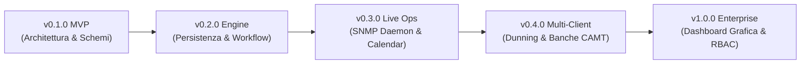

# 🗺️ ROADMAP — itinfra-business-ops

> **Visione Strategica, Tappe Evolutive e Ciclo di Vita del Repository Operativo & Finanziario**  
> Allineato all'architettura **Hub-and-Spoke** federata a [`itinfra`](https://github.com/matrixNeo76/itinfra) tramite **Shared Customer Slug (`<slug>`)**.

---

## 🎯 Visione & Principi Guida

1. **Separazione Netta dei Domini (Separation of Concerns)**:
   * Nessun dato contabile o contrattuale nel repository tecnico di ingegneria dei sistemi.
   * `itinfra` governa topologie di rete, configurazioni e As-Built.
   * `itinfra-business-ops` governa contratti SLA, rendicontazione, fatturazione SDI, parco macchine MPS e commesse arredo.
2. **Determinismo & Zero Allucinazioni**:
   * Dati serializzati in YAML e JSON con schemi formali Draft-07.
   * Cross-check in sola lettura verso `itinfra` tramite `ITInfraBridge`.
3. **Automazione Senza Attrito**:
   * CLI unificata `it-ops` per operatori, tecnici e commercialisti.
   * Tracciati XML SDI v1.2 pronti per il Sistema di Interscambio dell'Agenzia delle Entrate.

---

## 🚦 Quadro delle Fasi di Sviluppo

---

## 📍 Dettaglio degli Stadi di Rilascio

### 🟢 FASE 1: v0.1.0 — MVP & Scaffolding Architetturale (Completata)
* [x] Inizializzazione repository GitHub pubblico con branch `main`.
* [x] Definizione dell'architettura Hub-and-Spoke con Shared Customer Slug (`<slug>`).
* [x] 8 Schemi di validazione YAML formali (manifest, contratti, rapportini, fatture, MPS, preventivi, arredo, jira).
* [x] 6 Template di scaffolding precompilati in `templates/`.
* [x] Motore CLI Python `it_ops.py` e wrapper batch Windows `it-ops.cmd`.
* [x] `ITInfraBridge`: Connettore read-only verso `../itinfra/projects/<slug>/06-As-Built.md` per cross-check seriali hardware.
* [x] Cliente dimostrativo reale `severino-srl` con test e validazione 100% passata.
* [x] Direttive AI deterministiche (`AGENTS.md`, `CLAUDE.md`).

---

### 🔵 FASE 2: v0.2.0 — Persistenza, Lifecycle Contratti & FatturaPA (Completata)
* [x] **Pipeline A (Contratti)**:
  * [x] Scarico automatico persistente delle ore consumate sul file `ctr-*.yaml` all'approvazione di un rapportino.
  * [x] Comando CLI `it-ops contract renew <slug> <contract_id>` per generare la bozza di rinnovo contrattuale.
* [x] **Pipeline B (Rapportini)**:
  * [x] Comando CLI `it-ops report new <slug>` con parametri e generazione automatica ID `RAP-YYYYMMDD-ID`.
  * [x] Generazione foglio di lavoro stampabile/firmabile in formato HTML/CSS con box grafometrico per il cliente.
* [x] **Pipeline C (Fatturazione & Scadenzario)**:
  * [x] Completamento tracciato XML FatturaPA SDI v1.2 (dati anagrafici Cedente, Cessionario, esigibilità IVA).
  * [x] Salvataggio fisico del batch `billing_batch.json` e del file `.xml` in `clients/<slug>/invoices/`.
  * [x] Gestione incassi: comando `it-ops billing pay <slug> <batch_id>` per chiudere le rate nello scadenzario.
* [x] **Pipeline D (Jira & Calendari)**:
  * [x] Sottocomando CLI `it-ops jira` registrato e funzionante.
  * [x] Generazione file standard iCalendar (`.ics`) per sincronizzazione rapida con Microsoft Outlook e Google Calendar.
* [x] **Pipeline F (MPS & Billing Integration)**:
  * [x] Passaggio automatico delle eccedenze copie e canoni base direttamente nel batch di fatturazione fine mese.
* [x] **Pipeline G (Arredo Ufficio)**:
  * [x] Comandi CLI per avanzare le fasi di commessa (`it-ops furniture advance`) e firma collaudo finale.

---

### 🟡 FASE 3: v0.3.0 — Telemetria Real-Time, Field Automation & Over-Budget (Completata)
* [x] **Gestione Deterministica Over-Budget**:
  * [x] Scorporo automatico delle ore contrattuali residue dalle ore eccedenti.
  * [x] Conversione automatica delle ore extra in addebiti a tariffa oraria extra nella fatturazione fine mese.
* [x] **Firma Grafometrica su Canvas & Ricambi**:
  * [x] Pad interattivo HTML5 Canvas per firma cliente su tablet/smartphone integrato in `rap-*.html`.
  * [x] Gestione materiali e ricambi usati sul campo via CLI (`--parts`) e addebito automatico nel billing.
* [x] **Scadenzario Multi-Rata 30/60 gg Fine Mese**:
  * [x] Calcolo automatico scadenze fine mese con split 50%/50% per termini `30_60_DF_FM`.
* [x] **SNMP Telemetry Live Poller**:
  * [x] Modulo nativo Python `scripts/core/snmp.py` via UDP 161 per Printer MIB (RFC 3805).
  * [x] Comando `it-ops mps poll` con rilevamento online e gestione timeout senza crash.
* [x] **Quote Builder & Offerta Commerciale Formale**:
  * [x] Comando `it-ops quote add-item` per comporre preventivi da terminale.
  * [x] Esportazione automatica della proposta commerciale formale `quote-*.html` con layout print-ready.
* [x] **Certificato di Collaudo & Handover Arredo**:
  * [x] Generazione automatica del Verbale di Collaudo e Accettazione Fornitura `handover-*.html`.

---

---

### 🛡️ FASE SOTA Level-2 (Settembre 2026) — Enterprise Architecture & Legal Governance (Completata)
* [x] **Pipeline H (Ingestione SOTA & Visual Parsing)**:
  * [x] Analisi visiva nativa pixel-to-markdown per PDF, distinte tecniche e fatture SDI.
  * [x] Riconciliazione triangolare 3-way matching tra documento, anagrafica e preventivo con zero allucinazioni.
* [x] **Pipeline I (Memoria Auto-Correttiva DAG & Attestation)**:
  * [x] Grafo aciclico orientato (DAG) con validazione cicli DFS e rilevamento orfani.
  * [x] Modello di attestazione formale umana (`human:possumato`) e decadimento logaritmico della confidenza.
  * [x] Peer-synchronization atomica cross-repository bidirezionale con `itinfra`.
* [x] **Pipeline J (Gap Analysis & Compliance D.Lgs. 231/2001, SPEC-19)**:
  * [x] Perimetro normativo reati informatici (Art. 24-bis), ISO/IEC 27001:2022, ISO 22301 e NIST CSF v2.0.
  * [x] Algoritmo di scoring ponderato (25% doc, 50% interviste, 25% VA) e livello di maturità CMMI (1.0 - 5.0).
  * [x] Scoring tecnico vulnerabilità secondo lo standard FIRST CVSS v4.0.
  * [x] Generazione automatica di Remediation Plan prioritizzato (P1 15gg, P2 45gg, P3 90gg).
  * [x] Riconciliazione federata As-Built/IPAM con rilevamento e allerta automatica di Shadow IT.
  * [x] Emissione formale dei 4 deliverable sigillati con digest SHA-256 e PDF vettoriali brandizzati Aure System.
* [x] **Evoluzioni SOTA Level-2 sulle 7 Pipeline Storiche (SPEC-18)**:
  * [x] Pipeline C: FatturaPA FPA12 per PA, codici CIG/CUP, ritenute RT01/RT02 e riconciliazione ISO 20022 CAMT.053.
  * [x] Pipeline A: Algoritmo Gaussiano per festività mobili di Pasqua e calcolo penali SLA progressive.
  * [x] Pipeline E: Safety floor per margini commerciali minimi e gestione rischio cambio USD/EUR.
  * [x] Pipeline F: SNMP v3 USM autenticato e monitoraggio parti ad usura prolungata (Drum/Fusore).
  * [x] Pipeline G: Gestione punch list (snagging), ritenuta di garanzia 5% e verifica carico elettrico su LLD.

### 🟠 FASE 4: v0.4.0 — Solleciti Automatici (Dunning) & Riconciliazione Bancaria (Q1 2027)
* [ ] **Engine Dunning & Solleciti**:
  * [ ] Notifica di cortesia automatica a -5 giorni dalla scadenza della rata.
  * [ ] Primo sollecito bonario a +3 giorni dalla scadenza.
  * [ ] Secondo sollecito a +15 giorni con estratto conto allegato e notifica al project manager per blocco ticket non critici.
* [ ] **Riconciliazione Bancaria**:
  * [ ] Parser flussi bancari CBI / ISO 20022 CAMT.053 / CSV per abbinamento automatico incassi a fatture aperte.
* [ ] **Import Listini Distributori IT**:
  * [ ] Parser cataloghi CSV/API (Esprinet, Computer Gross, Brevi) per aggiornamento costi di acquisto hardware.

---

### 🟣 FASE 5: v1.0.0 — Cruscotto Grafico Esecutivo & Multi-Tenancy (Q2 2027)
* [ ] **Dashboard Web Interattiva (`it-ops ui`)**:
  * [ ] Cruscotto locale interattivo (FastAPI o renderer statico con grafici Chart.js / Mermaid).
  * [ ] Vista globale portfolio clienti: margini commesse arredo, monte ore residuo, fatturato mese e contratti in scadenza.
* [ ] **Controllo Accessi & Multi-Tenancy (RBAC)**:
  * [ ] Profilazione ruoli (Tecnico sul campo, Amministrazione/Contabilità, PM Commerciale).
  * [ ] Mascheramento automatico dati economici per ruoli puramente tecnici.
* [ ] **Audit di Conformità Fiscale & ISO 27001**:
  * [ ] Certificazione log modifiche e conservazione a norma dei documenti firmati con hash SHA-256.

---

## 📈 Matrice di Avanzamento per Pipeline

| Pipeline | Ambito | MVP (v0.1) | Engine (v0.2) | Telemetry & Field (v0.3) | Automation (v0.4) | Enterprise (v1.0) |
| :--- | :--- | :---: | :---: | :---: | :---: | :---: |
| **A** | Contratti SLA & Ore | ✅ | ✅ | ✅ | 📅 Pianificato | 📅 Pianificato |
| **B** | Rapportini Intervento | ✅ | ✅ | ✅ | 📅 Pianificato | 📅 Pianificato |
| **C** | Fatturazione & SDI | ✅ | ✅ | ✅ | 📅 Pianificato | 📅 Pianificato |
| **D** | Jira & Calendario | ✅ | ✅ | ✅ | 📅 Pianificato | 📅 Pianificato |
| **E** | Preventivazione Multi | ✅ | ✅ | ✅ | 📅 Pianificato | 📅 Pianificato |
| **F** | Multifunzione MPS | ✅ | ✅ | ✅ | 📅 Pianificato | 📅 Pianificato |
| **G** | Commesse Arredo | ✅ | ✅ | ✅ | 📅 Pianificato | 📅 Pianificato |
| **H** | Ingestione SOTA OKF | ✅ | ✅ | ✅ | ✅ | 📅 Pianificato |
| **I** | Memoria DAG Attestata | ✅ | ✅ | ✅ | ✅ | 📅 Pianificato |
| **J** | Gap Analysis 231 | ✅ | ✅ | ✅ | ✅ | 📅 Pianificato |
