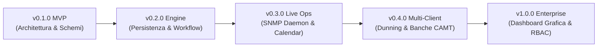

# 🗺️ ROADMAP — itinfra-business-ops

> **Visione Strategica, Tappe Evolutive e Ciclo di Vita del Repository Operativo & Finanziario**  
> Allineato all'architettura **Hub-and-Spoke** federata a [`itinfra`](https://github.com/matrixNeo76/itinfra) tramite **Shared Customer Slug (`<slug>`)**.

---

## 🎯 Visione & Principi Guida

1. **Separazione Netta dei Domini (Separation of Concerns)**:
   * Nessun dato contabile o contrattuale nel repository tecnico di ingegneria dei sistemi.
   * `itinfra` governa topologie di rete, configurazioni e As-Built.
   * `itinfra-business-ops` governa contratti SLA, rendicontazione, fatturazione SDI, parco macchine MPS e commesse arredo.
2. **Determinismo & Zero Allucinazioni**:
   * Dati serializzati in YAML e JSON con schemi formali Draft-07.
   * Cross-check in sola lettura verso `itinfra` tramite `ITInfraBridge`.
3. **Automazione Senza Attrito**:
   * CLI unificata `it-ops` per operatori, tecnici e commercialisti.
   * Tracciati XML SDI v1.2 pronti per il Sistema di Interscambio dell'Agenzia delle Entrate.

---

## 🚦 Quadro delle Fasi di Sviluppo

---

## 📍 Dettaglio degli Stadi di Rilascio

### 🟢 FASE 1: v0.1.0 — MVP & Scaffolding Architetturale (Completata)
* [x] Inizializzazione repository GitHub pubblico con branch `main`.
* [x] Definizione dell'architettura Hub-and-Spoke con Shared Customer Slug (`<slug>`).
* [x] 8 Schemi di validazione YAML formali (manifest, contratti, rapportini, fatture, MPS, preventivi, arredo, jira).
* [x] 6 Template di scaffolding precompilati in `templates/`.
* [x] Motore CLI Python `it_ops.py` e wrapper batch Windows `it-ops.cmd`.
* [x] `ITInfraBridge`: Connettore read-only verso `../itinfra/projects/<slug>/06-As-Built.md` per cross-check seriali hardware.
* [x] Cliente dimostrativo reale `severino-srl` con test e validazione 100% passata.
* [x] Direttive AI deterministiche (`AGENTS.md`, `CLAUDE.md`).

---

### 🔵 FASE 2: v0.2.0 — Persistenza, Lifecycle Contratti & FatturaPA (In Corso)
* [ ] **Pipeline A (Contratti)**:
  * [ ] Scarico automatico persistente delle ore consumate sul file `ctr-*.yaml` all'approvazione di un rapportino.
  * [ ] Comando CLI `it-ops contract renew <slug> <contract_id>` per generare la bozza di rinnovo contrattuale.
* [ ] **Pipeline B (Rapportini)**:
  * [ ] Comando CLI `it-ops report new <slug>` con parametri e generazione automatica ID `RAP-YYYYMMDD-ID`.
  * [ ] Generazione foglio di lavoro stampabile/firmabile in formato HTML/CSS con box grafometrico per il cliente.
* [ ] **Pipeline C (Fatturazione & Scadenzario)**:
  * [ ] Completamento tracciato XML FatturaPA SDI v1.2 (dati anagrafici Cedente, Cessionario, esigibilità IVA).
  * [ ] Salvataggio fisico del batch `billing_batch.json` e del file `.xml` in `clients/<slug>/invoices/`.
  * [ ] Gestione incassi: comando `it-ops billing pay <slug> <batch_id>` per chiudere le rate nello scadenzario.
* [ ] **Pipeline D (Jira & Calendari)**:
  * [ ] Sottocomando CLI `it-ops jira` registrato e funzionante.
  * [ ] Generazione file standard iCalendar (`.ics`) per sincronizzazione rapida con Microsoft Outlook e Google Calendar.
* [ ] **Pipeline F (MPS & Billing Integration)**:
  * [ ] Passaggio automatico delle eccedenze copie e canoni base direttamente nel batch di fatturazione fine mese.
* [ ] **Pipeline G (Arredo Ufficio)**:
  * [ ] Comandi CLI per avanzare le fasi di commessa (`it-ops furniture advance`) e firma collaudo finale.

---

### 🟡 FASE 3: v0.3.0 — Telemetria Real-Time & Sniffer Contatori (Q4 2026)
* [ ] **SNMP Telemetry Poller**:
  * [ ] Polling automatico via UDP 161 delle stampanti in rete locale su standard MIB Printer (RFC 3805).
  * [ ] Lettura autonoma contatori pagine totali (BN, Colore) e percentuali toner residuo (C, M, Y, K).
* [ ] **Alerting Consumabili & Logistica**:
  * [ ] Generazione automatica di ordini interni di magazzino quando il toner scende sotto la soglia del 15%.
  * [ ] Emissione automatica DDT di consegna materiale di consumo con aggancio al cliente.
* [ ] **Integrazione Webhook Jira Cloud**:
  * [ ] Ricezione eventi `issue_created` o `issue_updated` per pre-compilare i rapportini tecnici sul campo.

---

### 🟠 FASE 4: v0.4.0 — Solleciti Automatici (Dunning) & Riconciliazione Bancaria (Q1 2027)
* [ ] **Engine Dunning & Solleciti**:
  * [ ] Notifica di cortesia automatica a -5 giorni dalla scadenza della rata.
  * [ ] Primo sollecito bonario a +3 giorni dalla scadenza.
  * [ ] Secondo sollecito a +15 giorni con estratto conto allegato e notifica al project manager per blocco ticket non critici.
* [ ] **Riconciliazione Bancaria**:
  * [ ] Parser flussi bancari CBI / ISO 20022 CAMT.053 / CSV per abbinamento automatico incassi a fatture aperte.
* [ ] **Import Listini Distributori IT**:
  * [ ] Parser cataloghi CSV/API (Esprinet, Computer Gross, Brevi) per aggiornamento costi di acquisto hardware.

---

### 🟣 FASE 5: v1.0.0 — Cruscotto Grafico Esecutivo & Multi-Tenancy (Q2 2027)
* [ ] **Dashboard Web Interattiva (`it-ops ui`)**:
  * [ ] Cruscotto locale interattivo (FastAPI o renderer statico con grafici Chart.js / Mermaid).
  * [ ] Vista globale portfolio clienti: margini commesse arredo, monte ore residuo, fatturato mese e contratti in scadenza.
* [ ] **Controllo Accessi & Multi-Tenancy (RBAC)**:
  * [ ] Profilazione ruoli (Tecnico sul campo, Amministrazione/Contabilità, PM Commerciale).
  * [ ] Mascheramento automatico dati economici per ruoli puramente tecnici.
* [ ] **Audit di Conformità Fiscale & ISO 27001**:
  * [ ] Certificazione log modifiche e conservazione a norma dei documenti firmati con hash SHA-256.

---

## 📈 Matrice di Avanzamento per Pipeline

| Pipeline | Ambito | MVP (v0.1) | Engine (v0.2) | Telemetry (v0.3) | Automation (v0.4) | Enterprise (v1.0) |
| :--- | :--- | :---: | :---: | :---: | :---: | :---: |
| **A** | Contratti SLA & Ore | ✅ | 🔄 In corso | 📅 Pianificato | 📅 Pianificato | 📅 Pianificato |
| **B** | Rapportini Intervento | ✅ | 🔄 In corso | 📅 Pianificato | 📅 Pianificato | 📅 Pianificato |
| **C** | Fatturazione & SDI | ✅ | 🔄 In corso | 📅 Pianificato | 📅 Pianificato | 📅 Pianificato |
| **D** | Jira & Calendario | ✅ | 🔄 In corso | 📅 Pianificato | 📅 Pianificato | 📅 Pianificato |
| **E** | Preventivazione Multi | ✅ | 🔄 In corso | 📅 Pianificato | 📅 Pianificato | 📅 Pianificato |
| **F** | Multifunzione MPS | ✅ | 🔄 In corso | 📅 Pianificato | 📅 Pianificato | 📅 Pianificato |
| **G** | Commesse Arredo | ✅ | 🔄 In corso | 📅 Pianificato | 📅 Pianificato | 📅 Pianificato |
