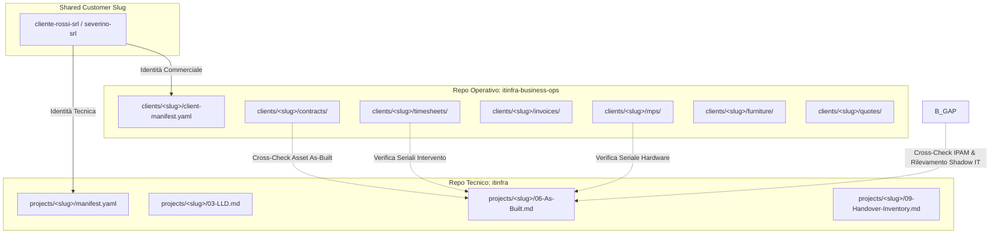
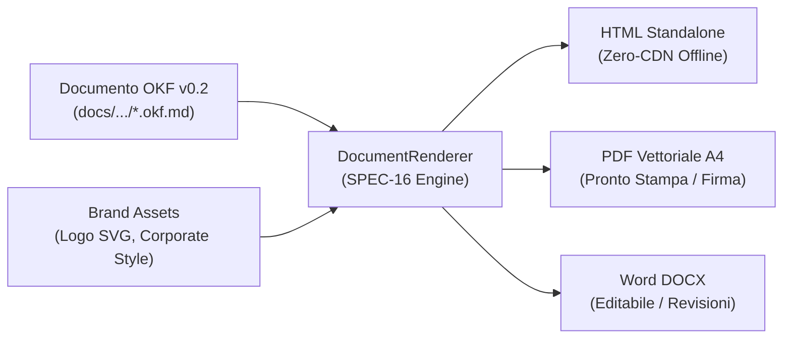
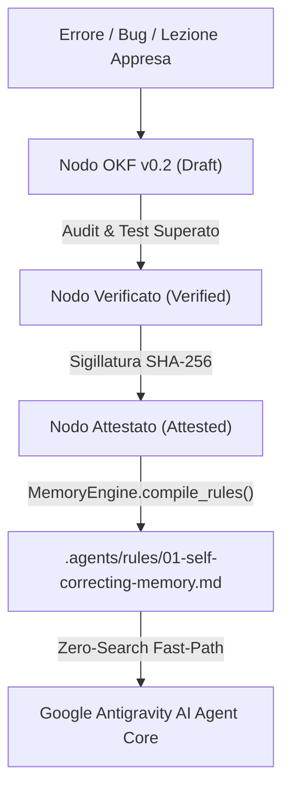
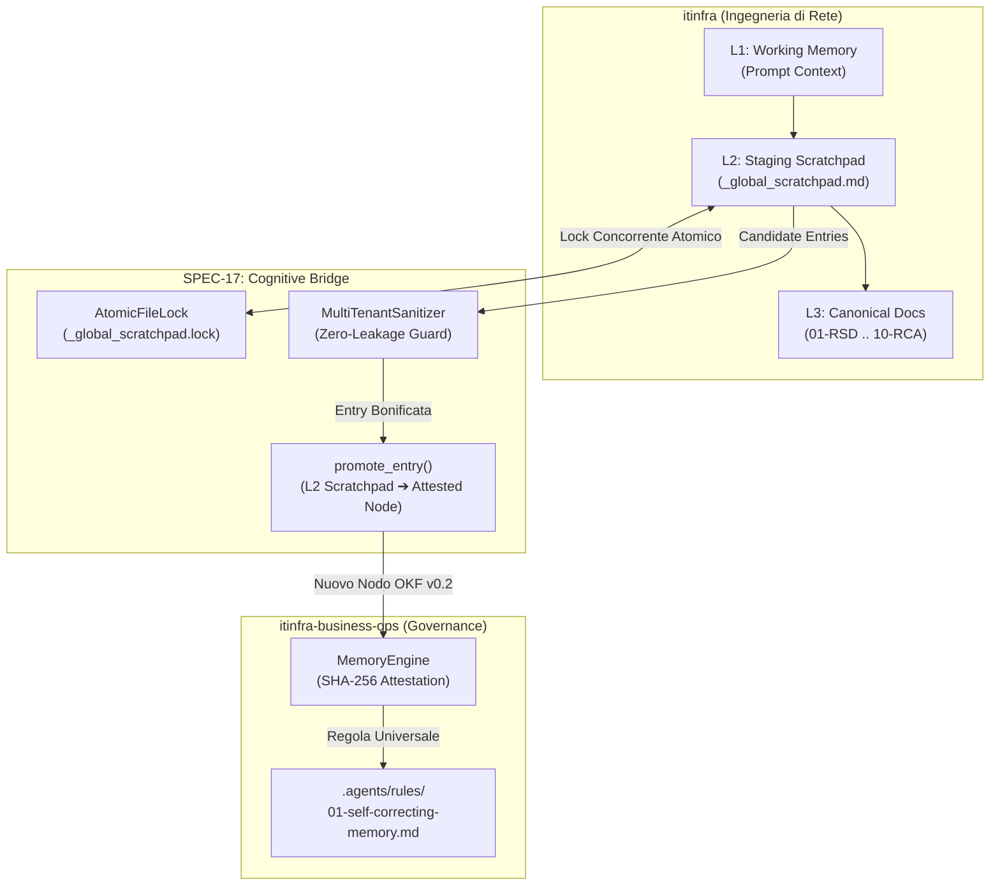

# 🏛️ Architettura di Repository: itinfra-business-ops & itinfra

## 1. Il Paradigma Hub-and-Spoke

L'architettura separa rigorosamente il repository ingegneristico (`itinfra`) dal repository gestionale/operativo (`itinfra-business-ops`).
L'anello di congiunzione deterministico è rappresentato dallo **Shared Customer Slug (`<slug>`)**.



### Perché Non nel Repo Tecnico (SoC & Compliance)
1. **Separation of Concerns (SoC)**: Il repo tecnico gestisce topologie di rete, configurazioni firewall, backup e conformità NIS2/ISO 27001. Il repo gestionale governa contratti, fatture elettroniche, canoni anticipati, SLA e logistica arredi.
2. **Access Control (RBAC)**: I tecnici di rete sul campo non devono accedere ai dati economici e ai margini commerciali. Gli addetti contabili o commerciali non devono modificare configurazioni di rete.
3. **Integrità dei Linter**: Gli audit tecnici (`it validate`) rimangono focalizzati sulla correttezza architetturale senza essere appesantiti da regole di fatturazione o codici SDI.

### 📐 Topologia ASCII Hub-and-Spoke

```text
                  ╔═══════════════════════════════════════════════╗
                  ║           SHARED CUSTOMER SLUG                ║
                  ║       <slug> (es. "severino-srl")             ║
                  ╚═══════════════════════╦═══════════════════════╝
                                          │
                   ┌──────────────────────┴──────────────────────┐
                   │                                             │
                   ▼                                             ▼
  ┌─────────────────────────────────┐           ┌─────────────────────────────────┐
  │   REPOSITORIO TECNICO ITINFRA   │           │ REPOSITORIO ITINFRA-BUSINESS-OPS│
  │    (Technical Ground Truth)     │           │   (Commercial / PSA / Finance)  │
  ├─────────────────────────────────┤           ├─────────────────────────────────┤
  │ • manifest.yaml (Progetto IT)   │           │ • client-manifest.yaml (Client) │
  │ • 01-Assessment / 02-HLD        │           │ • contracts/ (SLA & Monte Ore)  │
  │ • 03-LLD / 04-Network-IPAM      │           │ • timesheets/ (Rapportini Tec.) │
  │ • 05-Runbook (Procedure Op.)    │           │ • invoices/ (Fatture SDI v1.2)  │
  │ • 06-As-Built.md (Apparati/SN)  │◄──Read-───│ • quotes/ (Offerte Cost-Plus)   │
  │ • 07-Test-Report / 09-Inventory │   Only    │ • mps/ (Noleggio Stampanti MPS) │
  │ • NIS2 & ISO 27001 Compliance   │   Bridge  │ • furniture/ (Commesse Arredo)  │
  └─────────────────────────────────┘           └─────────────────────────────────┘
                   │                                             │
                   ▼                                             ▼
          CLI Ingegneristica:                           CLI Operativa & PSA:
              `it <cmd>`                                   `it-ops <cmd>`
```

### ⚙️ Pipeline Principale di itinfra (7 Fasi Ingegneristiche)

```text
  ┌─────────────────────────────────────────────────────────────────────────────┐
  │                      PIPELINE PRINCIPALE ITINFRA (7 FASI)                   │
  └──────────────────────────────────────┬──────────────────────────────────────┘
                                         │
  [FASE 1: Valutazione & Strategia]      ▼
  ┌─────────────────────────────────────────────────────────────────────────────┐
  │  01-Assessment.md (Stato Attuale)  ──►  02-HLD.md (High Level Architecture) │
  └──────────────────────────────────────┬──────────────────────────────────────┘
                                         │
  [FASE 2: Ingegneria di Dettaglio]      ▼
  ┌─────────────────────────────────────────────────────────────────────────────┐
  │  03-LLD.md (Low Level Design)      ──►  04-Network-IPAM.md (Subnet/VLAN/IP) │
  └──────────────────────────────────────┬──────────────────────────────────────┘
                                         │
  [FASE 3: Piani di Implementazione]     ▼
  ┌─────────────────────────────────────────────────────────────────────────────┐
  │  05-Runbook.md (Piani di Migrazione, Cut-Over e Procedure Operative)        │
  └──────────────────────────────────────┬──────────────────────────────────────┘
                                         │
  [FASE 4: Collaudo & Validazione]       ▼
  ┌─────────────────────────────────────────────────────────────────────────────┐
  │  06-As-Built.md (Config & Serials) ──►  07-Test-Report.md (FAT/SAT & Cert)  │
  └──────────────────────────────────────┬──────────────────────────────────────┘
                                         │
  [FASE 5: Consegna & Operations]        ▼
  ┌─────────────────────────────────────────────────────────────────────────────┐
  │  08-Handover-Operations.md         ──►  09-Handover-Inventory.md            │
  └──────────────────────────────────────┬──────────────────────────────────────┘
                                         │
  [FASE 6-7: Incident & Compliance]      ▼
  ┌─────────────────────────────────────────────────────────────────────────────┐
  │  10-Incident-RCA.md (Post-Mortem)  ──►  Audit NIS2 & Matrice ISO 27001      │
  └─────────────────────────────────────────────────────────────────────────────┘
```

> 📄 *Per il compendio completo di tutti i diagrammi ASCII, consulta [`docs/ASCII_DIAGRAMS.md`](ASCII_DIAGRAMS.md).*

---

## 2. Il Connettore Deterministico: `ITInfraBridge`
Il modulo Python `scripts/core/bridge.py` fornisce accesso in sola lettura agli artefatti di `itinfra`:
* Verifica esistenza progetto tecnico in `../itinfra/projects/<slug>/`.
* Estrae in modo deterministico i numeri di serie hardware e gli hostname da `06-As-Built.md`.
* Fornisce a `it-ops check <slug>` la matrice di riscontro per verificare che ogni apparato coperto da contratto SLA o oggetto di rapportino esista effettivamente nella documentazione tecnica.

---

## 3. Motore di Rendering & Exportazione Multi-Formato (`SPEC-16`)

Il modulo `DocumentRenderer` (`scripts/core/document_renderer.py`) standardizza la produzione documentale verso l'esterno secondo la specifica **SPEC-16**, implementando:

1. **Brand Identity Aure System**:
   - Palette cromatica ufficiale: Navy (`#0A192F`), Gold (`#D4AF37`), Slate (`#334155`), Light Gray (`#F8FAFC`).
   - Logo aziendale ufficiale vettorializzato (SVG scalabile e PNG Base64 Data URI) incorporato direttamente in intestazioni e copertine.
   - Dati societari legali conformi (Partita IVA, REA, PEC, sede legale).

2. **Tripla Esportazione Deterministica**:
   - **HTML Interattivo Zero-CDN**: Dashboard responsive navigabile, standalone, 100% offline (nessuna risorsa remota o CDN esterna).
   - **PDF Vettoriale A4**: Layout impaginato con interruzioni di pagina controllate (`@page`, `break-inside: avoid`), testate e piè di pagina numerati con timbro di autenticità.
   - **Microsoft Word (.docx)**: Documento nativo modificabile con stili tipografici aziendali e tracciamento revisioni.

3. **Integrazione CLI**:
   - Eseguibile tramite `.\it-ops.cmd export <doc.okf.md> [--format all|html|pdf|docx]`.



---

## 4. Motore di Memoria Auto-Correttiva Attestata (`OKF v0.2` & `MemoryEngine`)

Il modulo `MemoryEngine` (`scripts/core/memory_engine.py`) conferisce agli agenti AI (Google Antigravity, Claude Code, Cursor) una memoria persistente a lungo termine, basata su nodi di conoscenza formalizzati in standard **OKF v0.2 Concept**:

1. **Ciclo di Vita a Tre Livelli di Trust (Trust Tiers)**:
   - `draft`: Ipotesi o proposta generata dall'AI, non ancora convalidata formalmente.
   - `verified`: Regola verificata da un operatore umano o da test automatici, ma soggetta a finestra di obsolescenza (`stale_after`).
   - `attested`: Guardrail permanente, sigillato con hash crittografico SHA-256 e non modificabile senza ri-attestazione esplicita.

2. **Anti-Tampering Crittografico**:
   - Il calcolo dell'hash SHA-256 copre titolo, abstract semantico, categoria e punti chiave.
   - Il comando `.\it-ops.cmd learn audit` rileva istantaneamente alterazioni non autorizzate, nodi orfani o regole scadute.

3. **Compilazione Live in Direttive AI (`.agents/rules/`)**:
   - Tramite `.\it-ops.cmd learn sync`, tutti i nodi attestati e verificati vengono compilati nel file di regole persistente `.agents/rules/01-self-correcting-memory.md`.
   - L'agente Antigravity carica le regole a 0 secondi all'avvio della sessione, prevenendo ricorsioni degli stessi errori (es. UI scroll, omissione vincoli hardware, fast-path bypass).



---

## 5. Unified Cognitive Memory Bridge (`SPEC-17`)

Il modulo `CognitiveBridge` (`scripts/core/cognitive_bridge.py`) unifica l'architettura cognitiva di `itinfra` con `itinfra-business-ops`, realizzando una federazione di conoscenza continua:



### Garanzie Architetturali:
1. **Concorrenza Cross-Platform (`AtomicFileLock`)**: Scritture simultanee e promozioni tra i due repository sono regolate da lock esclusivo con timeout a 10s e gestione automatica di stale lock orfani.
2. **Zero-Leakage Multi-Tenant (`MultiTenantSanitizer`)**: Prima che qualsiasi annotazione tecnica o lezioni appresa venga promossa a guardrail globale, il sanitizer scansiona e blocca pattern sensibili: indirizzi IPv4/IPv6 privati, domini FQDN, credenziali `vault://`, codici fiscali, IBAN o ragioni sociali specifiche di singoli clienti.
3. **Promozione Trasparente da CLI**:
   - `.\it-ops.cmd learn promotables`: elenca tutte le voci dello scratchpad globale `itinfra` idonee alla promozione.
   - `.\it-ops.cmd learn promote <entry_id> --code <CODE> --title "..."`: promuove la voce in nodo OKF v0.2, sigilla con SHA-256 e rigenera le regole agentiche live.

