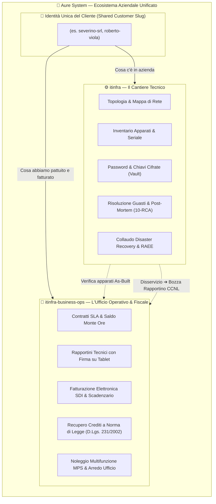

# 🏢 Guida Globale dell'Ecosistema ITInfra & Business Ops
### *Manuale Operativo e Funzionale per Titolari, Sistemisti, Commerciali e Amministrazione*

> **Autore:** Aure System di Eduardo Possumato  
> **Versione:** 1.0 (Settembre 2026)  
> **Repository Collegati:** [`itinfra`](https://github.com/matrixNeo76/itinfra) & [`itinfra-business-ops`](https://github.com/matrixNeo76/itinfra-business-ops)  

---

## 🧭 1. L'Ecosistema in 3 Minuti

Il nostro applicativo è una piattaforma aziendale completa progettata per gestire a 360° una moderna azienda di **servizi informatici gestiti (MSP), telecomunicazioni, impianti e noleggio**.

L'ecosistema è composto da due anime perfettamente sincronizzate:

### Perché due repository separati? (Separation of Concerns)
1. **Riservatezza & Sicurezza**: Il sistemista che configura uno switch o un firewall non ha bisogno di vedere l'IBAN del cliente, i costi di acquisto fornitore o lo scadenzario dei pagamenti.
2. **Integrità Contabile**: La contabilità e la fatturazione operano con rigore matematico e fiscale (D.Lgs. 231/2002, codici SDI, IVA) senza essere appesantite dai log o dalle configurazioni tecniche RouterOS/PowerShell.
3. **Ponte Deterministico**: I due mondi comunicano tramite il **Customer Slug** (es. `severino-srl`), garantendo che non possa mai esistere un apparato installato dal tecnico che non sia presente nel contratto di assistenza o fatturato.

---

## 🎮 2. I 3 Modi per Utilizzare l'Applicativo

L'operatore può scegliere l'esperienza di lavoro che preferisce in base al proprio ruolo e momento:

| Modalità | Per chi è pensata | Come si usa | Esempio Pratico |
| :--- | :--- | :--- | :--- |
| **🧠 1. In Chat con l'Assistente AI** | Chiunque preferisca parlare o scrivere in italiano | Scrivi direttamente in chat nella console AI (Google Antigravity, Claude, Gemini) | *"Mostrami la scheda di Severino"*, *"Crea un rapportino per ieri sera"*, *"Calcola la mora per Viola"* |
| **🎛️ 2. Cruscotto Grafico (Mission Control UI)** | Titolari, Manager, Helpdesk visivo | Apri il cruscotto nel browser con KPI a colori, schede clienti e pulsanti cliccabili | Digita `ui` o clicca sul link generato per esplorare grafi, alert e lo stato di salute generale |
| **⚡ 3. Terminale Rapido (CLI Prompt)** | Tecnici, Sistemisti, DevOps | Esegui i comandi diretti con `.\it.cmd` (tecnico) o `.\it-ops.cmd` (business) | `.\it-ops.cmd status severino-srl` `.\it-ops.cmd credit remind severino-srl --stage 2` |

---

## 📋 3. Tutte le Funzionalità Spiegate Passo-Passo

### 🟢 3.1 Inserimento Nuovo Cliente in 1 Solo Secondo (`onboard`)
Quando acquisiamo un nuovo cliente, non serve compilare decine di moduli o creare cartelle a mano:
- **Cosa fa**: Con il solo comando `onboard`, il sistema genera simultaneamente l'anagrafica fiscale, la cartella del progetto tecnico, l'assegnazione delle classi di rete (IPAM), il contratto SLA iniziale e la scheda clienti.
- **Garanzia**: Verifica istantaneamente che la Partita IVA e il Codice Fiscale siano validi e certifica che i due repository siano allineati al 100% (*Zero-Drift*).

---

### 🔵 3.2 Progettazione, As-Built e Password Cifrate
- **Documentazione a 10 Fasi**: Dalle prime interviste ai requisiti (`01-RSD`), al progetto di alto livello (`02-HLD`), alla tabella IP/VLAN (`03-LLD`), fino alla mappa reale dell'installato (`06-As-Built.md`).
- **Cassaforte Cifrata (`vault://`)**: Nessuna password o chiave di accesso viene mai salvata in chiaro nei documenti o su Git. Le credenziali risiedono in un archivio cifrato con algoritmo militare **AES-256-GCM** accessibile solo al personale autorizzato.
- **Riconciliazione Inversa**: Se sul campo il tecnico rileva uno switch o un IP diverso rispetto al progetto, il sistema confronta l'As-Built e aggiorna automaticamente il manifesto.

---

### 🟡 3.3 Interventi sul Campo e Rapportini Digitali con Firma
Quando un tecnico si reca dal cliente o interviene da remoto:
- **Compilazione Rapida**: Orario di inizio (`clock_in`), orario di fine (`clock_out`), apparati impattati e pezzi di ricambio impiegati.
- **Firma Digitale su Tablet/Smartphone**: Generazione istantanea di una pagina HTML con Canvas interattivo dove il referente cliente appone la propria firma con il dito o pennino.
- **Maggiorazioni Orarie CCNL ICT Automatiche**:
  - Intervento diurno feriale: **1.0x** (ore ordinarie).
  - Intervento notturno feriale (22:00 - 06:00): **1.20x** (+20% di addebito).
  - Intervento festivo / weekend: **1.30x** (+30% di addebito).
  - Intervento festivo notturno: **1.50x** (+50% di addebito).
- **Scarico Automatico SLA**: Le ore effettive calcolate vengono immediatamente sottratte dal monte ore del contratto attivo.
- **Valore Legale**: Il rapportino acquisisce sigillo crittografico SHA-256 a valore probatorio ex Art. 2702 c.c. e Codice Amministrazione Digitale.

---

### 🟠 3.4 Contratti SLA, Monte Ore e Prevenzione Over-Budget
- **Formule Flessibili**: Contratti a monte ore a scalare (es. 20, 50, 100 ore), canoni Flat all-inclusive (MSP) o canoni ibridi con franchigia.
- **Soglie di Allarme**: Alert automatico al raggiungimento dell'80% del monte ore consumato.
- **Prevenzione del "Lavoro Gratis"**: Se il cliente esaurisce le ore contrattuali, il sistema blocca il consumo a canone e reindirizza le ore eccedenti (*over-budget*) alla fatturazione straordinaria alla tariffa extra concordata.
- **Sorveglianza Scadenze**: Alert a **60 giorni** per rinegoziare il canone e a **30 giorni** per verificare i termini di disdetta.

---

### 🖨️ 3.5 Noleggio Stampanti e Multifunzione (MPS)
- **Costo Copia Trasparente**: Canone base semestrale/trimestrale con quota copie incluse (es. 3.000 copie b/n e 500 colore).
- **Telelettura Automatica**: Interrogazione via rete locale (SNMP v2c/v3) dei contatori di stampa reali degli apparati.
- **Alert Toner e Consumabili**: Notifica preventiva quando il livello di toner scende sotto il 15%, proponendo l'ordine del ricambio originale OEM prima del blocco macchina.
- **Conguagli Precisi**: Calcolo esatto al centesimo delle copie eccedenti a fine periodo inviate alla fatturazione.

---

### 📐 3.6 Preventivi Commerciali e Commesse Arredo Ufficio
- **Preventivatore Interattivo Cost-Plus**: Calcolo automatico dei margini netti, con ricarichi differenziati tra hardware, licenze software e manodopera specialistica.
- **Export con Logo Aziendale Ufficiale**: Esportazione in DOCX, PDF vettoriale A4 e HTML elegante Zero-CDN con logo ufficiale Aure System di Eduardo Possumato.
- **Commesse Arredo Ufficio**: Gestione chiavi in mano per progetti di arredo (rilievo metrico, distinte componenti, posa in opera e verbale di collaudo finale).

---

### 💶 3.7 Fatturazione SDI, Scadenzario e Recupero Crediti ex D.Lgs. 231/2002
- **Fattura Elettronica SDI v1.2**: Generazione del tracciato ministeriale XML conforme alle specifiche dell'Agenzia delle Entrate (FPR12 per privati e FPA12 per Pubbliche Amministrazioni con codici CIG/CUP).
- **Scadenzario Multi-Rata**: Ripartizione delle rate a 30/60 giorni fine mese con calcolo allineato all'ultimo giorno del mese.
- **Recupero Crediti a Norma di Legge (D.Lgs. 231/2002)**:
  - *Interessi di Mora Automatici*: Dal giorno successivo alla scadenza, si applica il tasso BCE + 8% (attualmente **11.50% annuo**) su base 365 giorni.
  - *Indennizzo Forfettario*: Addebito ex lege di **€ 40,00** per fattura a ristoro delle spese di recupero.
- **Lettere di Sollecito Graduate a 3 Stadi**:
  1. *Stadio 1 (Cortesia)*: Promemoria amichevole delle scadenze e coordinate IBAN.
  2. *Stadio 2 (Mora 231)*: Sollecito formale con conteggio analitico di capitale, mora ed indennizzo di € 40,00.
  3. *Stadio 3 (Diffida ad Adempiere)*: Atto formale ex Art. 1219 c.c. con termine perentorio di 5 giorni, preavviso di sospensione immediata dei servizi SLA e passaggio al legale per decreto ingiuntivo.

---

### 🛡️ 3.8 Sicurezza, Continuità Operativa e Sostenibilità (GDPR & RAEE)
- **Ponte Incident-to-Report**: La gestione di un guasto registrato nella scheda post-mortem `10-RCA.md` in `itinfra` attiva un avviso nel *Safe Action Gate* per generare la bozza di rapportino con maggiorazioni CCNL nel repository business.
- **Esercitazione Annuale Disaster Recovery (`dr-drill`)**: Procedura guidata a 5 step conforme all'**Art. 32 GDPR** e **D.Lgs. 231/2001 (Art. 24-bis)** per ripristinare i backup in ambiente sicuro, misurare i tempi effettivi RTO/RPO ed emettere il Verbale Ufficiale per l'Organismo di Vigilanza (OdV) e il DPO.
- **Aggiornamento Firmware Protetto (`firmware-upgrade`)**: Backup configurazione nel vault, deploy in modalità protetta (*Safe Mode*) con timer di auto-ripristino in caso di caduta connessione, test di connettività e conferma permanente.
- **Dismissione Sicura & Smaltimento RAEE (`hardware-decommissioning-raee`)**: Cancellazione sicura dei supporti di memoria secondo standard militare **NIST 800-88 Purge** (a norma del Provvedimento Garante Privacy 13/10/2008), rimozione dall'infrastruttura ed emissione del Formulario Identificazione Rifiuti (**FIR RAEE Cat. 3-4** ex D.Lgs. 49/2014).

---

## 🚦 4. Guida Rapida: "Cosa Devo Fare Se...?"

| Situazione Quotidiana | Cosa Fare in Chat | Comando da Terminale | Cosa Succede Dietro le Quinte |
| :--- | :--- | :--- | :--- |
| **Acquisisco un nuovo cliente** | `onboard cliente-rossi` | `.\it-ops.cmd onboard cliente-rossi --client "Rossi Srl"` | Crea anagrafica, cartella tecnica, contratti e verifica P.IVA/CF |
| **Voglio vedere la situazione completa** | `stato cliente-rossi` | `.\it-ops.cmd status cliente-rossi` | Mostra apparati, ore residue, fatture e stato documenti |
| **Apro il cruscotto grafico visivo** | `ui` | `.\it-ops.cmd ui` | Lancia la Mission Control Dashboard nel browser con pulsanti e grafi |
| **Vado a fare un intervento tecnico** | `rapportino cliente-rossi` | `.\it-ops.cmd report cliente-rossi new` | Apre la maschera per inserire orari, apparati e catturare la firma su tablet |
| **Un cliente chiede quante ore gli restano** | `contratto cliente-rossi` | `.\it-ops.cmd contract cliente-rossi balance` | Mostra il monte ore totale, consumato, residuo e percentuale |
| **Devo calcolare la telelettura stampanti** | `mps cliente-rossi` | `.\it-ops.cmd mps cliente-rossi calculate` | Calcola le copie fatte, copie incluse, eccedenze e consumabili |
| **A fine mese devo fatturare tutti i clienti** | `workflow run monthly-closing` | `.\it-ops.cmd workflow run monthly-closing` | Esegue la chiusura contabile, calcola i conguagli e prepara i lotti SDI |
| **Un cliente è in ritardo coi pagamenti** | `credit status cliente-rossi` | `.\it-ops.cmd credit remind cliente-rossi --stage 2` | Calcola gli interessi D.Lgs. 231/2002 (+€40 spese) e genera la lettera |
| **Devo simulare un preventivo con margini** | `preventivo cliente-rossi` | `.\it-ops.cmd quote cliente-rossi calculate` | Calcola prezzo di vendita, costi e marginalità esatta |
| **C'è stato un disservizio grave di rete** | `troubleshoot init cliente-rossi` | `it troubleshoot init cliente-rossi TICK-01` | Guida la diagnosi L1-L7, crea 10-RCA e notifica il rapportino |
| **Dobbiamo fare il test annuale di Disaster Recovery** | `workflow run dr-drill` | `.\it-ops.cmd workflow run dr-drill --slug cliente-rossi` | Ripristina i backup, calcola RTO/RPO e genera il verbale per l'OdV |
| **Devo rottamare un vecchio PC o server** | `workflow run hardware-decommissioning-raee` | `.\it-ops.cmd workflow run hardware-decommissioning-raee` | Pulisce i dati a norma NIST 800-88 ed emette il formulario FIR RAEE |

---

## 🇮🇹 5. Il Presidio di Garanzia e Rispetto della Legge Italiana

L'intero ecosistema è progettato specificamente per le imprese italiane:
1. **Fisco e Anagrafiche**:
   - Algoritmo di **Luhn modificato** per le Partite IVA.
   - Algoritmo ministeriale **DM 23/12/1976** per i Codici Fiscali con supporto ufficiale di tutte le lettere di **omocodia** (`L`..`V`).
   - Convalida dei canali telematici **SDI** (B2B 7 car. e IPA 6 car. per Pubblica Amministrazione).
2. **Tutela del Credito Commerciale**:
   - Applicazione rigorosa del **D.Lgs. 9 ottobre 2002 n. 231** (modificato dal D.Lgs. 192/2012 in attuazione della direttiva 2011/7/UE) con decorrenza automatica degli interessi e risarcimento forfettario spese.
3. **Tutela del Lavoro Tecnico**:
   - Riconoscimento delle maggiorazioni orarie contrattuali da **CCNL Metalmeccanico / Terziario ICT** su interventi notturni e festivi.
4. **Protezione dei Dati e Cybersecurity**:
   - Piena conformità all'**Art. 32 del Regolamento UE 2016/679 (GDPR)** per la continuità operativa e all'**Art. 24-bis del D.Lgs. 231/2001** sui delitti informatici.
5. **Ambiente e Rifiuti Tecnologici**:
   - Piena aderenza al **D.Lgs. 49/2014** per la tracciabilità dello smaltimento RAEE e al **Provvedimento del Garante Privacy 13/10/2008** sulla bonifica preventiva dei supporti di memoria.

---

## 📖 6. Glossario dei Termini Aziendali

- **Slug (`<slug>`)**: Il nome in codice del cliente (es. `severino-srl`), scritto tutto in minuscolo con trattini. È la chiave unica che collega cartelle, contratti, apparati e fatture.
- **SLA (Service Level Agreement)**: Livelli di servizio contrattuali (tempi massimi di risposta e risoluzione di un guasto).
- **Monte Ore (Hours Bank)**: Pacchetto di ore prepagate dal cliente che vengono scalate a scatti (di norma 30 minuti) ad ogni intervento.
- **Over-Budget**: Lavoro svolto oltre il monte ore disponibile, che viene automaticamente tariffato extra a fine mese per non perdere fatturato.
- **MPS (Managed Print Services)**: Noleggio a costo copia delle stampanti e multifunzione con monitoraggio remoto dei contatori e dei toner.
- **As-Built**: Il documento tecnico che fotografa la situazione reale installata dal cliente (apparati, seriali, indirizzi IP, VLAN).
- **10-RCA (Root Cause Analysis)**: Scheda post-mortem redatta dopo un guasto grave per individuarne la causa radice, la soluzione applicata e le contromisure future.
- **FIR RAEE**: Formulario di Identificazione Rifiuti per apparecchiature elettriche ed elettroniche dismesse a norma di legge.
- **SDI (Sistema di Interscambio)**: La piattaforma dell'Agenzia delle Entrate per la trasmissione e ricezione delle fatture elettroniche.
- **Safe Action Gate**: Meccanismo di sicurezza che impedisce all'intelligenza artificiale o a processi automatici di inviare email, cancellare dati o addebitare importi senza la previa approvazione esplicita dell'operatore umano (*Human-in-the-Loop*).
