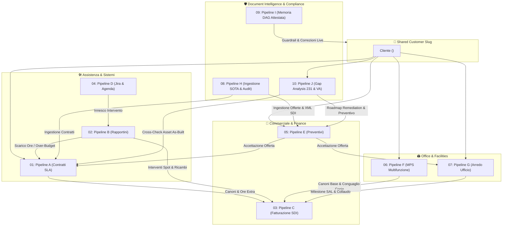

# 📚 Indice Master delle Pipeline Operative

Benvenuto nel compendio formale **OKF v0.2** di **`itinfra-business-ops`**.  
Questo documento censisce, mappa e relaziona le **11 pipeline native** di gestione operativa, commerciale, contabile, logistica, documentale e di conformità legale.

---

## 🗺️ Mappa delle Relazioni delle 11 Pipeline

---

## 📑 Registro Documentale OKF v0.2

| Documento Specifico | ID Univoco OKF | Dominio Operativo | Schemi Formale Associato |
| :--- | :--- | :--- | :--- |
| [`01-pipeline-a-contracts.md`](01-pipeline-a-contracts.md) | `spec-ops-pipeline-a-contracts` | Contratti SLA & Monte Ore | `contract.schema.yaml` |
| [`02-pipeline-b-reports.md`](02-pipeline-b-reports.md) | `spec-ops-pipeline-b-reports` | Time-Tracking & Rapportini | `report.schema.yaml` |
| [`03-pipeline-c-billing.md`](03-pipeline-c-billing.md) | `spec-ops-pipeline-c-billing` | Fatturazione SDI v1.2 (FPR12/FPA12) | `billing.schema.yaml` |
| [`04-pipeline-d-jira-calendar.md`](04-pipeline-d-jira-calendar.md) | `spec-ops-pipeline-d-jira-calendar` | Jira & Calendario RFC 5545 | `jira_sync.schema.yaml` |
| [`05-pipeline-e-quotes.md`](05-pipeline-e-quotes.md) | `spec-ops-pipeline-e-quotes` | Preventivazione Multiprodotto | `quote.schema.yaml` |
| [`06-pipeline-f-mps-rental.md`](06-pipeline-f-mps-rental.md) | `spec-ops-pipeline-f-mps-rental` | MPS, Costo Copia & SNMP v3 | `mps.schema.yaml` |
| [`07-pipeline-g-furniture.md`](07-pipeline-g-furniture.md) | `spec-ops-pipeline-g-furniture` | Commesse Arredo & Collaudo | `furniture.schema.yaml` |
| [`08-pipeline-h-document-ingestion.okf.md`](08-pipeline-h-document-ingestion.okf.md) | `spec-ops-pipeline-h-document-ingestion` | Ingestione SOTA & Audit Triangolare | N/A (Multi-Engine) |
| [`09-pipeline-i-memory-learning.okf.md`](09-pipeline-i-memory-learning.okf.md) | `spec-ops-pipeline-i-memory-learning` | Memoria DAG & Attestation | `registry.yaml` |
| [`10-pipeline-j-gap-analysis.okf.md`](10-pipeline-j-gap-analysis.okf.md) | `spec-ops-pipeline-j-gap-analysis` | Gap Analysis 231 & CVSS v4.0 | `gap_analysis.schema.yaml` |
| [`11-pipeline-k-client-onboarding.okf.md`](11-pipeline-k-client-onboarding.okf.md) | `spec-ops-pipeline-k-onboard` | Onboarding Unificato & Dual Storage | `client.schema.yaml` |
| [`../ASCII_DIAGRAMS.md`](../ASCII_DIAGRAMS.md) | `spec-ops-ascii-diagrams` | Compendio Diagrammi ASCII Hub & Pipelines | N/A |

---

## 🏛️ Specifiche Architetturali di Sistema (Core Specs)

Oltre alle 11 pipeline operative verticali, il sistema include le **Specifiche Architetturali di Governance Trasversale**:

| Specifica | Titolo Formale OKF v0.2 | Ambito & Descrizione | Documento Collegato |
| :---: | :--- | :--- | :--- |
| **SPEC-08** | Ingestione Visiva Nativa & OKF v0.2 | Parsing nativo SOTA pixel-to-markdown e zero-hallucination | [`../specs/08-spec-visual-document-ingestion-okf.md`](../specs/08-spec-visual-document-ingestion-okf.md) |
| **SPEC-16** | Enterprise Document Templates & Branding | Brand identity ufficiale Aure System, rendering DOCX/PDF/HTML | [`../specs/16-spec-enterprise-document-templates-branding.md`](../specs/16-spec-enterprise-document-templates-branding.md) |
| **SPEC-17** | Unified Cognitive Memory Bridge | Memoria auto-correttiva attestata cross-repo con itinfra | [`../specs/17-spec-unified-cognitive-memory-bridge.md`](../specs/17-spec-unified-cognitive-memory-bridge.md) |
| **SPEC-18** | SOTA Pipelines Evolution | FPA12 PA, CIG/CUP, CAMT.053, Pasqua Gaussiana, SNMP v3 USM | [`../specs/18-spec-sota-pipelines-evolution.md`](../specs/18-spec-sota-pipelines-evolution.md) |
| **SPEC-19** | Gap Analysis & Compliance 231 | Audit peritale reati informatici Art. 24-bis e scoring CVSS v4.0 | [`../specs/19-spec-gap-analysis-pipeline.md`](../specs/19-spec-gap-analysis-pipeline.md) |
| **SPEC-20** | Mission Control & Autonomous Swarm | Dashboard 360°, Swarm di agenti deterministici, Git Guard hooks | [`../specs/20-spec-mission-control-and-autonomous-swarm.okf.md`](../specs/20-spec-mission-control-and-autonomous-swarm.okf.md) |
| **SPEC-21** | Workflow Orchestration & Lifecycle Assurance | Orchestrazione a stati finiti (FSM), checkpoint e ripresa atomica | [`../specs/21-spec-workflow-orchestration-and-lifecycle-assurance.okf.md`](../specs/21-spec-workflow-orchestration-and-lifecycle-assurance.okf.md) |
| **SPEC-22** | Event-Driven Trigger System & Safe Action Gate | Rilevamento eventi proattivi e presidio autorizzativo umano | [`../specs/22-spec-event-driven-trigger-system-and-action-gate.okf.md`](../specs/22-spec-event-driven-trigger-system-and-action-gate.okf.md) |
| **SPEC-23** | Tassonomia Architetturale Integrata | Matrice di determinismo dei 10 concetti architetturali di sistema | [`../specs/23-spec-integrated-architectural-taxonomy.okf.md`](../specs/23-spec-integrated-architectural-taxonomy.okf.md) |
| **SPEC-24** | Conformità Nazionale Italiana & Estensioni | Presidio P.IVA/CF/SDI, mora 231, CCNL e workflow tecnici FSM | [`../specs/24-spec-italian-compliance-and-high-return-extensions.okf.md`](../specs/24-spec-italian-compliance-and-high-return-extensions.okf.md) |
