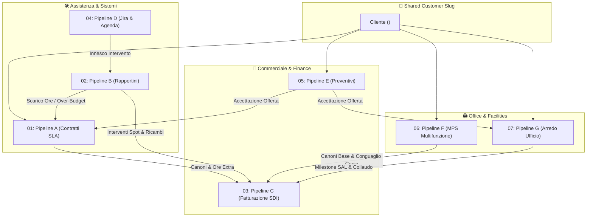

# 📚 Indice Master delle Pipeline Operative

Benvenuto nel compendio formale **OKF v0.2** di **`itinfra-business-ops`**.  
Questo documento censisce, mappa e relaziona le 7 pipeline di gestione operativa, commerciale, contabile e logistica.

---

## 🗺️ Mappa delle Relazioni delle Pipeline

---

## 📑 Registro Documentale OKF v0.2

| Documento Specifico | ID Univoco OKF | Dominio Operativo | Schemi Formale Associato |
| :--- | :--- | :--- | :--- |
| [`01-pipeline-a-contracts.md`](file:///c:/Users/auresystem/repos/itinfra-business-ops/docs/pipelines/01-pipeline-a-contracts.md) | `spec-ops-pipeline-a-contracts` | Contratti SLA & Monte Ore | `contract.schema.yaml` |
| [`02-pipeline-b-reports.md`](file:///c:/Users/auresystem/repos/itinfra-business-ops/docs/pipelines/02-pipeline-b-reports.md) | `spec-ops-pipeline-b-reports` | Time-Tracking & Rapportini | `report.schema.yaml` |
| [`03-pipeline-c-billing.md`](file:///c:/Users/auresystem/repos/itinfra-business-ops/docs/pipelines/03-pipeline-c-billing.md) | `spec-ops-pipeline-c-billing` | Fatturazione SDI v1.2 | `billing.schema.yaml` |
| [`04-pipeline-d-jira-calendar.md`](file:///c:/Users/auresystem/repos/itinfra-business-ops/docs/pipelines/04-pipeline-d-jira-calendar.md) | `spec-ops-pipeline-d-jira-calendar` | Jira & Calendario RFC 5545 | `jira_sync.schema.yaml` |
| [`05-pipeline-e-quotes.md`](file:///c:/Users/auresystem/repos/itinfra-business-ops/docs/pipelines/05-pipeline-e-quotes.md) | `spec-ops-pipeline-e-quotes` | Preventivazione Multiprodotto | `quote.schema.yaml` |
| [`06-pipeline-f-mps-rental.md`](file:///c:/Users/auresystem/repos/itinfra-business-ops/docs/pipelines/06-pipeline-f-mps-rental.md) | `spec-ops-pipeline-f-mps-rental` | MPS, Costo Copia & SNMP | `mps.schema.yaml` |
| [`07-pipeline-g-furniture.md`](file:///c:/Users/auresystem/repos/itinfra-business-ops/docs/pipelines/07-pipeline-g-furniture.md) | `spec-ops-pipeline-g-furniture` | Commesse Arredo & Collaudo | `furniture.schema.yaml` |
| [`../ASCII_DIAGRAMS.md`](file:///c:/Users/auresystem/repos/itinfra-business-ops/docs/ASCII_DIAGRAMS.md) | `spec-ops-ascii-diagrams` | Compendio Diagrammi ASCII Hub & Pipelines | N/A |
