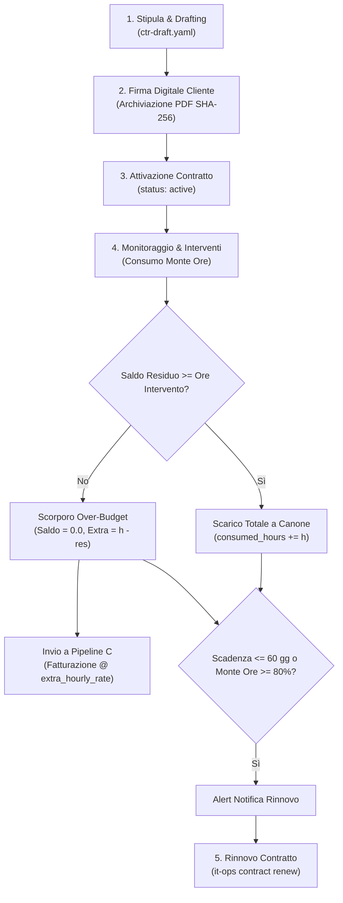

# 📑 Pipeline A — Contratti di Assistenza IT, SLA & Monte Ore

## 1. Obiettivi e Ambito Operativo
La **Pipeline A** governa il ciclo di vita dei contratti di assistenza tecnica, traducendo gli accordi commerciali cartacei in vincoli operativi deterministici per tecnici, helpdesk e contabilità:
* Gestione di formule a **Monte Ore a scalare** (`hours_bank`), **Canone Flat MSP** (`msp_flat`) o **Ibride**.
* Garanzia dei livelli di servizio **SLA** differenziati per gravità del guasto.
* Protezione del perimetro apparati tramite cross-check con il repository tecnico [`itinfra`](https://github.com/matrixNeo76/itinfra).
* Prevenzione del mancato fatturato tramite gestione automatica dell'**over-budget**.

---

## 2. Diagramma di Flusso Esecutivo



---

## 3. Regole Deterministiche di Business

### 3.1 Livelli di Servizio (SLA)
| Tier SLA | Prima Risposta (Presa in Carico) | Risoluzione Obiettivo | Finestra Oraria | Esempi di Guasto |
| :--- | :---: | :---: | :--- | :--- |
| **Critical** | $\le$ 2 ore | $\le$ 4 ore | H24 / Lun-Dom | Fermo totale host Hyper-V, blocco firewall perimetrale |
| **High** | $\le$ 4 ore | $\le$ 8 ore | 08:30-18:30 Lun-Ven | Degrado performance server, guasto switch secondario |
| **Standard** | $\le$ 8 ore | $\le$ 24 ore | 08:30-18:30 Lun-Ven | Configurazione nuova postazione, richiesta credenziali |

### 3.2 Algoritmo di Gestione Over-Budget
Dato un monte ore totale $H_{tot}$, ore già consumate $H_{cons}$, e un nuovo intervento di durata $h_{int}$:
1. Calcolo ore residue: $H_{res} = \max(0, H_{tot} - H_{cons})$.
2. Se $h_{int} \le H_{res}$:
   $$H_{cons}^{new} = H_{cons} + h_{int}, \quad h_{extra} = 0$$
3. Se $h_{int} > H_{res}$:
   $$H_{cons}^{new} = H_{tot}, \quad h_{extra} = h_{int} - H_{res}$$
   La quantità $h_{extra}$ viene memorizzata sia nel rapportino sia nel contratto e addebitata nella fattura mensile successiva al costo di $extra\_hourly\_rate$ (default: 80 €/h).

---

## 4. Schemi & Comandi CLI

* **Schema Formale**: `schemas/contract.schema.yaml`
* **Percorso Storage**: `clients/<slug>/contracts/ctr-<slug>-<anno>.yaml`

### Sintassi Comandi:
```powershell
# Verifica stato e saldo ore contratto attivo
.\it-ops.cmd contract <slug> status

# Cross-check con l'As-Built in itinfra
.\it-ops.cmd check <slug>

# Generare la bozza di rinnovo per l'anno successivo
.\it-ops.cmd contract <slug> renew --contract-id CTR-2026-SEVERINO
```


---

## 5. Sorveglianza Continua Scadenze & Rinnovi (SPEC-21, SPEC-24)

In aderenza alle specifiche **SPEC-21** e **SPEC-24**:
- **Demone di Sorveglianza Contrattuale (`CreditDaemon`)**: Monitora costantemente la data di scadenza (`end_date`) dei contratti attivi emettendo alert a **60 giorni** (avvio trattativa revisione tariffe) e a **30 giorni** (termine per eventuale disdetta a norma delle condizioni generali di contratto).
- **Workflow a Stati Finiti `contract-renewal`**: Avvia la procedura FSM guidata in 4 step per la revisione del canone, aggiornamento monte ore, redazione nuova appendice contrattuale e archiviazione del contratto precedente.
- **Trigger Proattivo `contract.renewal.*`**: Inoltra la proposta di rinnovo al **Safe Action Gate** (SPEC-22) richiedendo l'autorizzazione dell'amministrazione prima di apportare modifiche all'anagrafica cliente.
