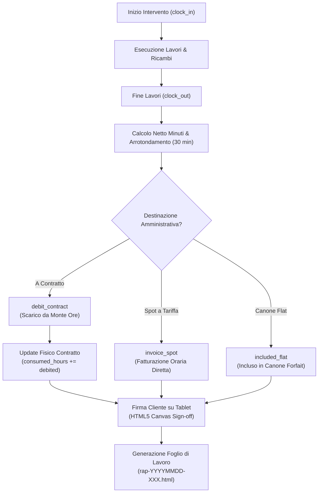

# ⏱️ Pipeline B — Rapportini di Assistenza, Time-Tracking & Firma

## 1. Obiettivi e Ambito Operativo
La **Pipeline B** costituisce il cuore dell'operatività sul campo per i tecnici IT:
* Registrazione precisa dei timestamp di inizio (`clock_in`) e fine (`clock_out`) intervento.
* Arrotondamento deterministico secondo gli scatti contrattuali concordati (default: 30 min).
* Associazione degli apparati coinvolti (cross-check con seriali As-Built).
* Cattura immediata della firma del cliente su tablet o smartphone con emissione simultanea della scheda di lavoro in HTML/PDF.
* Scarico contestuale dal monte ore (Pipeline A) o flag per fatturazione separata (Pipeline C).

---

## 2. Diagramma di Flusso Esecutivo



---

## 3. Regole Deterministiche di Calcolo

### 3.1 Arrotondamento Orario a Scatti di 30 Minuti
Dato $T_{in}$ (orario inizio), $T_{out}$ (orario fine) e pausa $P_{min}$:
$$\Delta_{min} = (T_{out} - T_{in}) - P_{min}$$
$$\text{Steps} = \left\lceil \frac{\Delta_{min}}{30} \right\rceil$$
$$H_{rounded} = \frac{\text{Steps} \times 30}{60} = \text{Steps} \times 0.5 \text{ ore}$$

*Esempio*: 
* Dalle 09:00 alle 10:10 ($\Delta = 70 \text{ min}$).
* $\text{Steps} = \lceil 70 / 30 \rceil = 3$.
* Ore addebitate: $3 \times 0.5 = 1.5 \text{ ore}$.

### 3.2 Distinzione Contabile (`ledger_action`)
* **`debit_contract`**: Consuma il saldo del contratto attivo; se esaurito, genera $extra\_hours$.
* **`invoice_spot`**: Genera una riga a tariffa standard (75 €/h) nel batch di fine mese.
* **`included_flat`**: Consuntiva le ore lavorate a scopo di controllo di gestione interno senza addebiti.

---

## 4. Schemi & Comandi CLI

* **Schema Formale**: `schemas/report.schema.yaml`
* **Percorso Storage**: `clients/<slug>/timesheets/rap-<YYYYMMDD>-<ID>.yaml` e `.html`

### Sintassi Comandi:
```powershell
# Creazione rapportino completo con ricambi e firma
.\it-ops.cmd report <slug> new `
  --tech "Mario Rossi" `
  --desc "Sostituzione switch di piano e ripristino VLAN" `
  --in "14:00" --out "15:45" `
  --action-type debit_contract `
  --assets "E4200891F7BC" `
  --parts "SW-24P:Switch 24P PoE:1:280.00" `
  --signed --signer "Marco Severino"

# Visualizzare il riepilogo delle ore dell'archivio rapportini
.\it-ops.cmd report <slug> balance
```
