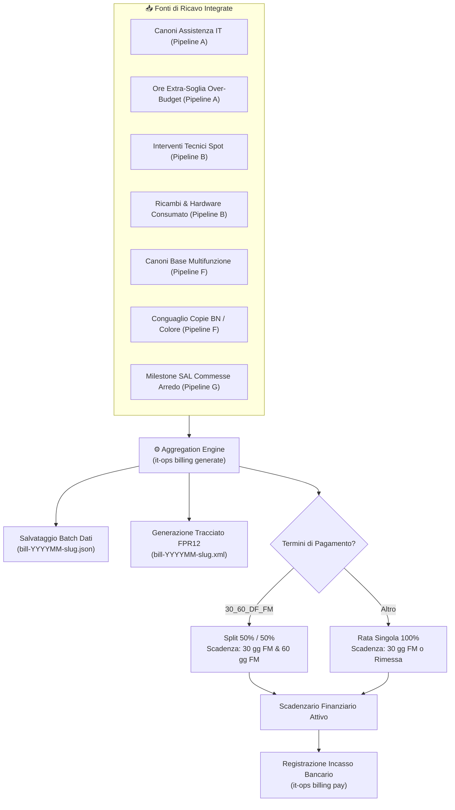

# 💶 Pipeline C — Fatturazione Elettronica SDI v1.2 & Scadenzario

## 1. Obiettivi e Ambito Operativo
La **Pipeline C** governa il flusso di cassa e la liquidazione economica dell'azienda:
* Aggregazione automatica multi-fonte a fine mese per azzerare il mancato fatturato.
* Generazione del tracciato ministeriale **XML FatturaPA SDI v1.2** (formato FPR12 per transazioni B2B tra privati).
* Calcolo rigoroso dello scadenziario finanziario con ripartizione in rate percentuali e allineamento all'ultimo giorno del mese.
* Tracciamento dello stato di incasso (partita aperta, parziale, saldata) con associazione del CRO/ID transazione.

---

## 2. Diagramma di Flusso Esecutivo



---

## 3. Struttura del Tracciato SDI v1.2 & Calcolo Scadenze

### 3.1 Nodi Obbligatori FatturaPA (FPR12)
* `<FatturaElettronicaHeader>`:
  * `<DatiTrasmissione>`: ID Trasmittente, Progressivo Invio, Codice Destinatario (7 caratteri SDI o 7 zeri con PEC).
  * `<CedentePrestatore>`: Dati fiscali ITInfra (P.IVA, C.F., Regime Fiscale RF01 Ordinario, Sede legale).
  * `<CessionarioCommittente>`: Anagrafica cliente derivata da `client-manifest.yaml`.
* `<FatturaElettronicaBody>`:
  * `<DatiGeneraliDocumento>`: TipoDocumento `TD01`, Divisa `EUR`, Data e Importo Totale Lordo.
  * `<DatiBeniServizi>`: Dettaglio linee con quantità, prezzo unitario, aliquota IVA (22%) e totale riga.
  * `<DatiRiepilogo>`: Imponibile complessivo, imposta IVA calcolata ed esigibilità `I` (Immediata).
  * `<DatiPagamento>`: Condizioni `TP02` (Completo), Modalità `MP05` (Bonifico), Scadenze e IBAN di accredito.

### 3.2 Regola di Calcolo Rate a Fine Mese (`30_60_DF_FM`)
Dato l'importo totale $T_{gross}$ e la data fattura $D$:
1. **Rata 1**:
   $$A_1 = \text{round}(T_{gross} / 2, 2)$$
   $$\text{Scadenza}_1 = \text{EndOfMonth}(D + 30 \text{ giorni})$$
2. **Rata 2**:
   $$A_2 = T_{gross} - A_1$$
   $$\text{Scadenza}_2 = \text{EndOfMonth}(D + 60 \text{ giorni})$$

---

## 4. Schemi & Comandi CLI

* **Schema Formale**: `schemas/billing.schema.yaml`
* **Percorso Storage**: `clients/<slug>/invoices/bill-<YYYYMM>-<slug>.json` e `.xml`

### Sintassi Comandi:
```powershell
# Calcolare e salvare il batch contabile con XML SDI formale
.\it-ops.cmd billing <slug> generate --period 2026-09

# Registrare l'incasso bancario di una rata nello scadenzario
.\it-ops.cmd billing <slug> pay `
  --batch-id BILL-202609-severino-srl `
  --inst 1 `
  --tx "CRO-123456789012"
```
