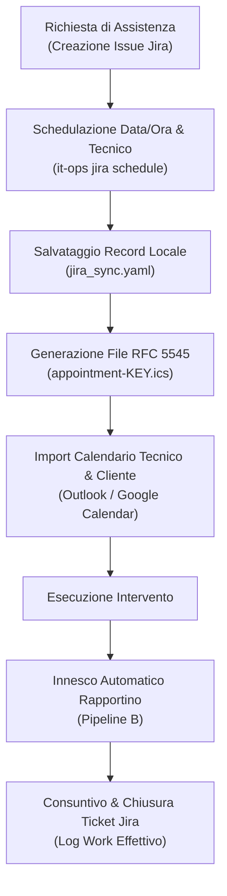

# 📅 Pipeline D — Task Jira, Agenda & Schedulazione RFC 5545

## 1. Obiettivi e Ambito Operativo
La **Pipeline D** unifica il ticketing di assistenza con la gestione dei calendari e degli interventi sul campo:
* Mappatura bidirezionale tra ticket di supporto Jira (`Incident`, `Task`, `Maintenance`) e il cliente di riferimento.
* Riserva automatica di slot temporali nel calendario del tecnico e del cliente.
* Emissione di file standard **iCalendar (`.ics`)** compatibili nativamente con Outlook, Google Calendar, Apple Calendar e Thunderbird.
* Predisposizione del contesto operativo per pre-compilare il rapportino di lavoro (Pipeline B).

---

## 2. Diagramma di Flusso Esecutivo



---

## 3. Specifiche del File iCalendar (`.ics`)

Il file generato rispetta lo standard **RFC 5545**:
```text
BEGIN:VCALENDAR
VERSION:2.0
PRODID:-//ITInfra Business Ops//Intervento Tecnico//IT
CALSCALE:GREGORIAN
METHOD:REQUEST
BEGIN:VEVENT
UID:IT-142@itinfra.local
DTSTAMP:20260917T131617Z
DTSTART:20260920T090000
DTEND:20260920T110000
SUMMARY:[IT-142] Manutenzione e verifica perimetrale
DESCRIPTION:Intervento tecnico programmato per il cliente severino-srl\nAssegnatario: Mario Rossi
LOCATION:Presso sede cliente severino-srl
STATUS:CONFIRMED
END:VEVENT
END:VCALENDAR
```

---

## 4. Schemi & Comandi CLI

* **Schema Formale**: `schemas/jira_sync.schema.yaml`
* **Percorso Storage**: `clients/<slug>/jira_sync.yaml` e `appointment-<issue>.ics`

### Sintassi Comandi:
```powershell
# Schedulare un appuntamento e generare il file .ics
.\it-ops.cmd jira <slug> schedule `
  --issue "IT-205" `
  --summary "Sostituzione tamburo e tuning VPN" `
  --start "2026-09-22T09:30:00" `
  --duration 2.5 `
  --tech "Mario Rossi"
```
