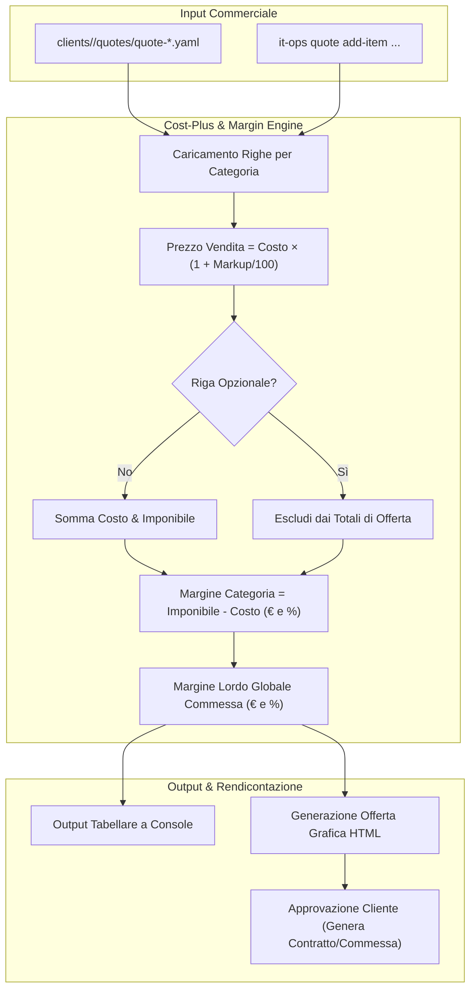

# 📑 Pipeline E — Preventivazione Multiprodotto Cost-Plus & Export Offerte

## 1. Obiettivi e Ambito Operativo
La **Pipeline E** standardizza la formulazione di offerte commerciali complesse, tipiche del system integrator moderno:
* Gestione di forniture eterogenee raggruppate in **6 macro-categorie merceologiche**:
  1. `hardware` (server, switch, workstation, apparati di rete)
  2. `software_licenses` (licenze Perpetue, SaaS, CSP Microsoft, Acronis)
  3. `cabling_infrastructure` (cablaggio strutturato Cat.6A/Fibra, patch panel, canalizzazioni)
  4. `furniture` (arredo ufficio, pareti divisorie, sedute ergonomiche)
  5. `labor` (installazione, collaudo, migrazione dati, formazione)
  6. `recurring_services` (canoni contrattuali, monitoraggio RMM, backup gestiti)
* Calcolo matematico deterministico dei **costi d'acquisto**, **ricarichi commerciali** (`markup_percent`) e **margini lordi** sia a livello di singola riga che aggregati per categoria e commessa totale.
* Gestione nativa di **righe opzionali** (`is_optional: true`): presentate al cliente con prezzo evidenziato ma escluse dal calcolo del totale imponibile preventivo.
* Generazione di proposte commerciali formali in formato **HTML/PDF** pronte per la presentazione e firma.

---

## 2. Diagramma di Flusso Esecutivo



---

## 3. Modello Dati e Struttura File

I preventivi sono archiviati in formato dichiarativo YAML all'interno di:
`clients/<slug>/quotes/quote-<id>.yaml`

Validati contro lo schema formale [`schemas/quote.schema.yaml`](file:///c:/Users/auresystem/repos/itinfra-business-ops/schemas/quote.schema.yaml).

### Campi Chiave del Documento
```yaml
quote_id: "PREV-2026-008"
slug: "severino-srl"
client_name: "Severino S.r.l."
date: "2026-09-17"
validity_days: 30
currency: "EUR"
categories:
  - name: "hardware"
    items:
      - part_number: "SRV-DELL-R450"
        description: "Server Dell PowerEdge R450 Xeon Silver 4314"
        quantity: 1
        unit_cost: 2150.00
        markup_percent: 28.00
        unit_price: 2752.00
        line_total: 2752.00
        is_optional: false
      - part_number: "UPS-APC-1500"
        description: "Gruppo di continuità APC Smart-UPS 1500VA LCD"
        quantity: 1
        unit_cost: 480.00
        markup_percent: 30.00
        unit_price: 624.00
        line_total: 624.00
        is_optional: true
```

---

## 4. Formule, Logiche di Calcolo & Algoritmi

### 4.1. Calcolo Prezzo di Vendita da Ricarico (Markup)
Se viene fornito il ricarico percentuale \( M \) e il costo unitario \( C \):
$$P = \text{round}\left(C \times \left(1 + \frac{M}{100}\right), 2\right)$$

### 4.2. Calcolo Ricarico da Prezzo Imposto
Qualora il prezzo di vendita \( P \) sia vincolato (es. listino pubblico o accordo quadro) e noto il costo \( C > 0 \):
$$M = \text{round}\left(\frac{P - C}{C} \times 100, 2\right)$$

### 4.3. Totali di Riga e Esclusione Opzionali
Per ciascun articolo con quantità \( Q \):
$$\text{LineTotal} = \text{round}(P \times Q, 2)$$
$$\text{LineCost} = \text{round}(C \times Q, 2)$$

Se `is_optional == false`:
$$\text{TotalCost} = \sum \text{LineCost}$$
$$\text{TotalNet} = \sum \text{LineTotal}$$

### 4.4. Margini di Categoria e Margine Lordo Complessivo
$$\text{GrossMarginAmount} = \text{TotalNet} - \text{TotalCost}$$
$$\text{GrossMarginPercent} = \text{round}\left(\frac{\text{GrossMarginAmount}}{\text{TotalNet}} \times 100, 2\right)$$

---

## 5. Esportazione Formale HTML
La Pipeline E include il generatore `generate_quote_html()` che produce un file autonomo:
`clients/<slug>/quotes/quote-<id>.html`

Caratteristiche del layout:
* Intestazione aziendale con dati cliente, data e validità dell'offerta.
* Raggruppamento chiaro per categorie con subtotali parziali.
* Sezione distinta per le **opzioni aggiuntive consigliate**.
* Box di riepilogo finanziario: Imponibile Netto, IVA 22%, Totale Lordo e Condizioni di Pagamento.
* Modulo per firma di accettazione e data timbrata.

---

## 6. CLI & Comandi Operativi

```bash
# 1. Ricalcolo deterministico totali e margini
.\it-ops.cmd quote <slug> calculate

# 2. Aggiunta interattiva / rapida di una nuova riga d'offerta
.\it-ops.cmd quote <slug> add-item --quote-id "PREV-2026-008" --category "hardware" --sku "SW-ARUBA-24G" --desc "Switch Aruba 2930F 24G PoE+" --qty 2 --cost 420.00 --markup 25.0

# 3. Aggiunta di voce opzionale
.\it-ops.cmd quote <slug> add-item --quote-id "PREV-2026-008" --category "hardware" --sku "UPS-APC-1500" --desc "Gruppo di continuità APC 1500VA" --qty 1 --cost 480.00 --markup 30.0 --optional

# 4. Generazione documento HTML formale di proposta commerciale
.\it-ops.cmd quote <slug> export --quote-id "PREV-2026-008"
```

---

## 7. Checklist di Validazione & Conformità

- [x] Schema `schemas/quote.schema.yaml` valido Draft-07.
- [x] Ricarico riga calcolato con arrotondamento a 2 decimali.
- [x] Voci contrassegnate come `is_optional: true` escluse matematicamente dai totali vincolanti.
- [x] Presenza di almeno una categoria valorizzata per preventivo.
- [x] Validità temporale espressa in giorni con data di emissione conforme ISO 8601 (`YYYY-MM-DD`).
