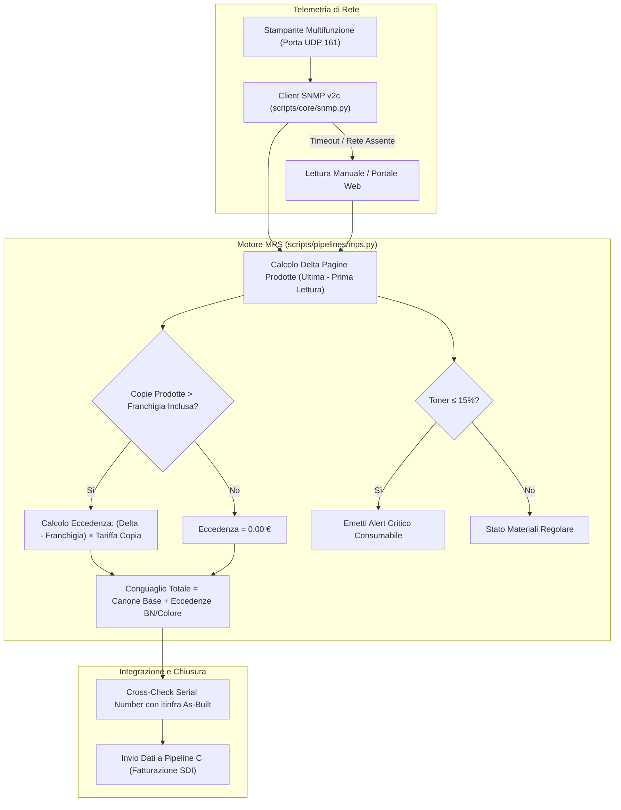

# 📑 Pipeline F — Noleggio Multifunzione MPS, Costo Copia & Telemetria SNMP

## 1. Obiettivi e Ambito Operativo
La **Pipeline F** governa i contratti di **Noleggio Operativo Multifunzione & Managed Print Services (MPS)**:
* Modello commerciale **"Tutto Incluso"**: canone di locazione apparato, fornitura automatica dei toner e materiali di consumo, manutenzione tecnica on-site e franchigia semestrale di copie incluse (Mono e Colore).
* **Calcolo del Conguaglio Eccedenze**: liquidazione periodica delle pagine stampate oltre franchigia con tariffazione differenziata centesimale per pagina BN e colore.
* **Telemetria SNMP v2c Integrata**: acquisizione automatica dei contatori fisici e percentuali toner tramite client UDP puro RFC 3805 (senza dipendenze C o agenti proprietari pesanti).
* **Alert Proattivo Consumabili**: rilevamento automatico del livello toner $\le 15\%$ per anticipare il fermo macchina del cliente.
* **Cross-Validation con `itinfra`**: verifica che l'indirizzo IP, il modello e il Serial Number corrispondano al perimetro di rete e documentazione As-Built.

---

## 2. Diagramma di Flusso Esecutivo



---

## 3. Modello Dati e Struttura File

I contratti e le registrazioni di telelettura risiedono in:
`clients/<slug>/mps/mps-*.yaml`

Validati contro lo schema formale [`schemas/mps.schema.yaml`](file:///c:/Users/auresystem/repos/itinfra-business-ops/schemas/mps.schema.yaml).

### Campi Chiave del Documento
```yaml
mps_contract_id: "MPS-2026-003"
slug: "severino-srl"
device_info:
  brand_model: "Canon imageRUNNER ADVANCE DX C3830i"
  serial_number: "CN-DXC3830-99482"
  ip_address: "192.168.10.25"
  snmp_community: "public"
contract_terms:
  lease_type: "operating_rental"
  semestral_base_fee: 420.00
  included_copies_semestral:
    mono: 6000
    color: 1500
  overage_cost_per_page:
    mono: 0.009
    color: 0.065
readings:
  - date: "2026-01-01"
    mono_total: 12500
    color_total: 3200
  - date: "2026-06-30"
    mono_total: 19800
    color_total: 5100
    toner_black_percent: 45
    toner_cyan_percent: 12
    toner_magenta_percent: 80
    toner_yellow_percent: 65
```

---

## 4. Formule, Logiche di Calcolo & Algoritmi

### 4.1. Calcolo Pagine Prodotte nel Periodo
Dati i contatori dell'ultima telelettura \( L \) e della lettura iniziale \( F \):
$$\Delta_{\text{mono}} = \text{mono\_total}_L - \text{mono\_total}_F$$
$$\Delta_{\text{color}} = \text{color\_total}_L - \text{color\_total}_F$$

### 4.2. Calcolo Eccedenze e Conguaglio Economico
Con franchigia semestrale inclusa \( I_{\text{mono}}, I_{\text{color}} \) e tariffe eccedenza per copia \( T_{\text{mono}}, T_{\text{color}} \):
$$E_{\text{mono}} = \max(0, \Delta_{\text{mono}} - I_{\text{mono}})$$
$$E_{\text{color}} = \max(0, \Delta_{\text{color}} - I_{\text{color}})$$

$$\text{OverageCost}_{\text{mono}} = \text{round}(E_{\text{mono}} \times T_{\text{mono}}, 2)$$
$$\text{OverageCost}_{\text{color}} = \text{round}(E_{\text{color}} \times T_{\text{color}}, 2)$$

$$\text{TotalSettlement} = \text{round}(\text{BaseFee} + \text{OverageCost}_{\text{mono}} + \text{OverageCost}_{\text{color}}, 2)$$

### 4.3. Regola di Allarme Toner e Consumabili
Per ciascun colore \( c \in \{\text{Black}, \text{Cyan}, \text{Magenta}, \text{Yellow}\} \):
$$\text{Alert}(c) = \begin{cases} \mathbf{CRITICO}, & \text{se } \text{toner\_percent}(c) \le 15\% \\ \mathbf{OK}, & \text{altrimenti} \end{cases}$$

---

## 5. Telemetria SNMP & Printer MIB (RFC 3805)
Il modulo [`scripts/core/snmp.py`](file:///c:/Users/auresystem/repos/itinfra-business-ops/scripts/core/snmp.py) implementa un client ASN.1/BER minimale per porta UDP 161, eliminando la necessità di pacchetti binari esterni (`pysnmp` o `net-snmp`):

| Parametro / OID | Significato Funzionale |
| :--- | :--- |
| `1.3.6.1.2.1.1.1.0` | `sysDescr` (Marca, Modello, Firmware stampante) |
| `1.3.6.1.2.1.1.5.0` | `sysName` (Hostname di rete dell'apparato) |
| `1.3.6.1.2.1.43.10.2.1.4.1.1` | `prtMarkerLifeCount` (Totale pagine fisiche stampate) |
| `1.3.6.1.2.1.43.11.1.1.9.1.x` | `prtMarkerSuppliesLevel` (Livello residuo toner) |
| `1.3.6.1.2.1.43.11.1.1.8.1.x` | `prtMarkerSuppliesMaxCapacity` (Capacità massima toner) |

---

## 6. CLI & Comandi Operativi

```bash
# 1. Calcolo deterministico conguaglio copie e verifica allarmi toner
.\it-ops.cmd mps <slug> calculate

# 2. Interrogazione SNMP in tempo reale dell'apparato cliente
.\it-ops.cmd mps <slug> read-snmp --contract-id "MPS-2026-003"

# 3. Registrazione manuale di una telelettura contatori
.\it-ops.cmd mps <slug> add-reading --contract-id "MPS-2026-003" --mono 21450 --color 5400
```

---

## 7. Checklist di Validazione & Conformità

- [x] Schema `schemas/mps.schema.yaml` valido Draft-07.
- [x] Differenziale contatori con verifica di non-decremento (contatori non retrogradi).
- [x] Eccedenze calcolate esclusivamente se il volume prodotto eccede la franchigia contrattuale.
- [x] Alert consumabili generato per tutti i serbatoi con livello $\le 15\%$.
- [x] Verifica del Serial Number incrociata con il file `06-As-Built.md` del repository `itinfra`.
