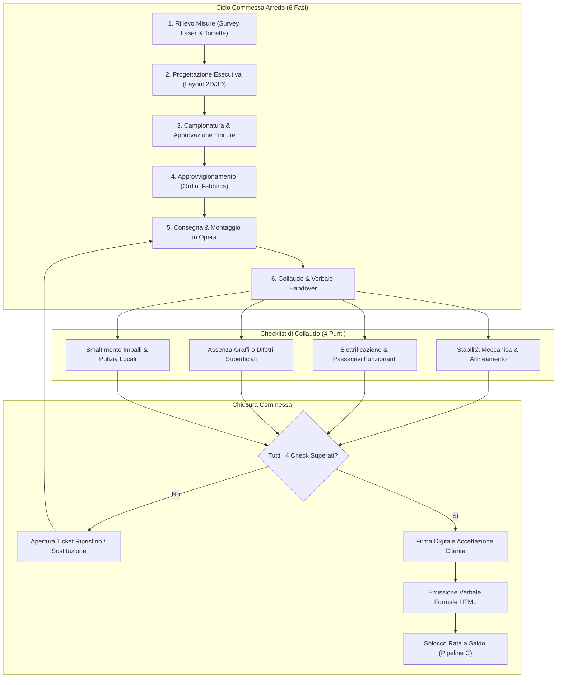

# 📑 Pipeline G — Commesse Arredo Ufficio & Collaudo Finale

## 1. Obiettivi e Ambito Operativo
La **Pipeline G** gestisce l'intero ciclo di vita dei progetti di **Arredo Ufficio, Pareti Divisorie e Allestimento Ambienti di Lavoro**:
* Tracciamento dell'avanzamento commessa attraverso una macchina a stati sequenziale a **6 fasi standard**:
  1. `1_survey` (Rilievo misure in loco, foto e vincoli impiantistici)
  2. `2_design` (Progettazione layout 2D/3D e computo metrico estimativo)
  3. `3_sampling_approval` (Campionatura finiture, tessuti, tinteggiature e approvazione formale)
  4. `4_procurement` (Invio ordini di produzione alle fabbriche fornitrici e conferme d'ordine)
  5. `5_assembly` (Consegna a piano, montaggio professionale e smaltimento imballaggi)
  6. `6_handover_approved` (Collaudo finale con checklist a 4 punti e firma verbale di accettazione)
* Sblocco condizionato della **fatturazione di saldo**: la contabilità non può emettere la fattura a saldo finché la commessa non ha raggiunto lo stato `6_handover_approved` con tutti i collaudi superati.
* Generazione automatica del **Certificato Formale di Collaudo e Accettazione** (`handover-*.html`).

---

## 2. Diagramma di Flusso Esecutivo



---

## 3. Modello Dati e Struttura File

I dati della commessa risiedono in:
`clients/<slug>/furniture/furniture-*.yaml`

Validati contro lo schema formale [`schemas/furniture.schema.yaml`](file:///c:/Users/auresystem/repos/itinfra-business-ops/schemas/furniture.schema.yaml).

### Campi Chiave del Documento
```yaml
order_id: "ARREDO-2026-004"
slug: "severino-srl"
title: "Rinnovamento Uffici Direzionali e Sala Riunioni"
status: "6_handover_approved"
estimated_total_net: 18500.00
currency: "EUR"
stages:
  survey:
    laser_measures_verified: true
    survey_date: "2026-04-10"
    floor_socket_compatibility: true
  design:
    layout_revision: "v2.1"
    approved_by_client: true
    approval_date: "2026-04-20"
  sampling_approval:
    fabrics_selected: true
    melamine_finish: "Rovere Sbiancato"
  procurement:
    factory_orders_sent: true
    supplier: "Quadrifoglio Sistemi d'Arredo"
  assembly:
    team_leader: "Marco B."
    assembly_completion_date: "2026-06-15"
  handover:
    checklist:
      mechanical_stability_verified: true
      electrification_working: true
      no_surface_scratches: true
      packaging_disposed: true
    signed_acceptance_date: "2026-06-16"
    client_signatory: "Ing. R. Severino"
```

---

## 4. Logica delle 6 Fasi & Regole di Avanzamento

L'avanzamento della commessa segue rigorosamente la sequenza definita in `FurniturePipeline.STAGES_ORDER`:
1. Non è consentito il passaggio alla fase `4_procurement` senza l'approvazione formale del cliente sul layout esecutivo e sulle campionature (`3_sampling_approval`).
2. Lo stato finale `6_handover_approved` è condizionato dal superamento del 100% delle voci della checklist di collaudo:
   * **Stabilità Meccanica**: serraggio bulloneria, regolazione piedini e allineamento giunzioni.
   * **Elettrificazione**: continuità dei canali passacavi e funzionamento prese integrate su top scrivania.
   * **Finiture Superficiali**: assenza di abrasioni, sbeccature o difetti di laccatura.
   * **Pulizia Ambientale**: rimozione totale di pellicole, bancali e imballi avviati al riciclo.

---

## 5. Verbale di Collaudo e Certificato HTML
Il metodo `sign_handover()` certifica la conclusione positiva dell'opera ed esporta il documento:
`clients/<slug>/furniture/handover-<order_id>.html`

Il documento include:
* Identificativo commessa, titolo e data di ultimazione dei lavori.
* Tabella esplicita dei 4 punti di controllo con esito **SUPERATO**.
* Nome e qualifica del firmatario cliente autorizzato.
* Clausola liberatoria che autorizza l'emissione della fattura finale a saldo.

---

## 6. CLI & Comandi Operativi

```bash
# 1. Visualizzazione avanzamento e stato checklist commessa
.\it-ops.cmd furniture <slug> status

# 2. Avanzamento sequenziale alla fase successiva
.\it-ops.cmd furniture <slug> next-stage --order-id "ARREDO-2026-004"

# 3. Avanzamento forzato a una specifica fase
.\it-ops.cmd furniture <slug> next-stage --order-id "ARREDO-2026-004" --stage "5_assembly"

# 4. Certificazione collaudo, firma verbale ed export HTML
.\it-ops.cmd furniture <slug> sign-handover --order-id "ARREDO-2026-004" --signatory "Ing. Roberto Severino"
```

---

## 7. Checklist di Validazione & Conformità

- [x] Schema `schemas/furniture.schema.yaml` valido Draft-07.
- [x] Calcolo percentuale di avanzamento basato sull'indice della fase attiva ($1/6 \dots 6/6$).
- [x] Blocco dell'handover qualora anche una sola voce della checklist sia `false`.
- [x] Integrazione con Pipeline C per svincolo della quota a saldo contrattuale.
- [x] Archiviazione tracciata del firmatario e della data nei metadati YAML di commessa.
