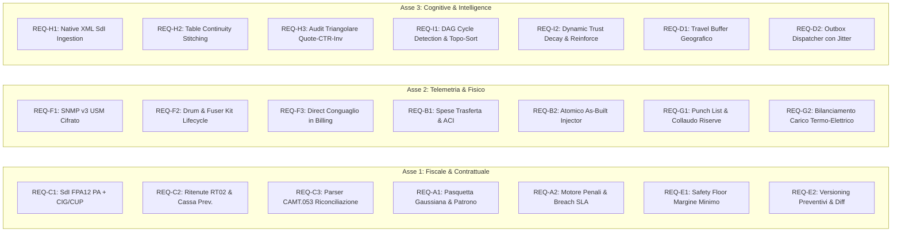

# SPEC-18: Evoluzione SOTA di Secondo Livello delle Pipeline Operative

- **Codice Specifica**: `SPEC-18-SOTA-PIPELINES-EVOLUTION`
- **Data di Redazione**: 18 Settembre 2026
- **Autore**: Team Antigravity AI & Architecture Governance
- **Stato**: `DRAFT — IN ATTESA DI APPROVAZIONE`
- **Ambito**: Governance Fiscale, Telemetria Hardware, Integrazione Spazio Fisico, Document Intelligence e Memoria Cognitiva Federata

---

## 1. Visione & Obiettivi Architetturali

La presente specifica definisce i requisiti funzionali, matematici e di integrazione per elevare le **9 pipeline operative** di `itinfra-business-ops` a un livello di eccellenza **SOTA (State-of-the-Art) aggiornato a Settembre 2026**.

L'architettura persegue quattro invarianti capitali:
1. **Zero-Hallucination & Provenance Formale**: Nessun dato contabile, matricola o parametro economico può essere inventato o alterato senza riscontro documentale verificabile.
2. **Zero-CDN & Local-First Autonomous Resilience**: Tutte le operazioni di computo, esportazione PDF/HTML/DOCX e accodamento task devono funzionare al 100% offline in locale.
3. **Hub-and-Spoke Separation of Concerns**: Totale segregazione tra dati commerciali/PSA (`itinfra-business-ops`) e dati tecnici infrastrutturali (`itinfra`), con bridge read-only e patch atomiche certificate.
4. **Deterministic Cognitive Memory**: Apprendimento continuo basato su standard Google OKF v0.2 con DAG aciclico e hash SHA-256 canonico.

---

## 2. Requisiti Dettagliati per Asse Strategico

---

### Asse 1: Fiscale, Finanziario & Contrattuale

#### REQ-C1: Supporto Formato FatturaPA `FPA12` con CIG e CUP
- **Problema**: L'attuale generazione XML produce solo `FPR12` (privati B2B). Le fatture indirizzate a PA vengono respinte dallo SdI se prive di formato `FPA12`, Codice IPA a 6 caratteri e riferimenti CIG/CUP.
- **Specifica**:
  - In `BillingPipeline.generate_sdi_xml()`: se `cmanifest.get("is_public_administration") == True` o `cbilling.get("is_pa") == True`:
    - `FormatoTrasmissione` = `FPA12`.
    - `CodiceDestinatario` = `cbilling.get("sdi_code")` validato a 6 caratteri alfanumerici.
    - Se presenti `cig` e/o `cup`, generazione del blocco `<DatiOrdineAcquisto>` o `<DatiContratto>` con `<CodiceCIG>` e `<CodiceCUP>`.

#### REQ-C2: Ritenute d'Acconto e Rivalse Previdenziali
- **Specifica**:
  - Supporto in fattura dei nodi `<DatiRitenuta>`:
    - `TipoRitenuta`: default `RT02` (persone fisiche/studi) o `RT01` (società).
    - `ImportoRitenuta`: calcolato su aliquota (es. 20%) dell'imponibile soggetto a ritenuta.
    - `CausalePagamento`: default `A` (prestazioni di lavoro autonomo).
  - Supporto del nodo `<DatiCassaPrevidenziale>`:
    - `TipoCassa`: default `TC22` (INPS) o cassa specifica.
    - `AlCassa`: percentuale (es. 4.0%).
    - Ricalcolo automatico del netto a pagare: $\text{Totale Documento} + \text{Cassa} + \text{IVA} - \text{Ritenuta d'Acconto}$.

#### REQ-C3: Parser di Riconciliazione Bancaria ISO 20022 `camt.053`
- **Specifica**:
  - Metodo `reconcile_bank_statement(camt_xml_content)`:
    - Parsing dei record `<Ntry>` (movimenti bancari).
    - Estrazione importo, segno (CRDT/DBIT), data valuta e causale libera `<RmtInf><Ustrd>`.
    - Matching con fatture emesse tramite regex su numero fattura (es. `FATT-\d+` o `BATCH-\d+`) e slug cliente.
    - Invocazione automatica di `mark_installment_paid()` per le corrispondenze certe (confidence = 1.0).

#### REQ-A1: Calcolo Festività Mobili (Algoritmo Pasquale di Gauss) & Santo Patrono
- **Specifica**:
  - Funzione `calculate_easter_and_easter_monday(year: int) -> Tuple[datetime.date, datetime.date]`: implementazione dell'algoritmo di computo canonico per individuare Pasqua e Lunedì dell'Angelo.
  - In `ContractsPipeline.compute_business_hours_sla()`: inclusione automatica del Lunedì dell'Angelo tra i giorni non lavorativi per qualsiasi anno `current.year`.
  - Supporto facoltativo al parametro `patron_saint_date` (`MM-DD`) definito nel manifest cliente per escludere il patrono locale.

#### REQ-A2: Motore di Computo Penali SLA (*SLA Breach & Penalty Ledger*)
- **Specifica**:
  - Metodo `compute_sla_penalties(slug, ticket_id, report_id, severity="sev1")`:
    - Verifica del target di risoluzione rispetto a `compute_business_hours_sla`.
    - Se $\text{ore effettive} > \text{target SLA}$, calcolo penale oraria contrattuale (es. € 50/ora di ritardo o 2% del canone mensile per ogni ora eccedente fino a max 20%).
    - Registrazione del debito penale nel ledger del contratto (`financial.penalties_accrued`).
    - Generazione automatica di proposta sconto compensativo per la prossima fatturazione.

#### REQ-E1: Safety Floor di Margine Minimo Garantito
- **Specifica**:
  - In `QuotesPipeline.calculate_quote()`: calcolo del margine lordo complessivo `gross_margin_percent`.
  - Se `gross_margin_percent < min_margin_floor` (default 20.0%):
    - Impostazione del flag `margin_safety_floor_breached: True`.
    - Calcolo dell'importo netto minimo necessario per ripristinare il margine target.
    - Inibizione esportazione formale a meno di flag `--override-margin` con registrazione dell'approvatore.

#### REQ-E2: Versionamento Preventivi (*Revisions & Diff Engine*)
- **Specifica**:
  - Salvataggio file preventivo nella forma `quote-{quote_id}-rev{N}.yaml` (es. `quote-PREV-101-2025-rev1.yaml`).
  - Metodo `compare_quote_revisions(slug, quote_id, rev_a, rev_b)`:
    - Confronto categoria per categoria e riga per riga (part number, quantitativi, prezzi unitari).
    - Output formale delle differenze (Delta Netto, Voci Aggiunte, Voci Rimosse, Variazione Margine).

---

### Asse 2: Telemetria, Hardware & Integrazione Fisica

#### REQ-F1: Client SNMP v3 (USM - User-based Security Model)
- **Specifica**:
  - Estensione di `SNMPPoller` in `scripts/core/snmp.py`:
    - Supporto a configurazione v3 nel contratto MPS (`version: "v3"`, `username`, `auth_protocol: "SHA"`, `auth_key`, `priv_protocol: "AES"`, `priv_key`).
    - Gestione handshake Discovery (EngineID e Boots/Time) e fallback su SNMP v2c qualora i parametri v3 non siano valorizzati.

#### REQ-F2: Monitoraggio Ciclo di Vita Parti Meccaniche a Lunga Durata
- **Specifica**:
  - Mappatura OID per Drum Unit (fotoconduttore), Fuser Kit (fusore) e Transfer Belt.
  - In `predict_toner_depletion()`: estensione a `predict_hardware_depletion()` monitorando anche l'usura dei rulli/tamburo e segnalando la soglia di sostituzione a 5.000 copie rimanenti.

#### REQ-F3: Ponte Diretto Conguaglio Copie in Fatturazione
- **Specifica**:
  - Metodo `generate_mps_billing_lines(slug, period)` in `MPSPipeline`:
    - Estrazione dell'ultimo conguaglio non fatturato (`calculate_settlement`).
    - Formattazione delle righe di fatturazione pronte per `BillingPipeline`:
      - Canone base semestrale/mensile con riferimenti contratto.
      - Eventuale eccedenza copie mono: `quantità * tariffa_eccedenza`.
      - Eventuale eccedenza copie colore: `quantità * tariffa_eccedenza`.

#### REQ-B1: Rimborso Chilometrico ACI & Spese di Trasferta nel Rapportino
- **Specifica**:
  - Nel tracciato rapportino (`RAP-...`):
    - Sezione `travel`: `distance_km`, `travel_time_minutes`, `rate_per_km` (default 0.50 €/km), `tolls_euro`, `parking_euro`.
    - Calcolo del totale rimborso trasferta: $\text{Costo Trasferta} = (\text{km} \times \text{tariffa}) + \text{pedaggi} + \text{parcheggi}$.
    - Inclusione nelle voci fatturabili spot se l'intervento non ha trasferta inclusa nel canone SLA.

#### REQ-B2: Applicatore Atomico As-Built Patch in `itinfra`
- **Specifica**:
  - Metodo `apply_as_built_patch_to_project(slug, report_id, peer_repo_dir=None)`:
    - Lettura di `itinfra/projects/<slug>/06-As-Built.md`.
    - Localizzazione della tabella `### 4. Tabella Riepilogo Asset Hardware`.
    - Controllo anti-duplicazione dei seriali già presenti.
    - Inserimento atomico delle nuove righe generate dal rapportino con lock sul file.
    - Scrittura del log di audit sull'aggiornamento dell'As-Built.

#### REQ-G1: Gestione Punch List (Riserve di Collaudo Fornitura Arredo)
- **Specifica**:
  - In `FurniturePipeline`:
    - Supporto a stato `6_handover_conditional_snagging`.
    - Sezione `punch_list`: lista anomalie minori (`item_id`, `description`, `rectification_deadline`, `responsible_team`).
    - Trattenuta di garanzia (`warranty_retention_percent`: default 5-10% del totale fornitura).
    - Certificato formale di collaudo con riserva in HTML pronto per la firma.
    - Metodo `resolve_punch_list_item(slug, order_id, item_id)` che, una volta azzerate le riserve, promuove la commessa a `6_handover_approved` e svincola la ritenuta.

#### REQ-G2: Bilanciamento Carichi Elettrici vs Infrastruttura UPS
- **Specifica**:
  - Metodo `cross_check_electrical_load(slug, order_id)`:
    - Calcolo potenza stimata assorbita dalle postazioni arredo (default 300W per postazione operativa).
    - Parsing di `itinfra/projects/<slug>/03-LLD.md` per estrarre la potenza nominale degli UPS (VA/Watt) e dei quadri elettrici dedicati.
    - Emissione di verdetto di conformità (`PASS`, `WARNING`, `CRITICAL_OVERLOAD`).

---

### Asse 3: Document Intelligence & Memoria Cognitiva

#### REQ-H1: Ingestore Nativo di Fatture Elettroniche XML SDI
- **Specifica**:
  - In `scripts/pipelines/ingestion.py`:
    - Riconoscimento automatico di file `.xml` e `.xml.p7m` come `FatturaElettronica`.
    - Estrazione deterministica diretta dei dati anagrafici (P.IVA, Ragione Sociale, Sede, Codice Univoco).
    - Estrazione di tutte le linee di dettaglio, quantitativi, prezzi unitari, sconti riga, codici articolo fornitore e seriali nelle note.
    - Zero latenza OCR e confidenza al 100% con marcatura automatica `VERIFIED`.

#### REQ-H2: Algoritmo di Cucitura Continua Tabelle Multi-Pagina (*Table Continuity Stitching*)
- **Specifica**:
  - Nel motore di estrazione PDF:
    - Se una tabella su pagina $N$ termina a fondo pagina e la pagina $N+1$ inizia con una struttura di colonne identica o con la medesima riga di header:
    - Fusione atomica dei due blocchi tabellari eliminando l'header duplicato.
    - Mantenimento dell'integrità dei totali riga e progressivi.

#### REQ-H3: Motore di Audit Triangolare (*Triangular Cross-Audit Engine*)
- **Specifica**:
  - Classe `TriangularAuditEngine`:
    - Verifica incrociata a 3 fattori: Preventivo (`PREV-`), Contratto SLA (`CTR-`), Fattura/Bolla (`FATT-`).
    - Individuazione di discrepanze tra seriali ordinati vs seriali fatturati, o tra canone contrattualizzato vs canone addebitato.

#### REQ-I1: Validazione DAG e Rilevamento Cicli nei Nodi OKF v0.2
- **Specifica**:
  - In `MemoryEngine.audit_memory()`:
    - Costruzione del grafo orientato delle dipendenze (`requires`, `replaces`).
    - Algoritmo di ordinamento topologico e rilevamento cicli (DFS con tracciamento stack ricorsivo).
    - Rilevamento nodi orfani (nodi referenziati in `requires` ma inesistenti su disco).
    - In caso di cicli: segnalazione di `status: FAIL` e blocco della compilazione delle regole per Antigravity.

#### REQ-I2: Decadimento Dinamico di Confidenza & Rinforzo (*Confidence Decay Engine*)
- **Specifica**:
  - Campo `trust.confidence_score` (float compreso tra 0.1 e 1.0) in ogni nodo OKF v0.2.
  - Ad ogni esecuzione positiva di `it-ops learn test` che valida il guardrail del nodo: $+0.05$ (rinforzo, fino a max 1.0).
  - Se il nodo non viene richiamato o verificato per oltre 60 giorni: decadimento progressivo calcolato matematicamente:
    $$\text{score}(t) = \text{score}_0 \times e^{-\lambda t}$$
  - Alert di recertificazione quando lo score scende al di sotto di 0.50.

#### REQ-D1: Travel Buffer Geografico & Verifica Spostamento Fisico
- **Specifica**:
  - In `JiraSyncPipeline.check_schedule_conflicts()`:
    - Se due appuntamenti per lo stesso tecnico si svolgono nello stesso giorno ma per client slug differenti (`slug_A != slug_B`):
    - Calcolo del buffer di spostamento fisico (default 45 minuti).
    - Verifica che:
      $$\text{start}_B \ge \text{end}_A + \text{travel\_buffer}$$
    - Se la condizione è violata, emissione di conflitto `TRAVEL_BUFFER_CONFLICT` indicando le due sedi e il tempo di trasferimento mancante.

#### REQ-D2: Worker Locale Outbox con Retry Esponenziale e Jitter
- **Specifica**:
  - Metodo `dispatch_outbox_queue(slug, max_attempts=5)`:
    - Elaborazione delle azioni pendenti in `jira_outbox.yaml`.
    - Calcolo del backoff esponenziale:
      $$t_{\text{wait}} = 2^{\text{attempts}} + \text{uniform}(0, 1)$$
    - Simulazione/chiamata all'adapter remoto, aggiornamento dello stato in `completed` o incremento tentativi con marcatura dell'errore.

---

## 3. Piano di Collaudo e Certificazione

Tutte le implementazioni dovranno essere collaudate tramite:
1. Nuovi test unitari dedicati in `tests/test_sota_level2_pipelines.py` (target: 100% PASS).
2. Verifica regressioni su `tests/test_sota_pipelines.py` (16/16 PASS).
3. Verifica regressioni su `tests/test_cognitive_bridge.py` (5/5 PASS).
4. Esecuzione suite integrata `itinfra` (`scripts/itinfra_test_suite.py`: 16/16 PASS).
5. Collaudo integrità formale `it-ops learn audit` e `it-ops learn test` (100% PASS).
6. Validazione schemi YAML su tutti i file cliente (`it-ops validate clients/`: 20/20 PASS).
