# SPEC-19: Pipeline Specialistica di Compliance & Gap Analysis (D.Lgs. 231/2001, ISO 27001, NIST CSF)

> **Repository**: `itinfra-business-ops`  
> **Federazione**: `itinfra` (Hub-and-Spoke via Shared Customer Slug)  
> **Brand & Titolarità**: **Aure System di Eduardo Possumato**  
> **Standard di Riferimento**: Google Open Knowledge Format (OKF) v0.2, CVSS v4.0, D.Lgs. 231/2001 Art. 24-bis, ISO/IEC 27001:2022, NIST CSF v2.0  
> **Data Specifica**: 18 Settembre 2026  

---

## 1. Visione & Driver Strategici

Attualmente `itinfra-business-ops` dispone di 9 pipeline operative verticalizzate su supporto tecnico, governance contrattuale SLA, fatturazione elettronica, preventivazione, noleggio multifunzione e commesse arredo.  
L'ingestione dell'offerta peritale D.Lgs. 231/2001 per il cliente **Unisped AG S.a.s.** evidenzia la necessità aziendale di introdurre una **decima pipeline nativa e specializzata**: la **`GapAnalysisPipeline`** (`scripts/pipelines/gap_analysis.py`).

Tale pipeline consente ad **Aure System** di automatizzare, standardizzare e certificare l'intero ciclo di vita delle attività di **Cybersecurity Governance, Gap Analysis e Audit di Conformità**, generando i deliverable formali a norma di legge e integrandosi con il repository tecnico `itinfra` per la verifica dell'inventario hardware reale (zero Shadow IT).

```mermaid
graph LR
    subgraph Input["Input Documentali & Tecnici"]
        DOC["Documentazione Cliente (MOG, Policy, Contratti)"]
        INT["Interviste 5 Aree Aziendali"]
        VA["Vulnerability Assessment (CVSS v4.0)"]
        INFRA["As-Built & IPAM (itinfra)"]
    end

    subgraph Engine["GapAnalysisPipeline (Aure System)"]
        AUD["Audit Comparativo (As-Is vs To-Be)"]
        SCORE["Maturity & Gap Scoring Engine"]
        REM["Remediation Planner Prioritizzato"]
    end

    subgraph Output["Deliverable Ufficiali Aure System"]
        DEL1["Verbale Kick-off & Perimetro"]
        DEL2["Rapporto Gap Analysis & Remediation"]
        DEL3["Rapporto Vulnerability Assessment"]
        DEL4["Executive Briefing CDA / OdV"]
    end

    Input --> Engine
    Engine --> Output
```



---

## 2. Standard e Framework di Conformità Supportati

La pipeline deve supportare nativamente una matrice parametrizzata di requisiti:
1. **D.Lgs. 231/2001 (Focus Art. 24-bis)**: Delitti informatici e trattamento illecito di dati (introdotto da L. 48/2008). Verifica presidi di accesso, tracciamento log, separazione delle funzioni e idoneità del MOG ex artt. 6 e 7.
2. **ISO/IEC 27001:2022 & ISO/IEC 27002:2022**: 93 controlli suddivisi nei 4 temi (Organizzativo, Persone, Fisico, Tecnologico).
3. **NIST Cybersecurity Framework v2.0 (2024)**: Funzioni GOVERN (GV), IDENTIFY (ID), PROTECT (PR), DETECT (DE), RESPOND (RS), RECOVER (RC).
4. **GDPR (Reg. UE 2016/679) & D.Lgs. 196/2003 s.m.i.**: Misure tecniche e organizzative adeguate (Art. 32) e privacy by design/default.
5. **ISO 22301:2019**: Continuità operativa e Disaster Recovery.

---

## 3. Modello Dati e Schema (`schemas/gap_analysis.schema.yaml`)

Il fascicolo di Gap Analysis di ciascun cliente sarà archiviato in `clients/<slug>/gap_analysis/ga-<id>.yaml` e validato dallo schema formale:

```yaml
assessment_id: "GA-2025-231-01"
slug: "unisped-ag-sas"
title: "Gap Analysis & Compliance D.Lgs. 231/01"
framework: "dlgs_231" # Opzioni: dlgs_231, iso_27001, nist_csf, gdpr_integrated
created_at: "2025-11-18"
target_completion_date: "2025-12-31"
status: "in_progress" # draft, in_progress, remediation_ready, closed
lead_auditor: "Eduardo Possumato"

scope:
  location: "Via San Nicola alla Dogana, 9 - 80133 Napoli"
  target_networks: ["192.168.1.0/24", "10.0.0.0/24"]
  in_scope_assets_count: 45
  third_party_dependencies: ["Cloud Provider ERP", "Fornitore Firewall"]

documentary_review:
  documents_requested: 7
  documents_received: 7
  reviewed_items:
    - code: "DOC-MOG-01"
      name: "Modello Organizzativo 231 vigente"
      status: "compliant_with_gaps"
      finding: "Manca sezione specifica su presidio accessi privilegiati ex art. 24-bis"

interviews:
  - area: "ciso_security"
    respondent: "Mario Esposito (CISO)"
    interview_date: "2025-11-25"
    maturity_score: 3.2 # scala 1.0 - 5.0
  - area: "it_operations"
    respondent: "Luigi De Rosa (IT Manager)"
    interview_date: "2025-11-26"
    maturity_score: 2.8
  - area: "risk_compliance"
    respondent: "Avv. Carla Bianchi (Compliance)"
    interview_date: "2025-11-27"
    maturity_score: 3.5
  - area: "procurement_contracts"
    respondent: "Giuseppe Ferrara (Acquisti)"
    interview_date: "2025-11-28"
    maturity_score: 2.1
  - area: "facility_physical_security"
    respondent: "Antonio Russo (Facility)"
    interview_date: "2025-11-29"
    maturity_score: 3.0

vulnerability_assessment:
  scan_date: "2025-12-05"
  engine: "CVSS_v4"
  total_targets_scanned: 18
  findings_summary:
    critical: 1
    high: 3
    medium: 7
    low: 12
  findings:
    - cve_id: "CVE-2024-XXXX"
      target_ip: "192.168.1.10"
      service: "OpenSSH 8.2"
      cvss_v4_score: 9.3
      severity: "critical"
      title: "Remote Code Execution unauthenticated"
      remediation: "Aggiornare pacchetto alla versione più recente e restringere ACL"

gap_scores:
  overall_compliance_percent: 64.5
  domain_scores:
    governance_and_mog: 72.0
    access_control: 58.0
    incident_response: 50.0
    asset_inventory_logging: 65.0
    vendor_risk: 42.0
    physical_security: 80.0

remediation_plan:
  actions:
    - id: "REM-01"
      priority: "P1_CRITICAL"
      deadline_days: 30
      domain: "access_control"
      title: "Attivazione MFA obbligatoria per accessi amministrativi ed ERP"
      owner: "IT Operations"
      estimated_cost_eur: 1200.0
      related_reato_presupposto: "Art. 24-bis Accesso abusivo a sistema informatico"
    - id: "REM-02"
      priority: "P2_HIGH"
      deadline_days: 60
      domain: "vendor_risk"
      title: "Clausole penali e audit di sicurezza nei contratti fornitori IT"
      owner: "Ufficio Acquisti & Legale"
      estimated_cost_eur: 800.0
      related_reato_presupposto: "Art. 24-bis Frode informatica e violazione segreti"
```

---

## 4. Architettura della Classe `GapAnalysisPipeline`

File di destinazione: `scripts/pipelines/gap_analysis.py`

### Metodi Principali:
1. `__init__(self, clients_root: Optional[Path] = None)`: Inizializza i path e istanzia il bridge verso `itinfra`.
2. `init_assessment(self, slug: str, assessment_id: str, framework: str = "dlgs_231", title: Optional[str] = None, scope: Optional[Dict[str, Any]] = None) -> Dict[str, Any]`: Crea il fascicolo YAML iniziale.
3. `record_document_review(self, slug: str, assessment_id: str, document_code: str, name: str, status: str, finding: str) -> Dict[str, Any]`: Registra l'esito della perizia documentale.
4. `record_interview(self, slug: str, assessment_id: str, area: str, respondent: str, answers: Dict[str, Any], maturity_score: float) -> Dict[str, Any]`: Registra l'intervista per una delle 5 aree aziendali canoniche.
5. `record_vulnerability_findings(self, slug: str, assessment_id: str, findings: List[Dict[str, Any]]) -> Dict[str, Any]`: Registra le risultanze del Vulnerability Assessment interno/esterno con classificazione CVSS v4.0.
6. `compute_gap_scores(self, slug: str, assessment_id: str) -> Dict[str, Any]`: Computa la media ponderata di conformità complessiva e per dominio, calcolando la distanza (gap) rispetto al target 100%.
7. `generate_remediation_plan(self, slug: str, assessment_id: str) -> List[Dict[str, Any]]`: Genera l'elenco prioritizzato delle azioni correttive (P1 Critical, P2 High, P3 Medium) con stima tempi ed effort.
8. `cross_check_with_itinfra_assets(self, slug: str, assessment_id: str) -> Dict[str, Any]`: Confronta gli IP e apparati scansionati nel VA con quelli censiti in `06-As-Built.md` e `04-Network-IPAM.md` di `itinfra`, segnalando eventuali host scansionati non documentati (Shadow IT) o apparati As-Built non inclusi nel perimetro di assessment.
9. `generate_deliverables(self, slug: str, assessment_id: str, output_dir: Optional[Path] = None) -> Dict[str, Path]`: Genera i 4 deliverable ufficiali brandizzati Aure System:
   - `01-verbale-kickoff.md`
   - `02-rapporto-gap-analysis-remediation.md`
   - `03-rapporto-vulnerability-assessment.md`
   - `04-executive-presentation-odv.html` (Interfaccia generativa / dashboard visuale)

---

## 5. Integrazione con la CLI (`cli.py` & `it-ops.cmd`)

Aggiunta del comando `gap` per un'esperienza operatore immediata e deterministica:
- `.\it-ops.cmd gap <slug> status`: Mostra lo stato di avanzamento della Gap Analysis, score di maturità e deliverable prodotti.
- `.\it-ops.cmd gap <slug> init --framework dlgs_231`: Inizializza un nuovo fascicolo di compliance.
- `.\it-ops.cmd gap <slug> interview --area it_operations --score 3.5`: Registra un'intervista.
- `.\it-ops.cmd gap <slug> calculate`: Esegue il calcolo dei gap e genera il piano di remediation.
- `.\it-ops.cmd gap <slug> report`: Esporta tutti i deliverable formali brandizzati Aure System.
- `.\it-ops.cmd gap <slug> check`: Esegue il cross-check di perimetro con `itinfra/06-As-Built.md`.

---

## 6. Identità Visiva e Branding Aure System

Tutti i documenti generati integrano le coordinate aziendali di Aure System:
- **Ragione Sociale**: `Aure System di Eduardo Possumato`
- **Sede**: `Via Luigi Tansillo, 54 F – 80125 Napoli (NA)`
- **P.IVA / C.F.**: `IT07714231219`
- **Contatti**: `info@auresystem.it` | `salvatorepossumato@pec.it` | `+39 333 7328065`
- **Colori Istituzionali**: Navy Blue (`#1E3A8A`), Accent Blue (`#2563EB`), Slate Gray (`#64748B`)
- **Logo**: Embedding dell'asset ufficiale `templates/assets/brand/logo.png`
