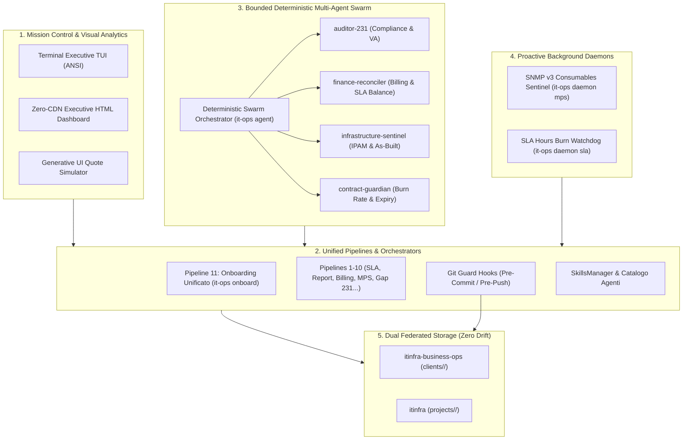

# SPEC-20: Mission Control, Bounded Deterministic Swarm & Continuous Assurance System

> **Repository Primario**: `itinfra-business-ops`  
> **Repository Federato**: `itinfra` (Hub-and-Spoke via Shared Customer Slug)  
> **Brand & Titolarità**: **Aure System di Eduardo Possumato**  
> **Standard di Riferimento**: Google Open Knowledge Format (OKF) v0.2, Git RFC Standards, JSON Schema Draft 7, Zero-CDN HTML5/SVG  
> **Data Specifica**: 18 Settembre 2026  

---

## 1. Visione Architetturale & Obiettivi SOTA

Con il completamento di 10 pipeline verticali specializzate (dal supporto tecnico alla Gap Analysis D.Lgs. 231/2001), l'ecosistema **Aure System** raggiunge la piena maturità funzionale.  
L'obiettivo di **SPEC-20** è elevare il sistema da un insieme di strumenti CLI reattivi a una **piattaforma di Continuous Assurance proattiva, centralizzata e agentica**, salvaguardando il principio cardine di **assoluto determinismo, zero allucinazioni e isolamento Hub-and-Spoke**.

---

## 2. Componente 1: Pipeline 11 — Unified Client Onboarding Orchestrator (`OnboardPipeline`)

### 2.1 Motivazione & Invarianti
Attualmente l'inizializzazione di un nuovo cliente richiede l'esecuzione di `it-ops init <slug>` in `itinfra-business-ops` e la creazione manuale o via script di `projects/<slug>` in `itinfra`.  
La **Pipeline 11** (`scripts/pipelines/onboard.py`, comando `it-ops onboard <slug>`) unifica questa procedura in una **singola transazione atomica e deterministica**:

1. **Creazione Workspace Commerciale (`itinfra-business-ops/clients/<slug>/`)**:
   - `client-manifest.yaml` compilato con anagrafica aziendale, referente, P.IVA/CF, codice SDI, PEC e livello di servizio (Silver, Gold, Platinum).
   - `contracts/ctr-<slug>-<year>.yaml` preconfigurato con monte ore SLA associato al livello prescelto.
   - `timesheets/` predisposto per rapportini.
   - `invoices/` predisposto per batch contabili.
   - `quotes/quote-<slug>-01.yaml` precompilato con proposta economica standard di audit e onboarding.
   - `mps/mps-<slug>-01.yaml` configurato con parco macchine multifunzione base.
   - `furniture/arr-<slug>-01.yaml` predisposto.
   - `gap_analysis/ga-<slug>-01.yaml` inizializzato per assessment D.Lgs. 231/2001 e ISO 27001.

2. **Creazione Workspace Tecnico Federato (`itinfra/projects/<slug>/`)**:
   - `manifest.yaml` sincronizzato esattamente su Shared Customer Slug, ragione sociale e contatti.
   - Documenti OKF e Markdown tecnici:
     - `01-Executive-Summary.md`
     - `02-Physical-Site-Survey.md`
     - `03-Logical-Network-Architecture.md`
     - `04-Network-IPAM.md` (con subnet primaria `/24`, gateway, DNS primario/secondario, DHCP range e pool server/client).
     - `05-Disaster-Recovery-Plan.md`
     - `06-As-Built.md` con baseline apparati di rete, firewall, switch, hypervisor e server.

3. **Verifica Immediata Zero-Drift**:
   - Esecuzione automatica in-memory di `ITInfraBridge.check_slug(slug)` e `validate_yaml_file`.
   - Emissione del certificato di onboarding atomico e SHA-256 seal.

---

## 3. Componente 2: Deterministic Git Guard Hooks (`.githooks/`)

### 3.1 Scopo & Trigger
Prevenire errori prima che vengano inclusi nella cronologia Git o inviati a GitHub.
Installazione trasparente multipiattaforma tramite `it-ops hooks install [--both]`.

### 3.2 Controlli nel Pre-Commit (`scripts/hooks/git_guard.py pre-commit`)
1. **Validazione Schemi YAML**:
   - Scansiona tutti i file `.yaml` modificati nella working copy e li valida a fronte degli schemi JSON Schema / YAML in `schemas/`.
2. **Secret & Credential Leak Detection**:
   - Rileva pattern di chiavi private (`BEGIN (RSA|EC|OPENSSH) PRIVATE KEY`), password in chiaro (`password:\s*["'][^"']+["']`), token API (`ghp_`, `AKIA`, `sk-`), IBAN errati o credenziali non cifrate.
3. **OKF v0.2 Linter**:
   - Verifica la conformità del frontmatter YAML nei file `.okf.md` modificati.

### 3.3 Controlli nel Pre-Push (`scripts/hooks/git_guard.py pre-push`)
1. **Smoke Test Suite**:
   - Esegue automaticamente `python -m unittest discover tests` bloccando il push in caso di regressioni.
2. **Sincronizzazione Hub-and-Spoke**:
   - Verifica che i clienti censiti in `clients/` con corrispondente in `../itinfra/projects/` mantengano slug identici e manifest validi.

---

## 4. Componente 3: Mission Control Dashboard CLI (`it-ops mission-control` / `it-ops ui`)

### 4.1 Caratteristiche Funzionali
Console esecutiva centralizzata per il monitoraggio a 360° dell'intero portfolio clienti Aure System:
- **TUI (Terminal User Interface)**: Tabella formattata ad alto contrasto con indicatori grafici Unicode.
- **HTML Dashboard (Zero-CDN)**: Interfaccia web stand-alone (`mission-control.html`) con logo aziendale in base64, KPI cards, visualizzatore grafico vettoriale del monte ore SLA, allarmi toner MPS, scadenzario pagamenti e stato as-built.

### 4.2 Metriche Aggreggate per Cliente:
- **SLA & Hours**: Totale ore acquistate, ore consumate, saldo residuo, percentuale di utilizzo e alert burn rate.
- **Billing**: Stato fatturazione, partite aperte e importi scaduti.
- **MPS**: Numero stampanti attive, copie prodotte, e alert consumabili con livello toner <= 15%.
- **Compliance 231**: Punteggio conformità percentuale, CMMI maturity level e conteggio vulnerabilità aperte.
- **Federazione itinfra**: Stato di sincronizzazione as-built con `itinfra`.

---

## 5. Componente 4: Specialized Deterministic Multi-Agent Swarm (`scripts/core/swarm.py`)

### 5.1 Filosofia Bounded Agentic
A differenza degli agenti autonomi generici soggetti ad allucinazioni, i 4 agenti deterministici operano su **contratti I/O rigorosamente definiti in JSON**, senza facoltà di inventare dati contabili o tecnici:

1. **`Auditor231Agent`**:
   - Analizza il fascicolo `gap_analysis/`, estrae il punteggio di conformità, livello CMMI e calcola penalità CVSS v4.0.
2. **`FinanceReconcilerAgent`**:
   - Riconcilia monte ore contrattuale, rapportini rendicontati, copie MPS ed emette il foglio contabile per la fatturazione SDI.
3. **`InfrastructureSentinelAgent`**:
   - Interroga in sola lettura il gemello tecnico in `../itinfra/projects/<slug>`, verifica allineamento IPAM, apparati hardware e contratti di manutenzione.
4. **`ContractGuardianAgent`**:
   - Analizza i log temporali, stima il burn rate settimanale e prevede deterministicamente la data di esaurimento del monte ore.
5. **`DeterministicSwarm`**:
   - Orchestratore che aggrega in parallelo i risultati dei 4 agenti in un unico payload certificato.

---

## 6. Componente 5: Proactive Background Daemons (`scripts/pipelines/daemon.py`)

Sentinelle di background deterministiche per monitoraggio proattivo senza carico manuale:
1. **`MPSDaemon`**:
   - Interroga i contatori e lo stato consumabili delle stampanti di rete (SNMP v3), emettendo un alert automatico quando il toner scende sotto la soglia del 15%.
2. **`SLADaemon`**:
   - Sorveglia il saldo ore contrattuale di ciascun cliente, notificando anomalie quando le ore residue scendono sotto il 20% del monte ore totale.

---

## 7. Componente 6: Skills Management & Catalogo Agenti Antigravity

Il modulo `SkillsManager` (`scripts/core/skills_manager.py`) integra in ITInfra Business Ops il catalogo globale di 300+ skills agentiche (`rmyndharis/antigravity-skills`):
- **Ricerca & Ispezione**: `it-ops skills search <query>` e `it-ops skills info <name>`.
- **Installazione & Bundle**: Download atomico via pure Python stdlib di bundle operativi (`core`, `compliance`, `engineering`).
- **Nazionalizzazione Contestuale**: Ogni skill integrata viene automaticamente auditata e adattata al contesto normativo, fiscale e tecnico italiano (es. `billing-automation` su FatturaPA v1.2, Codici Agenzia Entrate MP05/MP12, DFFM e D.Lgs. 231/2002).
