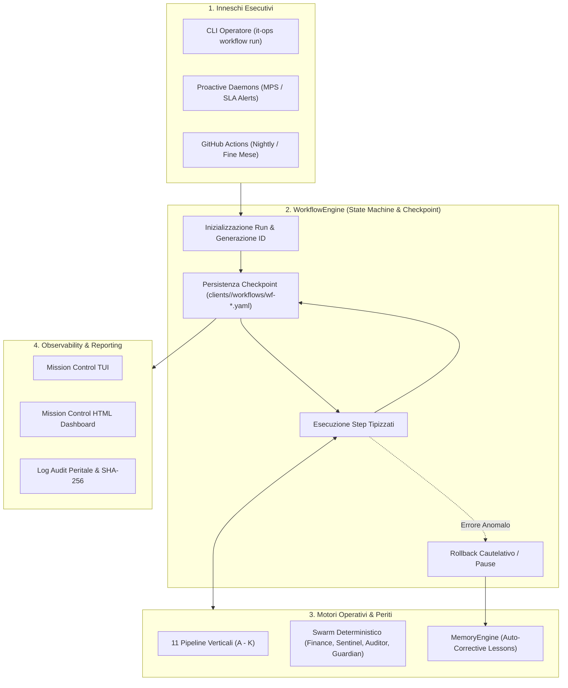

# SPEC-21: State-Machine Workflow Orchestration & Lifecycle Continuous Assurance

> **Repository Primario**: `itinfra-business-ops`  
> **Repository Federato**: `itinfra` (Hub-and-Spoke via Shared Customer Slug)  
> **Brand & Titolarità**: **Aure System di Eduardo Possumato**  
> **Standard di Riferimento**: Google Open Knowledge Format (OKF) v0.2, Finite State Machine (FSM), JSON Schema Draft 7, Zero-CDN HTML5/SVG  
> **Data Specifica**: 18 Settembre 2026  

---

## 1. Visione Architetturale & Motivazione

L'ecosistema **itinfra-business-ops** dispone di 11 pipeline verticali specializzate (dalla contrattualistica SLA all'onboarding atomico) e di 4 agenti deterministici nello Swarm.  
Tuttavia, le operazioni di business del mondo reale (es. la chiusura contabile mensile, il go-live completo di un cliente, o la gestione di un incidente critico P1) non sono processi isolati, bensì **sequenze coordinate di più pipeline nel tempo**, che richiedono:
1. **Orchestrazione a Stati Finiti (FSM)**: Ogni fase deve avere precondizioni, esecuzione e postcondizioni verificate.
2. **Resumable State (Checkpoint)**: Possibilità di interrompere un processo, attendere input umani (es. firma cliente) o sopravvivere a crash riprendendo esattamente dallo step non completato.
3. **Audit Trail Immutabile**: Registrazione di ogni transizione di stato con timestamp ISO 8601, output JSON e sigillo SHA-256.
4. **Sinergia con Mission Control & Swarm**: I periti dello Swarm validano gli step, i demoni innescano i workflow, e il Mission Control ne monitora l'avanzamento.



---

## 2. Modello Dati del Workflow (`schemas/workflow.schema.yaml`)

Ciascuna istanza di workflow registra il suo stato persistente su file YAML in `clients/<slug>/workflows/wf-<workflow_type>-<timestamp>.yaml` (o `workflows/` globale per i processi trasversali a più clienti):

```yaml
workflow_id: "WF-20260930-MONTHLY-CLOSING"
workflow_type: "monthly-closing"
slug: "all"  # oppure slug cliente specifico
status: "COMPLETED" # PENDING | RUNNING | PAUSED_FOR_INPUT | COMPLETED | FAILED | ROLLED_BACK
created_at: "2026-09-30T18:00:00Z"
updated_at: "2026-09-30T18:00:14Z"
initiated_by: "cli:possumato"
current_step_index: 5
total_steps: 6
steps:
  - step_id: "step_01_mps_telemetry"
    name: "Telelettura Contatori MPS & Copie Eccedenti"
    status: "DONE"
    started_at: "2026-09-30T18:00:01Z"
    completed_at: "2026-09-30T18:00:03Z"
    output_summary: "Elaborate 4 stampanti, 2 conguagli calcolati per € 84.50"
    data: {...}
  - step_id: "step_02_sla_hours_reconciliation"
    name: "Riconciliazione Saldi Monte Ore SLA & Extra-Budget"
    status: "DONE"
    started_at: "2026-09-30T18:00:03Z"
    completed_at: "2026-09-30T18:00:06Z"
    output_summary: "4 contratti verificati, 0 ore in over-budget non coperte"
  - step_id: "step_03_finance_swarm_certification"
    name: "Perizia Riconciliazione Finanziaria Swarm"
    status: "DONE"
    started_at: "2026-09-30T18:00:06Z"
    completed_at: "2026-09-30T18:00:08Z"
    output_summary: "Quadratura contabile certificata al 100%, split IVA conforme"
  - step_id: "step_04_billing_batch_generation"
    name: "Generazione Batch SDI XML FPR12 Multi-Rata"
    status: "DONE"
    started_at: "2026-09-30T18:00:08Z"
    completed_at: "2026-09-30T18:00:12Z"
    output_summary: "Emessi 4 file XML FPR12 con scadenzario 30/60 DF FM"
  - step_id: "step_05_schedule_and_outbox"
    name: "Aggiornamento Scadenzario Attivo & Notifiche"
    status: "DONE"
    started_at: "2026-09-30T18:00:12Z"
    completed_at: "2026-09-30T18:00:14Z"
    output_summary: "Scadenzario generato con successo"
```

---

## 3. I 5 Workflow Chiave di Aure System

### WF-01: Chiusura Mensile & Fatturazione Massiva (`monthly-closing`)
* **Scopo**: Automatizzare l'intero fine mese per tutti i clienti senza errori umani.
* **Sequenza Step**:
  1. `telemetry_mps`: Telelettura contatori e calcolo copie eccedenti (`MPSPipeline`).
  2. `timesheet_reconciliation`: Quadratura ore rapportini vs monte ore (`ContractsPipeline` + `ReportsPipeline`).
  3. `swarm_audit`: Certificazione peritale con `FinanceReconcilerAgent` (zero discrepanze centesimi).
  4. `generate_invoices`: Emissione deterministica batch XML FatturaPA v1.2 (`BillingPipeline`).
  5. `active_schedule`: Calcolo scadenzario attivo `30_60_DF_FM` e riepilogo liquidità.

### WF-02: End-to-End Client Onboarding & Go-Live (`onboarding-to-live`)
* **Scopo**: Condurre il cliente da prospect a sistema a regime in produzione.
* **Sequenza Step**:
  1. `quote_simulation`: Simulazione offerta commerciale e margini (`QuoteSimulatorPipeline`).
  2. `atomic_scaffolding`: Creazione dual-repo simultanea (`OnboardPipeline` / Pipeline 11).
  3. `survey_and_asbuilt`: Validazione seriali hardware e mappa IPAM da cantiere (`InfrastructureSentinelAgent`).
  4. `contract_activation`: Attivazione monte ore SLA iniziale (`ContractsPipeline`).
  5. `compliance_baseline`: Assessment di sicurezza iniziale D.Lgs. 231/2001 (`GapAnalysisPipeline`).
  6. `handover_dossier`: Generazione verbale di collaudo con brand formale Aure System (`SPEC-16`).

### WF-03: Incident P1 ➔ RCA ➔ Guardrail Auto-Correttivo (`incident-postmortem`)
* **Scopo**: Trasformare un blocco operativo o disservizio in una barriera protettiva permanente.
* **Sequenza Step**:
  1. `emergency_timesheet`: Apertura rapportino d'intervento critico con presa in carico SLA immediata.
  2. `topology_isolation`: Ispezione apparato impattato tramite As-Built di `itinfra`.
  3. `draft_rca`: Redazione del fascicolo `10-RCA.md` in `itinfra/projects/<slug>`.
  4. `capture_okf_lesson`: Estrazione automatica della causa radice tramite `MemoryEngine.record_incident_as_draft`.
  5. `attest_and_compile`: Attestazione formale SHA-256 e ricompilazione live in `.agents/rules/`.

### WF-04: Ciclo Trimestrale Audit 231 & Continuous Compliance (`quarterly-audit-231`)
* **Scopo**: Certificare periodicamente l'assenza di violazioni e Shadow IT.
* **Sequenza Step**:
  1. `review_compliance_dossier`: Ispezione del fascicolo `ga-*.yaml` tramite `Auditor231Agent`.
  2. `shadow_it_detection`: Confronto apparati censiti vs IPAM As-Built con `InfrastructureSentinelAgent`.
  3. `cmmi_and_cvss_rescore`: Ricalcolo deterministico punteggi e roadmap P1/P2/P3.
  4. `executive_pack_generation`: Generazione verbali OdV, report peritali PDF e dashboard HTML.

### WF-05: Rinnovo Annuale Contratti SLA (`contract-renewal`)
* **Scopo**: Rinegoziare e aggiornare i contratti SLA basandosi sui dati reali di consumo.
* **Sequenza Step**:
  1. `analyze_burn_rate`: Analisi cronologica a 12 mesi con `ContractGuardianAgent`.
  2. `quantify_extra_budget`: Calcolo ore eccedenti e interventi fuori copertura.
  3. `calculate_renewal_quote`: Proposta cost-plus con adeguamento ISTAT e margine ottimizzato.
  4. `export_proposal_pdf`: Generazione offerta pronta per la firma del cliente.

---

## 4. Integrazione con Mission Control (`MissionControlPipeline`)

1. **Dashboard TUI**:
   - Aggiunta della sezione *"WORKFLOWS RECENTI & AUTOMAZIONI"*: visualizzazione degli ultimi flussi eseguiti, data, stato (`COMPLETED`, `RUNNING`, `FAILED`) e durata.
2. **Dashboard HTML Zero-CDN**:
   - Nuova scheda interattiva con timeline visuale degli step per ciascun workflow.
   - Badge di stato colorati e log dettagliato di collaudo.

---

## 5. Continuous Assurance su GitHub Actions (`.github/workflows/`)

1. **`continuous-assurance.yml`**:
   - Trigger: `push` e `pull_request` su branch `main`.
   - Esecuzione:
     - Scansione secret leak e credenziali in chiaro.
     - Validazione schemi YAML di tutti i clienti.
     - Validazione frontmatter OKF v0.2.
     - Esecuzione unit test suites (47 test in bizops + 16 moduli in itinfra).
     - Controllo consistenza Hub-and-Spoke.
2. **`nightly-sentinel.yml`**:
   - Trigger: Schedulazione automatica ogni notte (cron `0 2 * * *`).
   - Esecuzione:
     - Esecuzione di `MPSDaemon --once` (controllo consumabili).
     - Esecuzione di `SLADaemon --once` (controllo saldi ore SLA).
     - Verifica assenza drift as-built tra i repository.

---

## 6. Comandi CLI `it-ops workflow`

```powershell
# 1. Elenco dei workflow disponibili e delle esecuzioni recenti
.\\it-ops.cmd workflow list [--slug <slug>]

# 2. Esecuzione workflow di chiusura mensile per tutti i clienti
.\\it-ops.cmd workflow run monthly-closing --period 2026-09

# 3. Esecuzione workflow con simulazione senza scritture
.\\it-ops.cmd workflow run monthly-closing --period 2026-09 --dry-run

# 4. Ripresa di un workflow interrotto o fallito
.\\it-ops.cmd workflow resume <workflow_id>

# 5. Ispezione stato e dettagli di un workflow
.\\it-ops.cmd workflow status <workflow_id>
```
