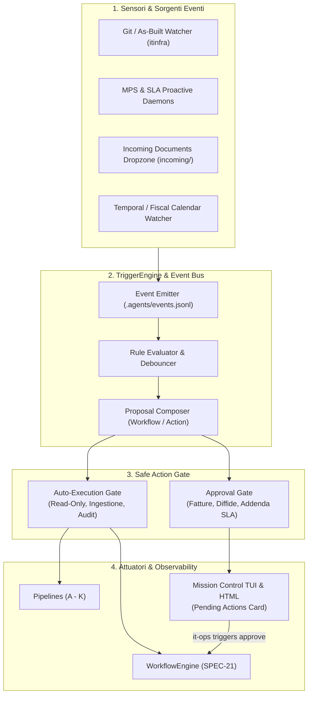

# SPEC-22: Event-Driven Proactive Trigger System & Safe Action Gate

> **Repository Primario**: `itinfra-business-ops`  
> **Repository Federato**: `itinfra` (Hub-and-Spoke via Shared Customer Slug)  
> **Brand & Titolarità**: **Aure System di Eduardo Possumato**  
> **Standard di Riferimento**: Google Open Knowledge Format (OKF) v0.2, Event-Driven Architecture (EDA), Append-Only Audit Log, Safe Action Gate  
> **Data Specifica**: 18 Settembre 2026  

---

## 1. Visione Architetturale & Motivazione

L'infrastruttura di **Aure System** dispone di 11 pipeline verticali specializzate, 4 agenti deterministici e un motore di workflow a stati finiti (SPEC-21).  
Tuttavia, l'avvio di ciascuna operazione richiede ancora un'iniziativa esplicita dell'operatore o l'attesa di un cron cieco.  
L'obiettivo di **SPEC-22** è dotare i due repository di un **sistema nervoso sensoriale proattivo ed event-driven**:
1. **Sensori & Event Emitters**: Rilevano variazioni di cantiere (`06-As-Built.md`), allarmi telemetrici (toner, SLA burn), arrivo di documenti (`incoming/`) o scadenze contabili.
2. **Deterministic Trigger Engine**: Valuta le regole di matching e compone la proposta operativa adatta (`Trigger-to-Proposal`).
3. **Safe Action Gate (Human-in-the-Loop)**: Separa le azioni *auto-eseguibili* (in sola lettura, verifiche bridge, estrazioni visive) dalle azioni *finanziarie/contrattuali* che richiedono la validazione di Eduardo Possumato nel Mission Control.
4. **Append-Only Audit Log**: Ogni evento e ogni transizione viene registrato immutabilmente in `.agents/events.jsonl` con timestamp ISO 8601 UTC.



---

## 2. Tassonomia degli Eventi Supportati

| Tipologia Evento | Codice Evento | Sorgente | Condizione di Trigger | Livello di Sicurezza | Azione Innescata |
| :--- | :--- | :--- | :--- | :---: | :--- |
| **As-Built Hardware Change** | `itinfra.asbuilt.changed` | Commit / Git Guard in `itinfra` | Modifica in `06-As-Built.md` o `04-Network-IPAM.md` | `AUTO` per check, `APPROVAL` per addendum | Verifica copertura contrattuale via `ITInfraBridge`. Se apparato non coperto, propone addendum SLA. |
| **Allarme Toner Critico** | `telemetry.mps.consumable_low` | `MPSDaemon` | Livello toner cartuccia `<= 15%` | `APPROVAL` | Generazione riga ricambio con codice OEM e predisposizione spedizione consumabile. |
| **Consumo Monte Ore SLA** | `telemetry.sla.hours_low` | `SLADaemon` / `ReportsPipeline` | Saldo ore residuo `<= 20%` o `remaining_hours <= 10.0` | `APPROVAL` | Avvio `WF-05 contract-renewal` con calcolo proposta di estensione monte ore cost-plus. |
| **Drop Documento Ingestione** | `documents.incoming.dropped` | Filesystem Watcher su `incoming/` | Nuovo file PDF/PNG in `clients/<slug>/ingestion/incoming/` | `AUTO` | Esecuzione automatica `Pipeline H (DocumentIngestionPipeline)` con estrazione OKF v0.2. |
| **Pre-Flight Fine Mese** | `temporal.billing.preflight` | Calendar Watcher | Penultimo giorno lavorativo del mese | `AUTO` per dry-run, `APPROVAL` per invio SDI | Esecuzione `WF-01 monthly-closing --dry-run` e predisposizione prospetto per Mission Control. |
| **Audit Trimestrale 231** | `temporal.audit231.quarterly` | Calendar Watcher | 1° giorno del trimestre (Gen/Apr/Lug/Ott) | `AUTO` | Avvio perizia `WF-04 quarterly-audit-231` e rilevamento anomalie Shadow IT. |

---

## 3. Modello Dati dell'Evento (`schemas/trigger_event.schema.yaml`)

```yaml
$schema: "http://json-schema.org/draft-07/schema#"
title: "Trigger Event Schema (SPEC-22)"
description: "Schema per eventi del Trigger Engine e azioni del Safe Action Gate"
type: object
required:
  - event_id
  - event_type
  - slug
  - timestamp
  - source
  - status
properties:
  event_id:
    type: string
  event_type:
    type: string
  slug:
    type: string
  timestamp:
    type: string
  source:
    type: string
  payload:
    type: object
  action_proposed:
    type: object
    properties:
      action_id:
        type: string
      action_type:
        type: string
      title:
        type: string
      description:
        type: string
      requires_approval:
        type: boolean
      workflow_to_run:
        type: string
      target_params:
        type: object
  status:
    type: string
    enum: ["EMITTED", "PENDING_APPROVAL", "APPROVED", "REJECTED", "EXECUTED", "FAILED"]
  resolved_at:
    type: ["string", "null"]
  resolved_by:
    type: ["string", "null"]
```

---

## 4. Architettura del Safe Action Gate

Per tutelare l'integrità legale e finanziaria di Aure System, nessuna transazione con impatto esterno viene finalizzata senza semaforo verde esplicito:

1. **Classificazione delle Azioni**:
   - **`READ_ONLY` / `INTERNAL`**: Esecuzione autonoma e trasparente (es. lanciare la telelettura, estrarre il testo da una scansione, eseguire il linter, calcolare il dry-run).
   - **`COMMERCIAL` / `FINANCIAL`**: Richiede autorizzazione umana (es. emettere fatture SDI, inviare PEC di sollecito, modificare canoni o contratti).
2. **Flusso di Approvazione nel Mission Control**:
   - Le azioni in attesa vengono serializzate in `.agents/pending_actions.json`.
   - Il Mission Control (sia TUI ANSI che HTML) mostra il badge con conteggio delle azioni in attesa.
   - Tramite la CLI:
     - `it-ops triggers pending`: elenca le proposte con motivazione, impatto economico e dettagli apparati.
     - `it-ops triggers approve <action_id>`: approva ed esegue l'azione o il workflow collegato.
     - `it-ops triggers reject <action_id> [--reason "..."]`: archivia la proposta senza applicarla.

---

## 5. Integrazione con i Componenti Esistenti

- **`MPSDaemon` & `SLADaemon` (`scripts/pipelines/daemon.py`)**:
  - Quando rilevano soglie critiche, invocano `TriggerEngine.emit_event(...)` che registra l'evento e genera la proposta d'azione.
- **Git Guard (`scripts/hooks/git_guard.py`)**:
  - Nel controllo pre-commit / post-commit, verifica se sono stati modificati apparati in `itinfra` ed emette l'evento per la verifica SLA.
- **Mission Control (`scripts/pipelines/mission_control.py`)**:
  - Raccoglie in `collect_all()` il conteggio e la lista delle `pending_actions`, visualizzandole in evidenza nella dashboard.
- **WorkflowEngine (`scripts/core/workflow_engine.py`)**:
  - Le azioni approvate invocano deterministicamente i workflow esistenti (`monthly-closing`, `contract-renewal`, `quarterly-audit-231`).

---

## 6. Comandi CLI `it-ops triggers`

```powershell
# 1. Elenco dei trigger configurati e delle regole di matching
.\it-ops.cmd triggers list

# 2. Storico degli eventi scatenati (audit trail immutabile)
.\it-ops.cmd triggers events [--slug <slug>] [--limit 20]

# 3. Elenco delle azioni preparate in attesa di autorizzazione umana
.\it-ops.cmd triggers pending

# 4. Scansione manuale immediata di tutte le sorgenti
.\it-ops.cmd triggers scan [--slug <slug>]

# 5. Approvazione ed esecuzione di un'azione proposta
.\it-ops.cmd triggers approve <action_id>

# 6. Rifiuto ed archiviazione di una proposta
.\it-ops.cmd triggers reject <action_id> --reason "Intervento già concordato"
```
