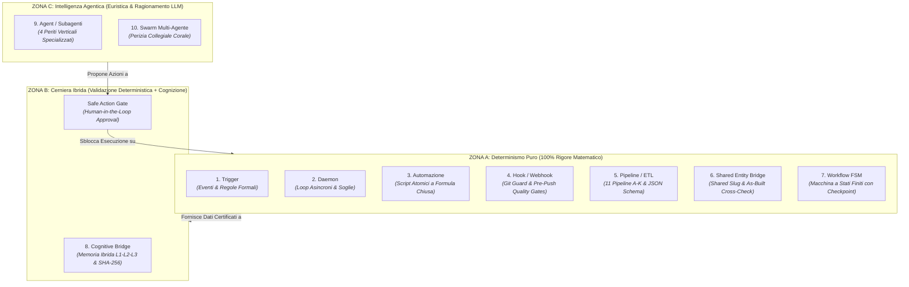

# Punti Chiave

1. **Principio di Determinismo Progressivo**: L'ecosistema unificato Aure System adotta un approccio stratificato a 10 livelli: le operazioni contabili, contrattuali, di rete e di compliance operativa sono affidate a componenti **100% deterministici** (Trigger, Daemon, Automazioni, Hook, Pipeline, Shared Entity Bridge, Workflow), riservando l'inferenza probabilistica dei Modelli di Linguaggio (LLM) e degli Agenti esclusivamente all'analisi euristica, al ragionamento peritale e alla sintesi multi-disciplinare.
2. **Copertura Integrale (10/10 Attivi nei Progetti)**: Tutti i 10 concetti della tassonomia sono attualmente implementati, collaudati e operativi all'interno dei due repository federati `itinfra` e `itinfra-business-ops`.
3. **Safe Action Gate come Cerniera di Controllo**: Quando i componenti probabilistici (Agenti o Swarm) o i demoni deterministici propongono azioni aventi impatto economico, contrattuale o infrastrutturale, il sistema applica il pattern **Human-in-the-Loop** (`Safe Action Gate`), garantendo che nessuna transazione o modifica critica avvenga senza approvazione esplicita.
4. **Tracciabilità Forense & Zero-Hallucination**: Ogni transizione tra i vari livelli architetturali è certificata mediante log append-only (`.agents/events.jsonl`), attestazioni crittografiche SHA-256 (`rules.json`) e validazione contro schemi JSON Schema Draft 7 formalizzati.

---

# Tabella Integrata (Tecnico + Business Ops)

La tabella seguente riassume la classificazione ontologica dei 10 concetti architetturali, la loro modalità operativa, il grado di determinismo e il rispettivo stato di adozione e tracciabilità nei due repository di progetto.

| Concetto | Cosa fa in breve? | Chi lo guida? | È deterministico? | Stato nei Progetti | Specifiche & Componenti Chiave di Riferimento |
| :--- | :--- | :--- | :--- | :--- | :--- |
| **Trigger** | Avvia un'azione o un flusso quando si verifica una condizione. | Evento tecnico o orario prestabilito. | **Sì (100%)** | **Attivo (100%)** | **SPEC-22**: `TriggerEngine` (`scripts/core/trigger_engine.py`), `.\it-ops.cmd triggers [scan\|pending\|approve]`, `schemas/trigger_event.schema.yaml`. |
| **Daemon** | Monitora in background metriche e scadenze (es. contratti, consumabili). | Loop asincroni e soglie di controllo. | **Sì (100%)** | **Attivo (100%)** | **SPEC-20 / SPEC-22**: `MPSDaemon` e `SLADaemon` (`scripts/pipelines/daemon.py`), `.\it-ops.cmd daemon [mps\|sla] [--once]`, Cron notturno GitHub Actions. |
| **Automazione** | Esegue una singola azione rigida (es. sposta o valida un file). | Regola deterministica singola. | **Sì (100%)** | **Attivo (100%)** | **SPEC-01..14 / SPEC-18**: Scaffolding progetti (`it scaffold`), calcolo margini preventivo (`it-ops quote calculate`), telelettura MPS (`it-ops mps calculate`). |
| **Hook (Webhook)** | Notifica un altro sistema in tempo reale (es. Git Guard Hooks). | Evento di sistema (es. pre-commit). | **Sì (100%)** | **Attivo (100%)** | **SPEC-20**: `Git Guard Engine` (`scripts/hooks/git_guard.py`), `.\it-ops.cmd hooks [install\|check] [--both]`, Quality Gate locale e pre-push cross-repo. |
| **Pipeline / ETL** | Trasforma, valida ed esporta dati (es. generazione tracciato SDI v1.2). | Script e schemi YAML formali. | **Sì (100%)** | **Attivo (100%)** | **SPEC-18 / SPEC-19**: 11 Pipeline operative A-K (`scripts/pipelines/`), Validatori formali JSON Schema Draft 7 (`schemas/`), export XML FPR12/FPA12. |
| **Shared Entity Bridge** | Mette in relazione dati tecnici (As-Built) e dati business (Contratti/Rapportini). | Ontologia del Knowledge Graph e Slug comuni. | **Sì (100%)** | **Attivo (100%)** | **SPEC-17 / SPEC-19**: `ITInfraBridge` (`scripts/core/bridge.py`), Shared Customer Slug (`<slug>`), D3.js Knowledge Graph (`scripts/itinfra_graph.py`), Cross-Check As-Built. |
| **Workflow (a Stati Finiti)** | Coordina sequenze complesse di attività bloccanti basate su stati (es. Onboarding). | Regole di business e transizioni di stato. | **Sì (Salvo decisioni umane)** | **Attivo (100%)** | **SPEC-21**: `WorkflowEngine` (`scripts/core/workflow_engine.py`), 5 Workflow tipizzati (`monthly-closing`, `onboarding-to-live`, ecc.), `.\it-ops.cmd workflow [run\|resume]`. |
| **Cognitive Bridge** | Allinea e sincronizza la memoria locale federata di diverse IA. | Protocolli di apprendimento auto-correttivi. | **Misto (Meccanismo deterministico, output probabilistico)** | **Attivo (100%)** | **SPEC-17**: `CognitiveBridge` (`scripts/core/cognitive_bridge.py`), `MemoryEngine` (`scripts/core/memory_engine.py`), Memoria a 3 livelli L1-L2-L3, sigillo crittografico SHA-256 (`rules.json`). |
| **Agent (Subagente)** | Ragiona e risolve un task verticale specifico (es. audit-231, infrastructure-sentinel). | IA specializzata (LLM focalizzato). | **No (Probabilistico)** | **Attivo (100%)** | **SPEC-20**: 4 Periti verticali deterministicamente invocabili (`audit-231`, `finance-reconciler`, `infrastructure-sentinel`, `contract-guardian`), CLI `.\it-ops.cmd agent <type> <slug>`. |
| **Sistemi Agentici (Swarm)** | Fanno collaborare agenti tecnici e commerciali sullo stesso cliente. | Architettura Multi-Agente orchestrata. | **No (Altamente dinamico)** | **Attivo (100%)** | **SPEC-20**: `AgentSwarm` (`scripts/core/agent_swarm.py`), `.\it-ops.cmd agent swarm <slug>`, perizia corale collegiale multi-disciplinare, sintesi esecutiva congiunta. |

---

# Dettaglio Operativo dei 10 Concetti & Guida di Adozione

### 1. Trigger (SPEC-22)
- **Ruolo Concettuale**: Dispositivo ad attivazione istantanea che cattura un evento e instanzia una transizione o una proposta d'azione.
- **Implementazione `itinfra-business-ops`**:
  - `TriggerEngine` (`scripts/core/trigger_engine.py`): valuta eventi di telemetria, filesystem e modifiche di bridge.
  - Comandi CLI: `.\it-ops.cmd triggers [scan|pending|approve|reject|events]`.
  - Append-only log: `.agents/events.jsonl` (tracciabilità forense immutabile).
- **Implementazione `itinfra`**:
  - Webhook e Trigger GitHub Actions (`.github/workflows/continuous-assurance.yml`).
  - Watcher locale deterministico (`it sync-engine`).
- **Verifica di Determinismo**: 100% deterministico. La correlazione tra payload dell'evento e `action_proposed` è regolata da funzioni algebriche e predicati booleani privi di ambiguità.

### 2. Daemon (SPEC-20 & SPEC-22)
- **Ruolo Concettuale**: Processo residente o programmato che opera in background senza interazione diretta dell'utente, scandendo periodicamente sorgenti dati per verificare condizioni di soglia.
- **Implementazione `itinfra-business-ops`**:
  - `MPSDaemon` (`scripts/pipelines/daemon.py`): monitora i consumabili delle stampanti a contratto; se il toner scende sotto il 15%, genera un evento di trigger proattivo.
  - `SLADaemon` (`scripts/pipelines/daemon.py`): monitora il burn-rate del monte ore SLA; se il consumo supera l'80%, genera una notifica di rinnovo.
  - CLI: `.\it-ops.cmd daemon [mps|sla] [--once]`.
- **Implementazione `itinfra`**:
  - `scripts/itinfra_deploy.py --watch`: demone di sincronizzazione e continuous publishing verso directory master.
- **Verifica di Determinismo**: 100% deterministico. Basato su intervalli temporali definiti (`cron`, `sleep`, timer) e comparazioni matematiche di soglia.

### 3. Automazione (SPEC-01..14 & SPEC-18)
- **Ruolo Concettuale**: Esecuzione puntuale e isolata di una singola routine esecutiva priva di ramificazioni complesse o negoziazioni esterne.
- **Implementazione `itinfra-business-ops`**:
  - Calcolo teleletture copie e conguagli eccedenze (`.\it-ops.cmd mps <slug> calculate`).
  - Calcolo margini e markup commerciale (`.\it-ops.cmd quote <slug> calculate`).
  - Generazione rapportini di intervento strutturati (`.\it-ops.cmd report <slug> new`).
- **Implementazione `itinfra`**:
  - Scaffolding automatico di progetti da template (`scripts/itinfra_scaffold.py`).
  - Compilazione configurazioni di rete MikroTik RouterOS e PowerShell (`scripts/itinfra_playbooks.py`).
- **Verifica di Determinismo**: 100% deterministico. Algoritmi deterministici a formula chiusa senza componenti stocastiche.

### 4. Hook / Webhook (SPEC-20)
- **Ruolo Concettuale**: Intercettore sincrono agganciato a un evento del ciclo di vita del codice o del sistema che funge da barriera o sentinella.
- **Implementazione `itinfra-business-ops`**:
  - `Git Guard Engine` (`scripts/hooks/git_guard.py`): intercetta i comandi `git commit` (pre-commit) e `git push` (pre-push).
  - Verifiche: Secret Leak Detection (chiavi API, private key), conformità JSON Schema dei file YAML cliente, linter OKF v0.2, smoke test unificati.
  - Gestione CLI: `.\it-ops.cmd hooks [install|check] [--both]`.
- **Implementazione `itinfra`**:
  - Hook nativi `.git/hooks/pre-commit` e pre-push sincronizzati con la Quality Gate di pubblicazione (`MOD-11`, `MOD-15`).
- **Verifica di Determinismo**: 100% deterministico. Valutazione basata su espressioni regolari certificate, parser YAML rigorosi ed exit-code di unit test.

### 5. Pipeline / ETL (SPEC-18 & SPEC-19)
- **Ruolo Concettuale**: Flusso unidirezionale di estrazione, trasformazione e caricamento/esportazione che valida i dati di input contro schemi formali e produce output conformi a standard di settore.
- **Implementazione `itinfra-business-ops`**:
  - 11 Pipeline operative native (A-K):
    - *Pipeline A*: Governance Contratti SLA & Monte Ore.
    - *Pipeline B*: Rapportini e Timesheet PSA.
    - *Pipeline C*: Fatturazione Elettronica SDI XML (FPR12 privati, FPA12 PA) & Scadenzario B2B.
    - *Pipeline D*: Sincronizzazione Calendari e Scadenze.
    - *Pipeline E*: Simulazione Preventivi e Margini Protetti.
    - *Pipeline F*: Noleggio Operativo MPS & Teleletture SNMP.
    - *Pipeline G*: Logistica e Commesse Arredo Ufficio.
    - *Pipeline H*: Ingestione Documentale Visiva Nativa SOTA OKF v0.2.
    - *Pipeline I*: Memoria Auto-Correttiva & Apprendimento Guidato.
    - *Pipeline J*: Gap Analysis & Compliance D.Lgs. 231/2001 (Art. 24-bis).
    - *Pipeline K*: Onboarding Unificato Dual-Repository (Zero-Drift).
- **Implementazione `itinfra`**:
  - Pipeline di compilazione documentale: `01-Assessment` ➔ `02-HLD` ➔ `03-LLD` ➔ `06-As-Built` ➔ `09-Handover`.
  - Calcolo deterministico IPAM e subnetting (`scripts/itinfra.py`).
- **Verifica di Determinismo**: 100% deterministico. Output certificato e validato mediante JSON Schema Draft 7.

### 6. Shared Entity Bridge (SPEC-17 & SPEC-19)
- **Ruolo Concettuale**: Connettore ontologico che relaziona entità tecniche e commerciali tra due repository distinti salvaguardando il principio di Separation of Concerns (SoC).
- **Implementazione Unificata**:
  - `ITInfraBridge` (`scripts/core/bridge.py`): fornisce accesso in sola lettura (Read-Only) dal repository business al repository tecnico.
  - **Shared Customer Slug (`<slug>`)**: chiave primaria universale condivisa (es. `severino-srl`, `teatek-spa`).
  - Cross-validazione: verifica che ogni apparato a contratto SLA o MPS in `itinfra-business-ops` esista fisicamente nel documento `06-As-Built.md` di `itinfra`.
  - Rilevamento Shadow IT: individua dispositivi scoperti da contratto o non censiti.
- **Verifica di Determinismo**: 100% deterministico. Lookup su filesystem locale con matching esatto di stringhe e seriali.

### 7. Workflow a Stati Finiti (SPEC-21)
- **Ruolo Concettuale**: Macchina a stati finiti (FSM) che governa processi articolati multi-fase con checkpoint persistiti, transizioni rigide, ripresa da interruzione (resumability) e punti di decisione umana.
- **Implementazione `itinfra-business-ops`**:
  - `WorkflowEngine` (`scripts/core/workflow_engine.py`) con schema formale `schemas/workflow.schema.yaml`.
  - Persistenza atomica: `clients/<slug>/workflows/wf-*.yaml`.
  - Registry dei 5 Workflow Fondamentali:
    1. `monthly-closing`: Chiusura fine mese integrata (telelettura + ore + batch fatturazione).
    2. `onboarding-to-live`: Onboarding completo da preventivo ad attivazione As-Built.
    3. `incident-postmortem`: Gestione emergenza, root cause analysis e apprendimento continuo.
    4. `quarterly-audit-231`: Riesame peritale di sicurezza, compliance e Shadow IT.
    5. `contract-renewal`: Rinnovo annuale indicizzato con analisi del burn-rate.
  - CLI: `.\it-ops.cmd workflow [run|list|status|resume]`.
- **Verifica di Determinismo**: Deterministico (100% nella transizione di stato, salvo pause controllate per autorizzazione o input umano).

### 8. Cognitive Bridge (SPEC-17)
- **Ruolo Concettuale**: Meccanismo di federazione cognitiva che consente a istanze di assistenti AI diverse (Google Antigravity, Claude Code, Cursor) di condividere regole, correzioni e lezioni operative senza dispersione.
- **Implementazione `itinfra-business-ops` & `itinfra`**:
  - `CognitiveBridge` (`scripts/core/cognitive_bridge.py`): gestisce il ciclo vitale della conoscenza operativa.
  - Memoria a tre livelli:
    - *L1 Short-Term Memory*: contesto volatile della sessione di chat.
    - *L2 Staging Scratchpad*: bozze di correzione in attesa di certificazione (`_global_scratchpad.md`).
    - *L3 Long-Term Ground Truth*: regole operative consolidate e verificate con attestazione SHA-256 (`rules.json`).
  - Protocollo di auto-correzione: `.\it-ops.cmd learn [list|sync|audit|test]`.
- **Verifica di Determinismo**: Ibrido/Misto. Il meccanismo di archiviazione, validazione crittografica e sincronizzazione è deterministico al 100%; l'estrazione concettuale iniziale della regola dal dialogo è guidata da ragionamento probabilistico.

### 9. Agent / Subagente (SPEC-20)
- **Ruolo Concettuale**: Entità cognitiva autonoma governata da un Large Language Model (LLM), provvista di specializzazione verticale, istruzioni di sistema peritali e un set circoscritto di tool per risolvere problemi ambigui o aperti.
- **Implementazione `itinfra-business-ops`**:
  - 4 Periti Verticali Deterministicamente Invocabili:
    1. `Audit231Agent`: specialista in diritto penale dell'informatica, Art. 24-bis D.Lgs. 231/2001 e standard ISO 27001 / NIST CSF.
    2. `FinanceReconcilerAgent`: perito contabile per quadratura monte ore, rilevamento discrepanze tariffe e conguagli MPS.
    3. `InfrastructureSentinelAgent`: perito sistemistico per audit topologico, verifica ridondanza LLD e conformità As-Built.
    4. `ContractGuardianAgent`: garante contrattuale per rispetto SLA, penali, finestre di servizio ed escalation.
  - CLI: `.\it-ops.cmd agent [audit-231|finance-reconciler|infrastructure-sentinel|contract-guardian] <slug>`.
- **Implementazione `itinfra`**:
  - Subagenti documentali e diagnostici: `itinfra-assistant`, `itinfra-troubleshooter`, `itinfra-setup`.
- **Verifica di Determinismo**: Non deterministico (inferenza stocastica LLM). La sicurezza operativa è garantita dai vincoli sui dati di input e dalla validazione formale degli output strutturati.

### 10. Sistemi Agentici / Swarm Multi-Agente (SPEC-20)
- **Ruolo Concettuale**: Piattaforma collaborativa multi-agente in cui più periti cognitivi cooperano scambiandosi valutazioni intermedie per convergere verso una perizia o una delibera collegiale ad alta complessità.
- **Implementazione `itinfra-business-ops`**:
  - `AgentSwarm` (`scripts/core/agent_swarm.py`): orchestratore che attiva in sequenza o in parallelo i 4 periti verticali su un dato cliente.
  - Composizione della Relazione Peritale Collegiale: consolidamento dei riscontri tecnici, giuridici, finanziari e contrattuali in un unico parere motivato.
  - CLI: `.\it-ops.cmd agent swarm <slug> [--topic "focus specifico"]`.
- **Verifica di Determinismo**: Non deterministico / Altamente dinamico. Rappresenta il livello più elevato di flessibilità euristica, governato e bilanciato dal Safe Action Gate a valle.

---

# Diagramma dello Spettro Architetturale

Il grafico seguente illustra il passaggio continuo dal rigore matematico (100% deterministico) alla flessibilità cognitiva e peritale:

---

# Matrice Decisionale di Design: Quando Usare Cosa?

Durante lo sviluppo quotidiano e l'evoluzione dei due progetti, fare riferimento a questo albero decisionale per selezionare il componente corretto:

| Se devi soddisfare questa esigenza operativa... | Usa questo Componente | Esempio Pratico nei Progetti |
| :--- | :--- | :--- |
| Devo eseguire una trasformazione dati rigida, validata da schema (es. fattura, rapportino, preventivo) | **Pipeline / ETL** | Esegui Pipeline C (`billing summary`) o Pipeline E (`quote calculate`). |
| Devo applicare una formula numerica o uno spostamento atomico di file | **Automazione** | Script di calcolo teleletture copie MPS o scaffolding da template. |
| Devo impedire che dati errati, chiavi private o violazioni di schema entrino nel repository Git | **Hook (Git Guard)** | Git Guard Hook pre-commit / pre-push (`git_guard.py`). |
| Devo sorvegliare costantemente parametri hardware o monte ore senza intervento umano | **Daemon** | `MPSDaemon` per consumabili stampanti o `SLADaemon` per ore contrattuali. |
| Devo reagire istantaneamente al superamento di una soglia o alla comparsa di un nuovo documento | **Trigger** | `TriggerEngine.emit_event()` su `telemetry.mps.consumable_low`. |
| Devo verificare la consistenza tra l'infrastruttura reale (rete) e il contratto economico | **Shared Entity Bridge** | `ITInfraBridge.check_asbuilt_consistency()` via `it-ops check <slug>`. |
| Devo governare un processo a più tappe con possibilità di stop, resume e approvazioni umane | **Workflow FSM** | Workflow `monthly-closing` o `onboarding-to-live`. |
| Devo trasmettere una regola operativa o una correzione tra sessioni AI differenti in modo immutabile | **Cognitive Bridge** | `MemoryEngine.seal_rule()` con SHA-256 su `rules.json`. |
| Devo valutare la conformità normativa complessa (es. D.Lgs. 231/2001) o fare auditing di configurazione | **Agent (Subagente)** | `Audit231Agent` o `InfrastructureSentinelAgent`. |
| Devo redigere un parere peritale completo che unisca diritto, bilancio, SLA e architettura di rete | **Swarm Multi-Agente** | `AgentSwarm.run_deliberation(slug)`. |

---

# Riferimenti Incrociati & Collegamenti alla Documentazione

### Repository `itinfra-business-ops`
- [`README.md`](../../README.md): Indice generale del repository gestionale/operativo.
- [`docs/ARCHITECTURE.md`](../ARCHITECTURE.md): Architettura del paradigma Hub-and-Spoke.
- [`docs/PIPELINES.md`](../PIPELINES.md): Manuale operativo delle 11 Pipeline native (A-K).
- [`docs/specs/20-spec-mission-control-and-autonomous-swarm.okf.md`](./20-spec-mission-control-and-autonomous-swarm.okf.md): Specifica di Mission Control e Swarm Agenti.
- [`docs/specs/21-spec-workflow-orchestration-and-lifecycle-assurance.okf.md`](./21-spec-workflow-orchestration-and-lifecycle-assurance.okf.md): Specifica della State Machine dei Workflow.
- [`docs/specs/22-spec-event-driven-trigger-system-and-action-gate.okf.md`](./22-spec-event-driven-trigger-system-and-action-gate.okf.md): Specifica del Trigger Engine e del Safe Action Gate.

### Repository `itinfra`
- [`docs/00-INDEX-DOCS.md`](../../../itinfra/docs/00-INDEX-DOCS.md): Indice master della documentazione tecnica.
- [`docs/02-ROADMAP-PIANO-SVILUPPO.md`](../../../itinfra/docs/02-ROADMAP-PIANO-SVILUPPO.md): Tabella di marcia evolutiva e tracciabilità.
- [`docs/08-GUIDA-MEMORIA-IBRIDA-TRUST-SIGNALS.md`](../../../itinfra/docs/08-GUIDA-MEMORIA-IBRIDA-TRUST-SIGNALS.md): Memoria locale L1-L2-L3.
- [`docs/09-GUIDA-GLOBAL-ENTERPRISE-GRAPH.md`](../../../itinfra/docs/09-GUIDA-GLOBAL-ENTERPRISE-GRAPH.md): Knowledge Graph e Shared Entity Bridges.
- [`docs/20-SPEC-MISSION-CONTROL-AND-AUTONOMOUS-SWARM.md`](../../../itinfra/docs/20-SPEC-MISSION-CONTROL-AND-AUTONOMOUS-SWARM.md): Controparte tecnica SPEC-20.
- [`docs/21-SPEC-WORKFLOW-ORCHESTRATION-AND-LIFECYCLE-ASSURANCE.md`](../../../itinfra/docs/21-SPEC-WORKFLOW-ORCHESTRATION-AND-LIFECYCLE-ASSURANCE.md): Controparte tecnica SPEC-21.
- [`docs/22-SPEC-EVENT-DRIVEN-TRIGGER-SYSTEM-AND-ACTION-GATE.md`](../../../itinfra/docs/22-SPEC-EVENT-DRIVEN-TRIGGER-SYSTEM-AND-ACTION-GATE.md): Controparte tecnica SPEC-22.

---

## 8. Applicazione Esecutiva nella Triade di Estensioni ad Alto Ritorno (SPEC-24)

La tassonomia dei 10 concetti trova diretta attuazione e validazione sul campo nella specifica **SPEC-24**:
- **Ambito 1 (Incident $\rightarrow$ Rapportino)**: combina **Trigger** (`telemetry.incident.created`), **Shared Entity Bridge** (Shared Customer Slug & 10-RCA.md), **Safe Action Gate** (approvazione umana preventiva) e **Pipeline** (Pipeline B con calcolo maggiorazioni CCNL).
- **Ambito 2 (Credit Collection D.Lgs. 231/2002)**: unisce **Daemon** (`CreditDaemon` per scansione continua partite aperte), **Automazione** (formula matematica BCE + 8% e €40 forfait), **Hook** (blocco Git Guard per P.IVA/CF errati) e **Pipeline** (Pipeline C per emissione lettere graduate a 3 stadi).
- **Ambito 3 (Technical Workflows FSM)**: implementa **Workflow** finiti e resumable a 5 step per `itinfra` (`dr-drill`, `firmware-upgrade`, `hardware-decommissioning-raee`), garantendo la massima resilienza operativa deterministica su procedure critiche di cybersecurity, continuità operativa e sostenibilità ecologica.
