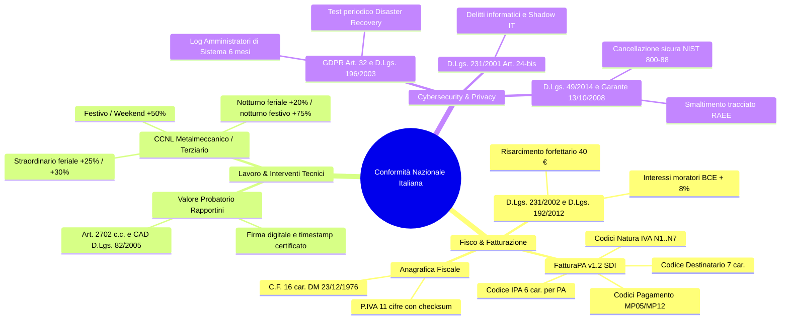
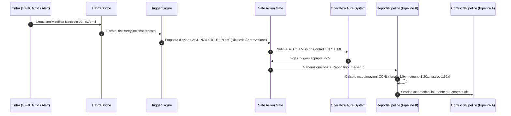

# SPEC-24: Italian Regulatory Compliance Guard & High-Return Triad Extensions

**Identificativo Specifica:** `SPEC-24`  
**Stato:** `APPROVED FOR IMPLEMENTATION`  
**Autore:** Aure System di Eduardo Possumato  
**Data:** 18 Settembre 2026  
**Repository Target:** `itinfra-business-ops` & `itinfra`  

---

## 1. Visione & Contesto Nazionale Italiano

L'ecosistema unificato formato da **`itinfra`** (infrastruttura tecnica, topologia, configurazioni e As-Built) e **`itinfra-business-ops`** (governance operativa, commerciale, PSA, contratti SLA e fatturazione) opera primariamente nel mercato italiano, prestando servizi a PMI, grandi imprese e Pubbliche Amministrazioni.

Il pieno rispetto del contesto normativo nazionale italiano è un **requisito vincolante non negoziabile**. Questa specifica formalizza il presidio normativo italiano e progetta i **tre ambiti di estensione a massimo ritorno operativo** identificati nella Tassonomia Architetturale Integrata (SPEC-23).

---

## 2. Quadro Normativo di Riferimento

---

## 3. Modulo di Presidio: `ItalianComplianceGuard`

Viene introdotto un componente dedicato e deterministico al 100% per il controllo delle regole nazionali:

### 3.1 Algoritmi di Validazione Fiscale
1. **Partita IVA Italiana (11 cifre)**:
   - Verifica di lunghezza (esattamente 11 cifre numeriche).
   - Verifica codice ufficio/provincia (prime 7 cifre matricola, successive 3 codice ufficio tra `001` e `100` o identificativo forfettario/speciale).
   - Verifica dell'undicesima cifra (check-digit) con l'algoritmo ministeriale italiano:
     $$\sum (\text{cifre posizione dispari}) + \sum (\text{raddoppio cifre posizione pari, sottraendo 9 se } \ge 10)$$
     Il totale deve essere multiplo di 10.
2. **Codice Fiscale Italiano (16 caratteri alfanumerici)**:
   - Regex sintattica ufficiale: `^[A-Z]{6}[0-9LMNPQRSTUV]{2}[A-EHLMPR-T][0-9LMNPQRSTUV]{2}[A-Z][0-9LMNPQRSTUV]{3}[A-Z]$`.
   - Gestione delle omocodie ufficiali dell'Agenzia delle Entrate (sostituzione numeri con lettere L..V).
   - Calcolo del carattere di controllo finale (sedicesima lettera) mediante tabelle di conversione ministeriali DM 23/12/1976 (valori caratteri pari e dispari).
   - Gestione delle persone giuridiche (11 cifre numeriche con validazione algoritmo P.IVA).
3. **Canali di Recapito SDI**:
   - `CodiceDestinatario`: 7 caratteri alfanumerici per B2B/B2C, oppure `0000000` con `PECDestinatario` obbligatoria.
   - `CodiceUnivocoUfficio`: 6 caratteri alfanumerici per fatturazione FPA12 verso la PA.
4. **Validazione Condizioni di Pagamento Italiane**:
   - `30_DF_FM` (30 giorni data fattura fine mese).
   - `30_60_DF_FM` (30/60 giorni data fattura fine mese a rate uguali).
   - `60_90_DF_FM` e `RD` (Rimessa Diretta a vista).
   - Modalità di pagamento con codici Agenzia Entrate: `MP05` (Bonifico bancario), `MP12` (Ri.Ba. / Ricevuta Bancaria), `MP08` (Carta di credito), `MP01` (Contanti entro limiti di legge antiriciclaggio D.Lgs. 231/2007).

### 3.2 Integrazione con Git Guard (`scripts/hooks/git_guard.py`)
Qualsiasi commit o push che introduca o modifichi un `client-manifest.yaml` viene validato da `ItalianComplianceGuard`. Se la Partita IVA o il Codice Fiscale presentano errori di calcolo o formattazione, il commit viene bloccato a monte.

---

## 4. Ambito 1: Ponte Deterministico "Incident $\rightarrow$ Rapportino" (Cross-Repo)

### Obiettivo
Evitare che qualsiasi disservizio o intervento tecnico straordinario gestito in `itinfra` rimanga non addebitato o non scalato dal monte ore contrattuale del cliente in `itinfra-business-ops`.

### Specifiche Tecniche dell'Evento
- `event_type`: `telemetry.incident.created`.
- `payload`: `{slug, incident_id, title, severity, start_time, end_time, lead_engineer, affected_assets}`.
- `action_proposed`:
  - `action_type`: `incident_emergency_report`.
  - `requires_approval`: `true` (Human-in-the-Loop obbligatorio).
  - `workflow_to_run`: `incident-postmortem`.

---

## 5. Ambito 2: Demone Crediti & Scadenzario Attivo a Norma D.Lgs. 231/2002

### Obiettivo
Monitorare proattivamente lo scadenzario delle fatture attive e delle Ri.Ba., applicare il calcolo deterministico degli interessi legali di mora ex D.Lgs. 231/2002 e tutelare i rinnovi contrattuali.

### 5.1 Motore Interessi Moratori ex D.Lgs. 231/2002
In caso di ritardato pagamento nelle transazioni commerciali B2B:
1. **Decorrenza automatica**: Gli interessi moratori decorrono dal giorno successivo alla scadenza del termine pattuito, senza necessità di formale costituzione in mora (Art. 4).
2. **Tasso Legale di Mora**:
   $$\text{Tasso Mora 231} = \text{Tasso BCE (Operazioni Rifinanziamento Principale)} + 8.0\%$$
   *(Es. tasso BCE 3.50% $\rightarrow$ Tasso Mora = 11.50% annuo)*.
3. **Calcolo degli Interessi**:
   $$\text{Interessi} = \frac{\text{Importo Insoluto} \times \text{Tasso Mora} \times \text{Giorni di Ritardo}}{365}$$
4. **Risarcimento Forfettario dei Costi di Recupero**:
   Ex Art. 6, comma 2 del D.Lgs. 231/2002, al creditore spetta **un importo forfettario di 40,00 €** a titolo di risarcimento del danno per ciascuna fattura scaduta, esigibile senza obbligo di prova.

### 5.2 Strategia Graduata dei Solleciti
- **Stadio 1 (Scaduta da 7 a 14 giorni)**: *Avviso di Cortesia / Promemoria Scadenza* (promemoria amichevole coordinate bancarie).
- **Stadio 2 (Scaduta da 15 a 30 giorni)**: *Sollecito Formale con Addebito Mora ex D.Lgs. 231/2002 & 40 €* (estratto conto con calcolo analitico).
- **Stadio 3 (Scaduta da oltre 30 giorni)**: *Diffida ad Adempiere e Costituzione in Mora ex Art. 1219 C.C.* con termine perentorio di 5 giorni e preavviso di sospensione dei servizi di supporto SLA e avvio monitorio giudiziale.

### 5.3 Demone di Sorveglianza Contrattuale
- Alert a **60 giorni** dalla scadenza: notifica all'operatore per avvio trattativa di rinnovo.
- Alert a **30 giorni** dalla scadenza: soglia critica per eventuale disdetta a norma delle condizioni generali di contratto.

---

## 6. Ambito 3: Workflow Tecnici a Stati Finiti per `itinfra` (FSM Engine)

### Obiettivo
Dotare il repository tecnico `itinfra` della stessa potenza e resilienza a stati finiti (resumable checkpoints, idempotenza, failure recovery) di `itinfra-business-ops`, focalizzandosi su 3 procedure tecniche critiche:

### 6.1 Workflow 1: `dr-drill` (Esercitazione Annuale Disaster Recovery)
*Conforme ad Art. 32 GDPR (Par. 1 lett. d) e D.Lgs. 231/2001 (Art. 24-bis).*
- **Step 1: `audit-backup-status`**: ispezione catalogo backup (NAS locale, cloud immutabile, retention period).
- **Step 2: `staging-restore`**: ripristino di prova su ambiente scratch isolato senza impatto sulla produzione.
- **Step 3: `data-integrity-verification`**: validazione checksum SHA-256 e avvio dei database/servizi critici.
- **Step 4: `rto-rpo-measurement`**: calcolo effettivo dei tempi di ripristino (Recovery Time Objective vs Recovery Point Objective).
- **Step 5: `compliance-certificate-generation`**: emissione del Verbale Ufficiale di Esercitazione DR conforme OKF v0.2 per l'Organismo di Vigilanza (OdV) e il Responsabile Protezione Dati (DPO).

### 6.2 Workflow 2: `firmware-upgrade-cycle` (Aggiornamento Sicuro di Rete)
- **Step 1: `preflight-config-backup`**: salvataggio atomico della configurazione attiva nel vault locale crittografato.
- **Step 2: `firmware-hash-verification`**: validazione hash SHA-256 dell'immagine firmware OEM (MikroTik / Fortinet / Cisco).
- **Step 3: `staged-deployment`**: applicazione firmware con modalità di sicurezza (Safe Mode con timer di auto-revert se cade il link di gestione).
- **Step 4: `post-upgrade-smoke-test`**: verifica delle tabelle di routing, connettività VLAN e tunnel VPN IPsec.
- **Step 5: `commit-or-rollback`**: conferma permanente o ripristino istantaneo dello stato precedente.

### 6.3 Workflow 3: `hardware-decommissioning-raee` (Dismissione Sicura & RAEE)
*Conforme a Provvedimento Garante Privacy 13/10/2008 e D.Lgs. 49/2014.*
- **Step 1: `identify-asset`**: verifica seriale su `06-As-Built.md` e corrispondenza col contratto SLA/MPS.
- **Step 2: `secure-sanitization`**: esecuzione procedura di cancellazione sicura (NIST 800-88 Purge / DoD 5220.22-M) e generazione del log di sovrascrittura.
- **Step 3: `topology-and-sla-detach`**: rimozione dell'apparato dall'As-Built e stralcio dal canone SLA/MPS.
- **Step 4: `raee-handover-dossier`**: emissione del Modulo di Presa in Carico e Formulario di Identificazione Rifiuti (FIR / RAEE Cat. 3-4) per il recupero ecologico.

---

## 7. Tabella di Tracciabilità e Conformità

| Componente | Standard Nazionale / Legge di Riferimento | Meccanismo Deterministico | Output Conforme |
| :--- | :--- | :--- | :--- |
| **`ItalianComplianceGuard`** | DM 23/12/1976 (CF), DPR 633/1972 (IVA), Provv. AdE SDI | Checksum algebrico P.IVA e tabella omocodie CF | Validazione bloccante in Git Guard |
| **Ponte Incident $\rightarrow$ Rapportino** | CCNL Metalmeccanico/Terziario ICT, Art. 2702 c.c. | Formula moltiplicatori orari (1.0x / 1.20x / 1.50x / 1.75x) | Bozza rapportino con firma e scarico SLA |
| **Demone Crediti & Interessi** | D.Lgs. 231/2002, D.Lgs. 192/2012, Art. 1219 c.c. | Formula BCE + 8% su base 365 gg + 40 € fissi | Estratto conto solleciti a 3 stadi |
| **Workflow DR Drill** | Regolamento UE 2016/679 (GDPR Art. 32), D.Lgs. 231/2001 | FSM atomica con misurazione RTO/RPO | Verbale formale OKF v0.2 per OdV e DPO |
| **Workflow Decommissioning** | Provv. Garante Privacy 13/10/2008, D.Lgs. 49/2014 (RAEE) | Log NIST 800-88 e aggiornamento As-Built | Certificato di sanificazione e FIR RAEE |

---

## 8. Criteri di Accettazione

1. **Zero Fake P.IVA/CF**: Nessun file `client-manifest.yaml` con Partita IVA o Codice Fiscale non valido può superare il Git Guard hook.
2. **Zero Disservizi Non Tracciati**: La creazione di un `10-RCA.md` genera istantaneamente una proposta d'azione nel Safe Action Gate.
3. **Calcolo Mora Impeccabile**: Gli interessi di mora D.Lgs. 231/2002 e i 40 € forfettari sono calcolati con precisione al centesimo di euro.
4. **Idempotenza e Checkpoint nei Workflow Tecnici**: I workflow `dr-drill`, `firmware-upgrade` e `hardware-decommissioning` possono essere interrotti e ripresi (`resume`) senza perdita di stato o duplicazione di operazioni.
5. **100% Suite Passing**: Tutti gli unit test (77/77 in business-ops, 16/16 in itinfra) superano il collaudo con l'inclusione della nuova suite di conformità italiana.
